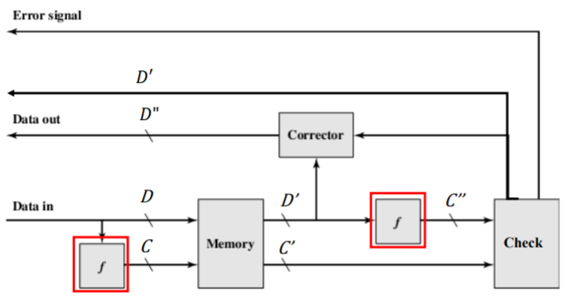
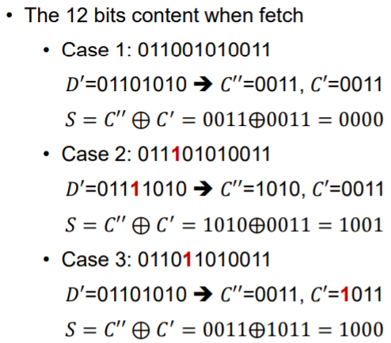
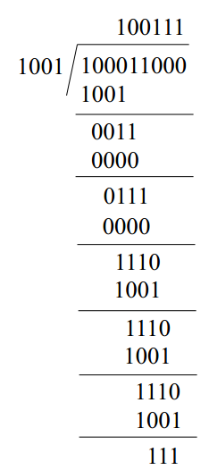

## 纠错

### 错误

1. **原因：**半导体储存器系统容易出错。
2. **种类：**
   + 硬件问题：
     + 因为永久的物理缺陷，记忆元件可能卡在0或1或是在0，1之间不停切换。
     + 因为环境问题或生产缺陷。
   + 软件问题：
     + 随机、无害的事件在不损害储存器的情况下改变一个或多个元件。
     + 供电问题或是&alpha;粒子。

### 纠错

1. **思想：**增加几位储存额外的信息来矫正。

2. **过程：**

   + 数据传入：在M位的数据D经过方法f时，产生一个K位的密码C。
   + 数据传出：当数据D'经过方法f后，产生一个新的K位密码C''，并且与C'比较。（‘代表是传入的数据）
     + 无出错：传送D’
     + 可被改正的错误：修正并传送D‘’
     + 不能改正的错误：报错

   

### 部分检查（奇偶校验）

1. **基本思想：**增加一位来标识数据里 1 的数量是奇数或偶数。

2. **奇校验：**

   + 校验位 = 所有位作异或后再与1异或

   + 若1的个数为奇数，则校验码为0。

3. **偶校验：**

   + 校验位 = 所有位异或
   +  若1的个数为偶数，则校验码为0。

4. **出错条件：**比较C’（新读出的校验码）与C’’（重新计算后得到的校验码）（作异或），注意，与原先的数据无关。结果为1时，有奇数位出错，为0，没有出错或者偶数位出错。

5. **优点：**成本低

6. **缺点：**

   + 只能知道出错不能找出错误之处
   + 当错误位为偶数时，找不到错误。

### 海明码 Hamming Code 

1. **基本思想：**将数据分成好几块，并对每块进行部分纠错。

2. **过程：**

   + 将一个M字节的数据分成K组，则有K位校验码。
   + 2^k-1 >= M+k（有2^k-1种取值使得数据出错，编码后的二进制有M+k位。）
   + 记八字节的数，海明码为4位。
   + 产生海明码。
   + 传输的数据再产生新的海明码。
   + 将新旧海明码做按位亦或运算，产生k位故障字(Syndrome word)

3. **故障字 Syndrome word：**

   + 每种故障字都代表不同的错误
   + 全0：正确。
   + 1位为1：海明码的检查位出错，无需改正。
   + 超过1位为1：可根据故障字的值来知道是哪个位置的数据出错了，并修改这个数据位。

4. **位置：**

   

   

5. **例子：**

   

6. SEC (Single-Error-Correcting)：只能纠错一位。

7. SEC-DED (Single-Error-Correcting, Double-Error-Detecting)：

   + 可以找两位错误，并更正一位的错误。
   + 增加1位的校验码。
   + 如果一位报错，三个校验码会有改变。
   + 全0：正确。
   + 1位为1：校验码错误，无需纠正。
   + 2位为1：两位数据错误以及一位校验码错误，无法找到是那里错了。
   + 3位为1：8位数据有1个错误，可以被找到。
   + 超过3位错误：需要检查硬件。
   + 优点：可靠性上升。
   + 缺点：校验码需要更多空间。

   

### 循环冗余校验 Cyclic Redundancy Check

1. **部分校验的问题：**

   + 额外开销大。
   + 需要将数据分块。

2. **思想：**

   + 适合储存大容量数据。
   + 产生数据与校验码的数学关系。
   + 将n位的数据除以k+1位的生成多项式。
   + 将k位的余数作为校验码。
   + 与校验码做亦或，开头为1时亦或。（详情看例子）

3. **检查：**

   + n+k位的内容可以被生成多项式除尽，则无错。

4. **例子：**

   

