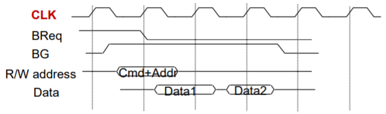
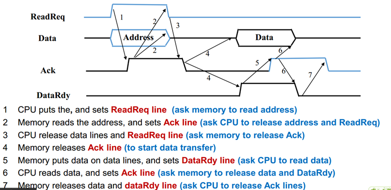

### 总线

1. **类型：**芯片内总线/**系统总线**/通讯总线

2. **按照功能分为三类：**

   + 数据总线：数据总线的数量决定了一次性能够传输的数据大小
   + 地址总线：地址总线的数量决定了最大寻址空间
   + 控制总线：传输一些控制信号，包括时钟、总线请求、接收、中断请求、中断允许等

3. **总线类型：**

   + 专用总线：
     + 优点：更快速高效
     + 缺点：规模花费增加
   + 复用总线：
     + 优点：需要更少的线节省空间与花费
     + 缺点：需要更复杂的电路，共用总线降低效率

4. **仲裁：**

   + 思想：

     + 如果好多个设备申请总线，但是总线一次只能传一条数据。
     + 用策略选择一个设备传输。

   + 平衡：

     + 优先级
     + 公平性

   + 集中式仲裁：一个硬件设备负责分配时间，进行仲裁。

     + 菊花链
     + 计数器
     + 独立请求式

   + 分布式：所有模块共享总线，并且各自都有都有访问逻辑。

     + 自选
     + 冲突探测

   + 菊花链

     + 每个设备依次按照优先级连接，由仲裁器发出信号依次询问
     + 优点:简单、方便添加设备
     + 缺点:不能保证公平、对错误敏感、速度限制

   + 计数器

     + 每个设备有一个ID号，由仲裁器在总线上叫号轮流询问
     + 优点:公平、对错误不敏感
     + 缺点:增加了线路、需要解码来匹配每个设备ID

   + 独立请求式

     + 每个设备与仲裁器由两根线连接一根请求一根回复
     + 仲裁器决定响应：（决定方法：固定的顺序、LRU、FIFO...）
     + 优点:响应快、可编程
     + 缺点:复杂控制电路、更多的控制线

   + 自选

     + 固定优先级
     + 高级的设备可以在线上设置请求，只有搞得设备没设置请求时，低的设备才能设置请求。

     + 每个设备连到总线上发送请求,自我决定(N根线连N个设备,线越少的优先级高)

   + 冲突探测

     + 设备自己检测能不能用总线。
     + 当两个设备同时请求使用总线时，总线自动停止数据传输，经过一个随机的时间后再开始工作。

5. **计时：**

   + 思想：
     + 决定每次总线交互的开始与结束。
   + 类型：

     + 同步
     + 异步
     + 半同步
     + 分割

   + 同步
     + 总线上:地址+数据1+数据2……
     + 优点：简单
     + 缺点：所有设备需要使用同一个时钟周期

  

   + 异步
     + 总线上:地址+数据1+数据2……
     + 握手(handshaking)
     + 优点：能让不同速度的设备有弹性
     + 缺点：噪声敏感、接口复杂

   
   + 半同步：
     + 减少噪声
     + 在每次时钟周期的两边都可传输

  

   + 分割：把一次操作变成两次
  
     + 优点：增加总线利用
     
     + 缺点：增加总线交互时间以及系统复杂度
     
        

6. **总线带宽：**

   + 单位时间传输的最大数据量
   + 区别于总线宽度(每次传输几位)
   + 增加方法：
     + 增加时钟频率
     + 增加总线宽度
     + 块转移
     + 分割计时
     + 将数据线和地址线分开

7. **总线金字塔：**

   + 单总线结构：

     + CPU，主存和I/O模块都连接到系统总线上

     + 好处：简单，易扩展
     + 缺点：总线是个瓶颈

   + 双总线结构：

     + 在CPU与主存之间增加一个主存总线
       + 好处：增加CPU与总线之间的传输效率，减少系统总线的负担

     + 将系统总线通过IPO（输入输出处理器）分成主存总线和I/O总线
       + 好处：减少I/O的负担
     + 将系统总线通过DMA总线分成主存总线和I/O总线，
       + 好处：增加I/O的效率

   + 多总线结构：

     + 增加一个本地总线来连接CPU于Cache
       + 优势：将CPU于I/O交流分离

     + 增加一个高速I/O总线来连接一个高速的设备
       + 优势：增加I/O的效率