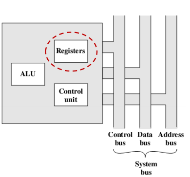
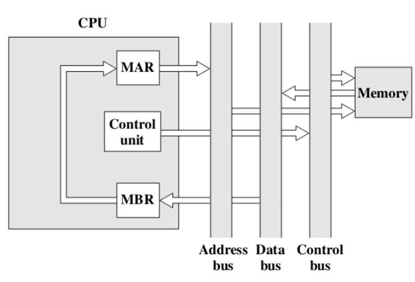
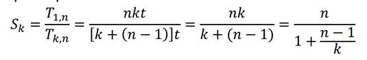

### CPU

1. **任务：**

   + 取指令
   + 解释指令（译码）
   + 取数据
   + 处理数据
   + 写数据

2. **需求：**CPU需要一个小的内部存储器 —— 寄存器

   

   

3. **寄存器组织：**

   + 用户可见寄存器：允许机器语言或汇编语言的编程人员通过优化寄存器的使用而减少对主存的访问。
   + 控制和状态寄存器：被控制器用来控制CPU的操作并被特权的操作系统程序用来控制程序的执行

4. **用户可见寄存器：**

   + 通用寄存器：可被程序猿指派各种用途。

   + 数据寄存器：仅可用于保持数据而不能用于操作数地址的计算

   + 地址寄存器：自身有某些通用性，或是专用于某种具体的寻址方式。

   + 段指针：在具有分段寻址的机器中，一个段寄存器保持着该段的基地址。可有多个段寄存器。

   + 变址寄存器：这些被用于变址寻址，并可能是自动变址的

   + 堆栈指针：若有用户可见的堆栈寻址方式，则一般是堆栈在存储器中，而CPU内有一专用的寄存器指向栈顶。这允许隐含寻址，即push,pop和其他堆栈指令不需要显式的含有堆栈操作数

   + 设计思路：

     + 到底该使用完全通用的寄存器，还是指定各寄存器的用途。
       + 对指定寄存器的使用，一个操作数指定器所引用的寄存器类型通常能隐含在操作码中，操作数指定器必须做的只是证实这一组指定寄存器中的某一个将被使用，而不是所有寄存器中的某一个，于是节省了位数，但是，这又限制了程序猿的灵活性。

     + 寄存器数量

       + 寄存器过多，要求操作数指定器的位数会变多。

       + 寄存器过少，导致更多的存储器访问。

     + 寄存器长度

       + 寄存器的长度至少要能保存最长的地址。数据寄存器赢能保存大多数数据类型的值，某些机器允许两个相邻的寄存器作为一个寄存器来保存两倍长度的值。

   + 条件代码（标志）：

     + 至少部分用户可见。

     + CPU硬件设置这些条件位作为操作的结果。
     + 条件代码位被收集到一个或者多个寄存器当中，一般，它们构成控制寄存器的一部分。通常，机器指令允许这些位以隐含引用的方式独处，但是它们不能被程序猿更改。

   + 储存及恢复：

     + 子例程的调用会自动储存所有寄存器，并自动恢复。
     + 程序员要在子例程调用前储存用户可见的内容。

5. **控制和状态寄存器：**

   + 这类寄存器在CPU中起着控制操作的作用。它们中的大多数，在大多数的机器上，是用户不可见的。某些对于控制或操作系统模式下执行的机器指令是可见的。

   + 程序计数器(PC) ：含有待取指令的地址，每次指令取完，一般情况下PC会被更新为下一条指令地址。

   + 指令寄存器(IR)：含有最近取来的指令，取来的指令被存进IR中，并进行译码。

   + 存储地址寄存器(MAR) ： 含有存储器位置的地址，MAR与地址总线直接相连

   + 存储缓冲寄存器(MBR) ：

     + 含有将被写入存储器的数据字或者最近读出的字。MBR与数据总线以及用户可见寄存器之间相连，并可交换数据 
     + ALU与MBR以及用户可见寄存器直接相连。

   + 程序状态字(PSW)：

     + 一般含有条件代码加上其他状态信息。普遍包括下列字段或标志：

     + 符号：容纳最后算数运算结果的符号位
+ 零： 当结果是零时被置位
     + 进位：若操作导致最高位有向上的进位（加法）或结尾（减法）时被置位。
+ 等于：若逻辑比较的结果是相等，则置位。
     + 溢出：用于指示算数溢出。
+ 中断允许/禁止： 用于允许或者禁止中断
     + 监督：指出CPU是执行在监督模式下还是在用户模式中。某些特权的指令只能在监督模式下执行，某些存储器区域也只能在监督模式中被访问。

   + 一些其他的有关状态和控制的寄存器：

     + 一个指向存储器快（如，进程控制块）的指针，此块含有另外的状态信息。
   
     + 使用向量式中断的机器中，可能提供一个有中断向量寄存器。
   
     + 若堆栈用于实现某些功能，则需要有一个系统堆栈指针。
   
     + 一个页表指针用于虚拟存储器系统。
   
     + I/O操作控制方面也可能需要寄存器
   
   + 设计考虑
   
     + 操作系统支持。（某些类型的控制信息是专门为操作系统使用的。若CPU设计者对将要使用的操作系统有基本的了解，则寄存器组织可被扩展，而为此操作系统定制。）
   
     + 控制信息在寄存器和存储器之间的分配。
   
     + 普遍是将存储器最前面的几百或者几千字用于控制目的。设计者必须裁定多少控制信息应在寄存器中，多少应在存储器中。通常要在成本和速度之间进行权衡考虑。
   
6. **指令周期：**

   + 间址周期

     + 可把间接地址的取看成额外的一个指令子周期。

     + 取来一条指令之后，要对它进行检查以确定是否需要间接寻址，如果是，则所要求的操作数使用间接寻址方式取来。在执行之后，可能有一个中断在取下一条指令之前执行完。

       

       

   + 数据流

     + 假定一个CPU，它有一个存储地址寄存器（MAR），一个存储缓冲寄存器（MBR)，一个程序计数器（PC），一个指令寄存器（IR）
     + 取指周期：
       + PC中存有待取的下一条指令的地址，该地址呗传送到MAR后放在地址总线。
       + 控制器请求一次存储器读，其结果放到数据总线并复制到MBR，然后传送到IR。
       + 在此期间 PC+1

     

     + 间址周期：

       + 控制器检查IR中内容，确定是否有一个使用间址寻址的操作数指定器。若是，则完成一个间址周期。

       + MBR最右N位是一个地址引用，被传送到MAR，后方到地址总线。控制器请求存储器读，得到所要求的操作数地址并送入MBR。

     

     + 中断周期：
       + PC的内容传送到MBR，并被写入存储器。为此目的，一个专门的存储器位置由控制器装入MAR。中断子程序的地址装入PC。结果是，下一指令周期将以此相应的指令开始。

     

7. **指令流水线：**

   + 流水线策略：一个产品经过几个制作步骤。通过把制作过程安排在一条装配线上，产品能在各个阶段同时被加工，这种过程被称为流水处理。
   
+ 事实上，指令的指令也是可以被分成几个步骤的。
  
+ 将指令处理分为两个阶段：取指令和执行指令。
  
     + 在一条指令执行期间，有主存未被存取的时间。这个时间能用于取下一条指令，从而这个取与当前指令的执行并行工作。
     + 可能的问题：
       + 执行的时间一般要长于取时间。于是，取指阶段可能必须等待一定的时间才能排空它的缓冲器。
    + 条件转移指令使得待取的下一条指令的地址是未知的。于是，取指阶段必须等待它由执行阶段得到下一条指令地址。而在取下一条指令时执行阶段又可能必须等待。
   
+ 将指令处理分为6个阶段
  
  + 取指令（FI）：读下一个预期的指令到缓冲器
  
  + 译码指令（DI）：确定操作码和操作数指定器
  
  + 计算操作数（CO）：计算每个源操作数的有效地址，这可能涉及到偏移、寄存器间接、间接或其他形式的地址计算。
  
  + 取操作数（FO）：由存储器取每个操作数。寄存器中的操作数不需要取
  
  + 执行指令（EI）：完成指定的操作。若有指定的目标操作数位置，则将结果写入此位置
  
     + 写操作数（WO）：将结果存入存储器。
  
     + 问题与一些限制：
    + 不是所有的指令都可以被分为6个阶段
       + 不是所有的阶段都可以并行处理（如同时需要对内存进行存取）
    + 6个阶段所需要的时间不等价，会有一定的等待
       + 条件转移会导致一些指令的作废
    + 中断
  
+ 流水线性能
  
     + Ti = 流水第i段的电路延迟时间
     
     + Tm= 最大段延迟（通过延时最长段的延迟）
     
     + k = 指令流水线段数
     
     + d = 锁存延时 （数据和信号送到下一段所需要的锁存接收时间）
     
       
     
     + 通常情况下，延迟d等于时钟脉冲的宽度切tm>>d。 假设现在有n条指令在进行，无转移发生。那么执行所有n条指令所需要的时间是：
     
       
     
     + 所以加速比
     
       
     
     + 误解：指令流水的段数越多，处理时间越快。
     
     + 错误的原因：
     
       + 每个阶段都有涉及缓冲器间移动数据和各种准备和传送命令的花销
       + 处理逻辑会变得更加复杂

8. **冒险 Hazard：**

   + 在一些情况下指令流水会堵塞，后面的指令不能被正确的执行。

   + 分类：

     + 结构冒险/硬件资源冲突
     + 数据冒险
     + 控制冒险

   + 结构冒险：

     +  原因：同一个设备被不同的指令使用

     +  一个设备在一个指令中只被使用一次，使用多个不同的设备。

   + 数据冒险：

     + 原因：指令需要的数据还未产生

     +  解决方法：
       + 嵌入无操作指令
       + 暂停当前指令执行，直到数据产生
       + 转发/绕过
       + 调整指令顺序

   + 控制冒险：

     + 指令执行顺序被改变
     + 原因：
       + 转移指令：条件转移，循环…
       + 中断
       + 异常
       + 调用/返回

     + 处理方法：
       + 多指令流：复制流水线的初始部分，并允许流水线同时取条件分支的两条指令，使用两个指令流。
       + 预取转移目标：识别出一个条件转移指令时，除了取此转移指令之后的指令外，转移目标处的指令也被取来。
       + 循环缓冲器：在流水线指令取阶段维护一个小的但极高速的存储器，含有n条最近取来的顺序指令。
       + 延迟转移：自动重排程序中的指令，以致一条转移指令出现在实际所要求的位置之后。
       + 转移预测：
         1. 猜测绝不发生
         2. 猜测总是发生
         3. 依操作码预测：根据转移指令的操作码进行判定。处理器假定对某些条件转移指令的操作码将总是发生转移，对另外一些总是不发生。
         4. 发生和不发生切换
         5. 转移历史表

