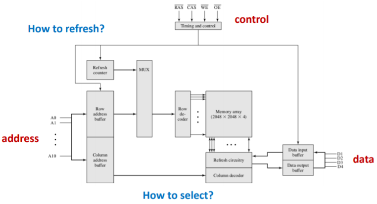

## Memory

### 存储器

1. 由一定数量的单元构成，每个单元可以被唯一标识，每 个单元都有存储一个数值的能力
2. **地址：**单元的唯一标识符（采用二进制）  
3. **地址空间：**可唯一标识的单元总数 
4. **寻址能力：**存储在每个单元中的信息的位数 
5. 大多数存储器是字节寻址的，而执行科学计算的计算机通 常是64位寻址的

## 半导体储存器 Semiconductor Memory

### 储存单元 Memory cell

1. **定义：**半导体储存器的基本元件。
2. **特性：**
   + 表现两种稳定的状态，也就是 0 或 1 。
   + 可以被写，就是设置状态。
   + 可以被读，就是感应状态。

### RAM (Random-Access Memory 随机访问存储器)

1. **特性：**
   + 可以简单迅速地读取和写入数据
   + 易失性(volatile)
2. **类型：**
   + DRAM(Dynamic RAM,动态随机访问存储器):电容存储 需要刷新
   +  SRAM(Static RAM,静态随机访问存储器):门
3. **DRAM(Dynamic RAM 动态随机访问存储器)：**
   + 将数据存于电容器，电容充电则表示 1 ，否则为 0 。
   + 因为存在电容中电回流失，需要定期充电来刷新。
4. **SRAM(Static RAM 静态随机访问存储器)：**
   + 将数据存在传统的逻辑门中。
   + 只要电还在就能一直保存数据。
5. **DRAM与SRAM的比较：**
   + 相同
     + 易失性(volatile)，所以电源需要持续供给。
   + 不同
     + DRAM更小更方便，也更便宜，所以在需要大容量时应用比较多。
     + DRAM需要电力刷新。
     + SRAM速度更快。
     + SRAM被用在cache，DRAM被用在主存(main memory)。
6. **Synchronous DRAM (SDRAM)：**
   + 传统的DRAM受到内部结构与内存总线接口的限制。
   + 传统DRAM是异步的
     + 处理器将控制级别与地址给内存，指示读或写到DRAM里。
     + DRAM必须处理很多事，而处理器要等他。
     + 之后，才能进行读或写。
   + SDRAM增加一个同步时钟，在运行好了之后再通知处理器读或写数据。
7. **Double-data-rate SDRAM (DDR SDRAM)：**
   + 在一个时钟周期内发送数据两次，一次在时钟脉冲的上升边缘、一次在下降边缘。
   + DDR, DDR2 和 DDR3 的比较：
     + 增加操作频率。
     + 增加预取缓冲区。

### ROM (Read-Only Memory 只读存储器)

1. **特性：**

   + 非易失性(Nonvolatile)

   + 可读取但是不可写入数据

2. **应用：**

   + 微编程、系统程序、函数表

3. **问题：**

   + 无出错空间，成本高。

4. **PROM(Programmable ROM 可编程只读存储器)：**

   + 特性
     + 非易失性(Nonvolatile)
     + 只能写入一次，需电写入并且需要特殊的环境。

   + 与ROM的区别
     + 更加灵活方便
     + ROM仍然对大批量生产有吸引力。

### Read-Mostly Memory

1. **特性：**
   + 读的次数比写的次数多很多
   + 非易失
2. **EPROM(Erasable PROM 可擦除编程只读存储器)：**
   + 特性
     + 可用电读写   
     + 紫外线擦除整块（需要20分钟）
     + 比PROM更贵，但是它能被升级多次。
3. **EEPROM(Electrically EPROM, 可电擦除编程只读存储器)：**
   + 特性
     + 可写入并且无需擦除数据。
     + 可按字节写入（覆盖）。
     + 每个字节的写操作要花数百微秒。
     + 比EPROM擦除速度快但造价更高。
4. **Flash Memory(闪存)：**
   + 特性
     + 电擦除（只需几秒，比EPROM更快）
     + 可擦除几块，比擦除几字节的EEPROM效率高。
     + 集成度高（跟EEPROM比）。
     + 成本和功能性在 EPROM 和 EEPROM中间。

### 集成

1. **寻址单元(Addressing Unit)：**
   + 含同样类型的几个位元
   + 寻址模式：字(Byte)（更加常见）、字节(Word)
   + 存储阵列：线的复用、先行后列

2. **地址解码器(Address Decoder)：**
   + n个解码器就有2^n个输出。
   + n-bit输入的值是 i，则第 i 个输出是1。
   + 任何情况下，只有一个输出1，其他为0。
3. **刷新(Refreshing)：**
   + 集中刷新(Centralized Fresh)      
     + 停止读写，集中刷新
     + 会有一段时间停止工作：死区
   + 分散刷新(Decentralized Fresh)
     + 在读或写后刷新。
     + 不会出现死区但是时间过长
   + 异步刷新(Asynchronous Fresh) 
     + 每64ms全部线刷新一次。
     + 高效。

4. **芯片的引脚：**

   + Address/Data/Vcc(power supply)/Vss(ground pin)/CE(chip enable)/Vpp(program voltage)
   + WE(write enable)/OE(output enable)/RAS(row address select)/CAS(column address select)

5. **模块的扩展：**
+ 位扩展：
   
  + 增加数据量。
   
  + 地址线数量不变，数据线数量增加
     + 例如：使用8个 4K\*1的芯片来组成4K\*8的芯片
   
+ 字扩展：
     + 增加寻址空间
     + 地址线数目增加
     + 数据线数目不变
     + 例如：使用 4个16K\*8bit的芯片组成64K\*8bit的主存
     + 内存是字扩展
     + 主存 = RAM + ROM    
     + 主存大小 = RAM 大小

