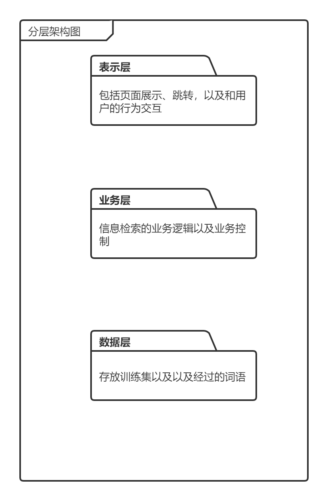
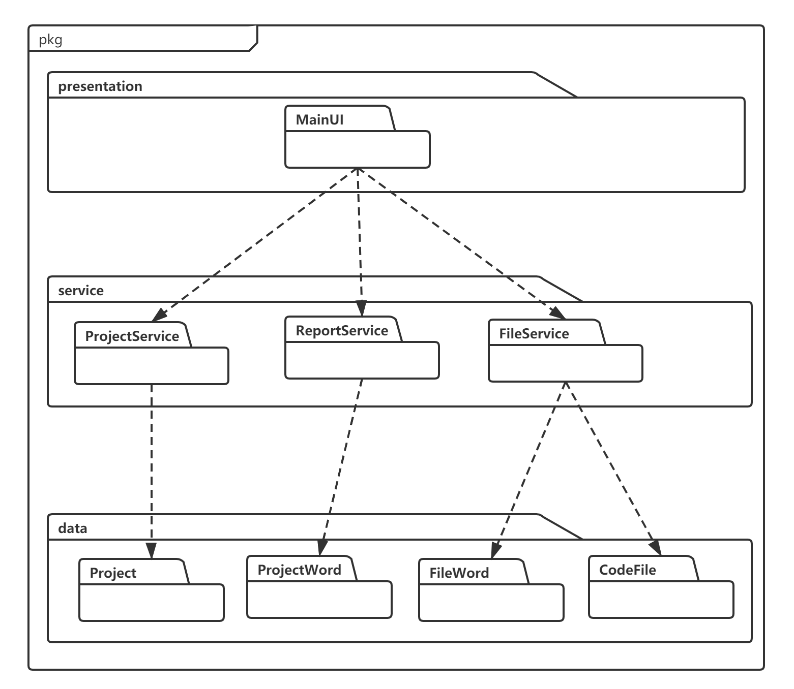
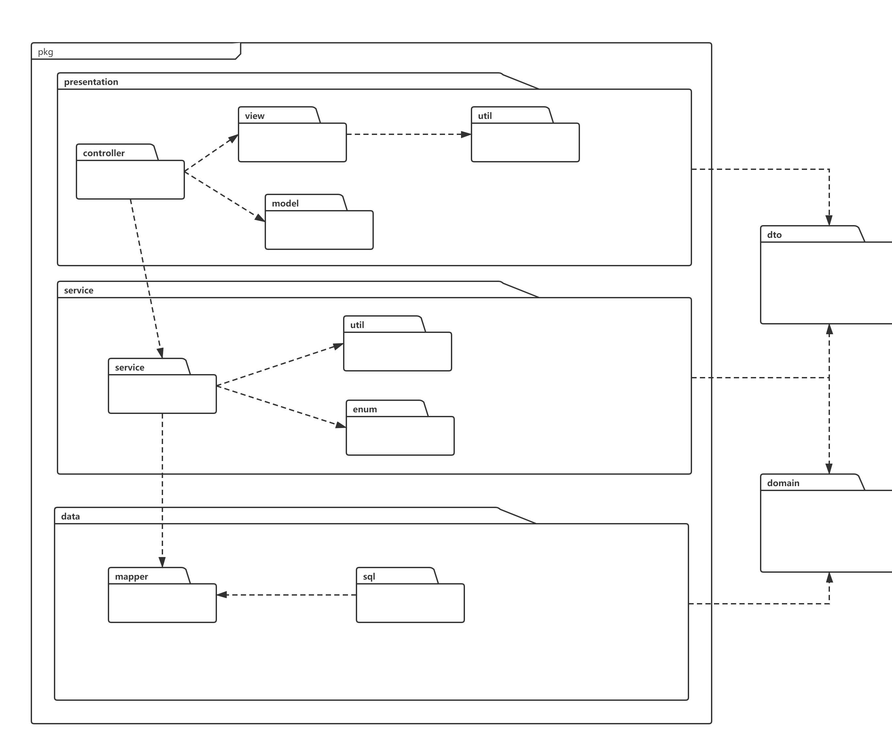
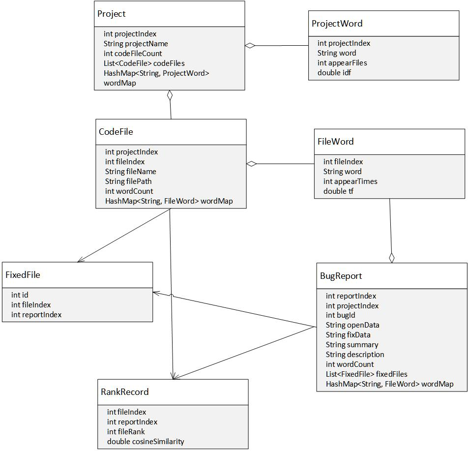

# 项目设计文档

#### 创建者：刘育麟

#### 创建时间：2021年3月7日

#### 文档修改记录

|     时间     | 操作者 | 修改内容 | 版本号 |
| :----------: | :----: | :------: | :----: |
| 2021年3月9日 | 刘育麟 | 创建文档 |  v1.0  |

## 1. 引言

### 1.1 编写目的

本文提供IRBL的软件架构概览，采用若干架构师图描述系统的不同方面，以便表示构造系统所需要的重要架构决策。

### 1.2 对象与范围

本文档的读者是IRBL团队内部的开发和管理人员，参考了RUP的《软件架构文档模版》，用于指导下一循环的代码开发和测试工作。

### 1.3 参考文献

《软件需求规格说明书》
《软件架构文档模版》

### 1.4 名词与术语

IRBL：基于信息检索的缺陷定位（Information Retrieval Based Bug Localization）

### 1.5 目录结构

#### 1.5.1 树状图

```
backend
├───sql
├───src
    ├───main
        ├───java
        │   └───team
        │       └───software
        │           └───irbl
        │               ├───controller
        │               ├───domain
        │               ├───dto
        │               ├───enum
        │               ├───mapper
        │               ├───service
        │               └───util
        └───resources
            ├───static
            └───templates
```

#### 1.5.2 包名解析

##### controller

接口层，用户访问请求时对接。

##### domain

用于放置这个系统中，与数据库中的表，一一对应起来的JavaBean的

##### dto

数据传输对象(Data Transfer Object)的缩写。 DTO模式，是指将数据封装成普通的JavaBeans，在J2EE多个层次之间传输。  DTO类似信使，是同步系统中的Message。 该JavaBeans可以是一个数据模型Model。  

##### enum

枚举类型存储位置。

##### mapper

Mybatis中与数据库交互的接口

##### service

业务层。顾名思义，它处理逻辑上的业务，而不去考虑具体的实现。

##### util

存放工具类。

##### sql

存放数据库初始化的sql文件。

## 2. 逻辑视角

### 2.1 分层架构图



### 2.2 逻辑包图



## 3. 组合视角

### 3.1 物理包的划分

| 开发包     | 依赖的开发包 |
| ---------- | ------------ |
| view       |              |
| model      |              |
| dto        | view         |
| controller | model、view  |
| service    | controller   |
| mapper     | domain       |
| util       |              |
| enum       |              |
| domain     |              |
| sql        | domain       |

### 3.2 物理包图



## 4. 接口视角

### 4.1模块的职责

| 模块      | 职责                            |
| --------- | ------------------------------- |
| component | 界面Frame，负责界面的显示和跳转 |

| 模块            | 职责             |
| --------------- | ---------------- |
| CodeFileService | 代码文件相关服务 |
| ProjectService  | 项目相关服务     |
| ReportService   | 缺陷报告相关服务 |

| 模块           | 职责             |
| -------------- | ---------------- |
| CodeFileMapper | 处理代码文件数据 |
| ProjectMapper  | 处理项目文件数据 |
| ReportMapper   | 处理缺陷报告数据 |

### 4.2模块的接口规范

#### 4.2.1 用户界面模块的分解

##### 需要的服务（需接口）

| 服务名                                    | 服务                                         |
| ----------------------------------------- | -------------------------------------------- |
| CodeFileService.readFile                  | 读取文件内容                                 |
| CodeFileService.getSortedFiles            | 读取指定缺陷报告下按相似度降序排列的文件列表 |
| ProjectService.getIndicatorEvaluation     | 获取指定项目的评估指标                       |
| ReportService.getAllReportsByProjectIndex | 读取指定项目下的所有缺陷报告列表             |

#### 4.2.2 业务逻辑模块的分解

##### 提供的服务（供接口）

| 服务名                                    | 语法                                                   | 前置条件       | 后置条件                                                     |
| ----------------------------------------- | ------------------------------------------------------ | -------------- | ------------------------------------------------------------ |
| CodeFileService.readFile                  | FileContent readFile(Integer fileIndex)                | 传入参数不为空 | 如果网络连接正常并且数据库里面有数据，则返回文件内容         |
| CodeFileService.getSortedFiles            | List\<File> getSortedFiles(Integer reportIndex)        | 传入参数不为空 | 如果网络连接正常并且数据库里面有数据，则返回指定缺陷报告下按相似度降序排列的文件列表 |
| ProjectService.getIndicatorEvaluation     | Indicator getIndicatorEvaluation(Integer projectIndex) | 传入参数不为空 | 如果网络连接正常并且数据库里面有数据，则返回指定项目的评估指标 |
| ReportService.getAllReportsByProjectIndex | List\<Report> getAllReportsByProjectIndex              | 传入参数不为空 | 如果网络连接正常并且数据库里面有数据，则返回指定项目下的所有缺陷报告列表 |

##### 需要的服务（需接口）

| 服务名            | 服务         |
| ----------------- | ------------ |
| BugReportMapper   | 获取缺陷报告 |
| CodeFileMapper    | 获取代码文件 |
| FileWordMapper    | 获取文件     |
| FixedFileMapper   | 获取缺陷报告 |
| ProjectMapper     | 获取项目信息 |
| ProjectWordMapper | 获取项目字段 |
| RankRecordMapper  | 获取排名记录 |

#### 4.2.3网络数据模块的分解

##### 提供的服务（供接口）

| 服务名            | 语法 | 前置条件       | 后置条件                                                     |
| ----------------- | ---- | -------------- | ------------------------------------------------------------ |
| BugReportMapper   | 继承自Mybatis-plus提供的BaseMapper,包括基本数据库操作     | 存在与数据库中表对应的BugReport实体类，且传入正确查询条件或实体列表 | 如果网络连接正常并且数据库里存在bug_report表，则返回增删改查结果 |
| CodeFileMapper    | 继承自Mybatis-plus提供的BaseMapper,包括基本数据库操作     | 存在与数据库中表对应的CodeFile实体类，且传入正确查询条件或实体列表 | 如果网络连接正常并且数据库里存在code_file表，则返回增删改查结果 |
| FileWordMapper    | 继承自Mybatis-plus提供的BaseMapper,包括基本数据库操作     | 存在与数据库中表对应的FileWord实体类，且传入正确查询条件或实体列表 | 如果网络连接正常并且数据库里存在file_word表，则返回增删改查结果 |
| FixedFileMapper   | 继承自Mybatis-plus提供的BaseMapper,包括基本数据库操作     | 存在与数据库中表对应的FixedFile实体类，且传入正确查询条件或实体列表 | 如果网络连接正常并且数据库里存在fixed_file表，则返回增删改查结果 |
| ProjectMapper     | 继承自Mybatis-plus提供的BaseMapper,包括基本数据库操作     | 存在与数据库中表对应的Project实体类，且传入正确查询条件或实体列表   | 如果网络连接正常并且数据库里存在project表，则返回增删改查结果  |
| ProjectWordMapper | 继承自Mybatis-plus提供的BaseMapper,包括基本数据库操作     | 存在与数据库中表对应的ProjectWord实体类，且传入正确查询条件或实体列表 | 如果网络连接正常并且数据库里存在project_world表，则返回增删改查结果 |
| RankRecordMapper  | 继承自Mybatis-plus提供的BaseMapper,包括基本数据库操作     | 存在与数据库中表对应的RankRecord实体类，且传入正确查询条件或实体列表  | 如果网络连接正常并且数据库里存在rank_record表，则返回增删改查结果 |

## 5. 信息视角

### 5.1 domain定义



## 6. pipeline脚本

```
def GetRemoteServer(ip){
    def remote = [:]
    remote.name = 'remoteServer'
    remote.host = ip
    remote.port = 22
    remote.user = 'root'
    remote.password = 'chenganchun.0811'
    remote.allowAnyHosts = true
    return remote
}

pipeline {
    agent any
    stages {
        stage('Clone to master') {
            agent {
                label 'master'
            }
            steps {
                echo "1. Git Clone Stage"
                git credentialsId: '79d2c1e6-d63c-4284-bd1f-6b4f1dfe7f56', url: "http://212.129.149.40/181250010_irbl/backend.git", branch: "release"
            }
        }
        /*stage('change yml file properties'){
            steps{
                sh """
                   rm -f src/target/IRBL-0.0.1-SNAPSHOT.jar
                   sed -i 's/root/visitor/g' ${WORKSPACE}/src/main/resources/application.yml
                   sed -i 's/#password: fill it in application-dev.yml/password: mysql@irbl/g' ${WORKSPACE}/src/main/resources/application.yml
                   sed -i 's/com.mysql.cj.jdbc.Driver/com.mysql.jdbc.Driver/g' ${WORKSPACE}/src/main/resources/application.yml
                   sed -i 's/localhost:3306/101.132.253.222/g' ${WORKSPACE}/src/main/resources/application.yml
                   """
            }
        }
        stage('change path'){
            steps{
                sh """
                   sed -i 's#ROOT_PATH.*#ROOT_PATH = "~/data/";#g' ${WORKSPACE}/src/main/java/team/software/irbl/util/SavePath.java
                   """
            }
        }*/
        stage('Maven Build') {
            agent {
                docker {
                    image 'maven:latest'
                    args '-v /root/.m2:/root/.m2 -v /report:/report'
                }
            }
            steps {
                echo "2. Maven Build Stage and Unit Test"
                sh 'mvn clean package -Dmaven.test.skip=true'
                sh 'mvn test jacoco:report'
                //sh 'apt-get install sshpass'
                //sh 'sshpass -p chenganchun.0811 scp -r target/site/jacoco root@101.132.253.222:~'
                sh 'mkdir -p /report'
                sh 'cp -r target/site /report/ && rm -rf target/site'
            }
        }
        stage('Image Build') {
            agent {
                label 'master'
            }
            steps {
                echo "3. Image Build Stage"
                sh 'docker build -f Dockerfile --build-arg jar_name=target/IRBL-0.0.1-SNAPSHOT.jar -t irbl:${BUILD_ID} . '
                sh 'docker tag irbl:${BUILD_ID} 101.132.148.43/backend/irbl:${BUILD_ID}'

            }

        }
        stage('Push') {
            agent {
                label 'master'
            }
            steps {
                echo "4. Push Docker Image Stage"
                sh "docker login -u admin -p Harbor12345@irbl 101.132.148.43"
                sh "docker push 101.132.148.43/backend/irbl:${BUILD_ID}"
            }
        }
        stage('Pull and Run'){
            agent {
                label 'master'
            }
            steps {
                echo "5. Login Docker Image Stage"
                script{
                    remoteServer = GetRemoteServer('101.132.253.222')
                    sshCommand remote: remoteServer, command: "docker login -u admin -p Harbor12345@irbl 101.132.148.43"
                }
                echo "6. Push Docker Image Stage"
                script{
                    sshCommand remote: remoteServer, command: "docker pull 101.132.148.43/backend/irbl:${BUILD_ID}"
                }
                echo "7. Run Docker Image Stage"
                script{
                    sshCommand remote: remoteServer, command: "docker run --rm -it -p 40000:40000 --link db:mysql --name irbl-backend -d 101.132.148.43/backend/irbl:${BUILD_ID}"
                }
            }
        }

    }
}
```

