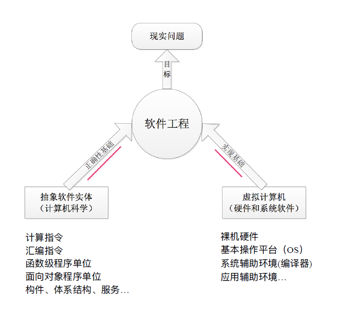
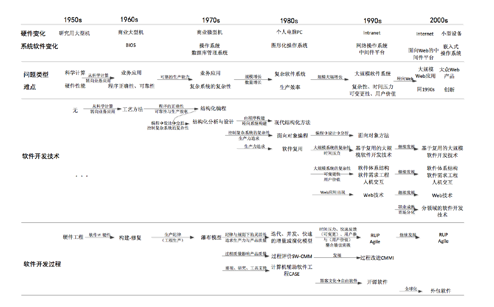
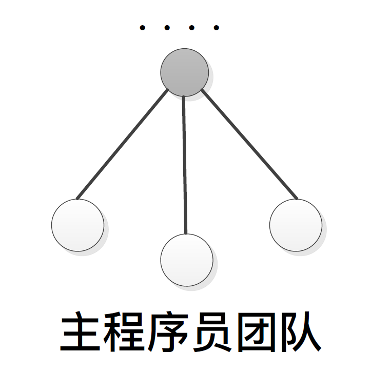
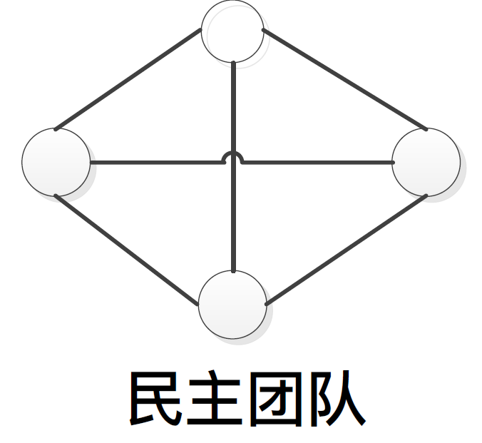
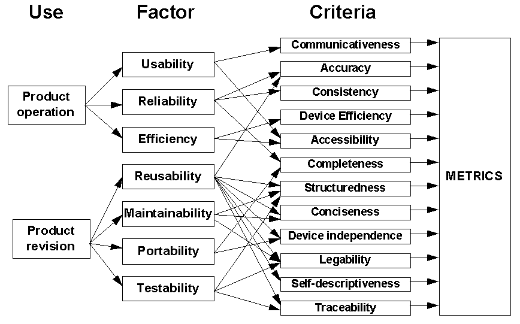
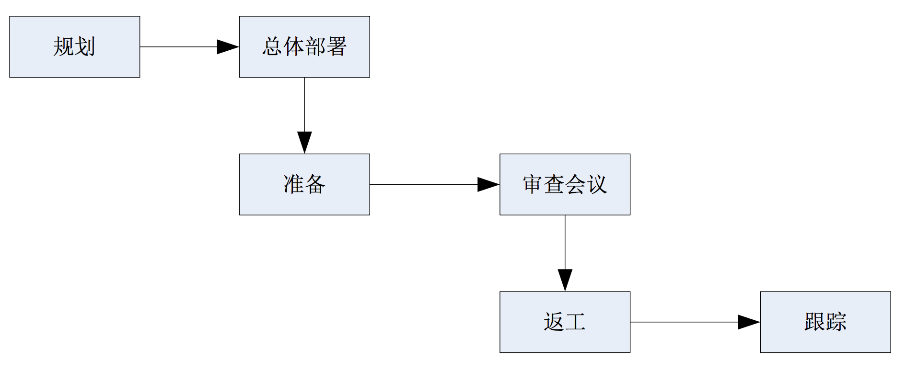
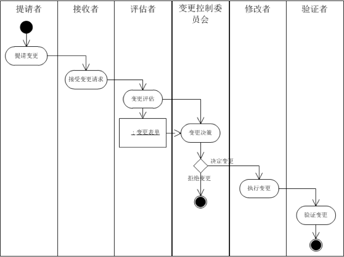

# 软件工程

## 01 - 基础

### 什么是软件？

+ Software is independent of hardware
+ Software is a tool
+ Software = programs + documents + data + knowledge
+ Software development is much more complicated than programming
+ Application software originate from the reality, and reversely improve the reality

### 什么是软件工程？

+ The application of a systematic, disciplined, quantifiable approach to the development, operation, and maintenance of software; that is, the application of engineering to software.
+ The study of approaches as in （1）

### 软件工程理解

+ 软件⼯程是⼀种⼯程活动
+ 软件⼯程的动机是解决实际问题
+ 软件⼯程是科学性、实践性和⼯艺性并重的
+ 软件⼯程追求⾜够好，不是最好
+ 软件⼯程真正的产品是基于虚拟计算机的软件⽅案
+ 软件⼯程的最终⽬的是要促进整个社会的进步

### 角色分工

+ 需求⼯程师，⼜被称为需求分析师：

  + 承担需求开发任务。软件产品的需求开发⼯作通常由多个需求⼯程师来完成，他们共同组成⼀个需
    求⼯程师⼩组，在⾸席需求⼯程师的领导下开展⼯作。通常⼀个团队只有⼀个需求⼯程师⼩组。
+ 软件体系结构师：

  + 承担软件体系结构设计任务。通常也是由多⼈组成⼀个⼩组，并在⾸席软件体系结构师的领导下开
    展⼯作。通常⼀个团队只有⼀个软件体系结构师⼩组。
+ 软件设计师：
    + 承担详细设计任务。在软件体系结构设计完成之后，可以将其部件分配给不同的开发⼩组。开发⼩
      组中负责所分配部件详细设计⼯作的⼈员就是软件设计师。⼀个团队可能有⼀个或多个开发⼩组。
      ⼀个⼩组可能有⼀个或多个软件设计师。

+ 程序员：
  + 承担软件构造任务。程序员与软件设计师通常是同⼀批⼈，也是根据其所分配到的任务开展⼯作。
+ ⼈机交互设计师：
  + 承担⼈机交互设计任务。⼈机交互设计师与软件设计师可以是同⼀批⼈，也可以是不同⼈员。在有
    多个⼩组的软件⼯程团队中，可以有⼀个单独的⼈机交互设计师⼩组，也可以将⼈机交互设计师分
    配到各个⼩组。
+ 软件测试⼈员：
  + 承担软件测试任务。软件测试⼈员通常需要独⽴于其他的开发⼈员⻆⾊。⼀个团队可能有⼀个或多
    个测试⼩组。⼀个⼩组可能有⼀个或多个软件测试⼈员。

+ 项⽬管理⼈员：
  + 负责计划、组织、领导、协调和控制软件开发的各项⼯作。相⽐于传统意义上的管理者，他们不完全是监控者和控制者，更多得是协调者。通常⼀个团队只有⼀个项⽬管理⼈员。
+ 软件配置管理⼈员：
  + 管理软件开发中产⽣的各种制品，具体⼯作是对重要制品进⾏标识、变更控制、状态报告等。通常⼀个团队只有⼀个软件配置管理⼈员。
+ 质量保障⼈员：
  + 在⽣产过程中监督和控制软件产品质量的⼈员。通常⼀个团队有⼀个质量保障⼩组，由⼀个或多个⼈员组成。
+ 培训和⽀持⼈员：
  + 负责软件移交与维护任务。他们可以是其他开发⼈员的⼀部分，也可以是独⽴的⼈员。
+ ⽂档编写⼈员：
  + 专⻔负责写作软件开发各种⽂档的⼈员。他们的存在是为了充分利⽤部分宝贵的⼈⼒资源（例如需求⼯程师和软件体系结构师），让这些⼈⼒资源从繁杂的⽂档化⼯作中解放出来。

### 软件工程三要素

+ 问题出现 -> 找理论
+ 更强表征能力 -> 解决更多问题
+ 技术进步 -> 更丰富表征能力

## 02 - 发展

### 软件工程历史

+ （老师的那100多页ppt想看就看吧）

## 04 - 项目启动

### 项目

+ 项⽬是具有下列特征的⼀系列活动和任务[Kerzner2009]：
  + 具有⼀个明确的⽬标；
  + 有限定的开始和结束⽇期；
  + 有成本限制；
  + 消耗⼈⼒和⾮⼈⼒资源；
  + 多⼯种合作。

### 项目管理

+ 项⽬管理的⽬标是做到以下⽅⾯：
  + 在限定时间内；
  + 在⼀定的成本内；
  + 在要求的质量⽔平上；
  + ⾼效使⽤资源；
  + 获得客户认可。

### 团队

+ 将团队定义为：为了⼀致的⽬的、绩效标准、⽅法⽽共担责任并且技能互补的少数⼈。
  + 团队成员要具备共同的⽬标。
  + 团队成员要共担责任。
  + 团队成员要技能互补。
  + 团队内部要有⼀个明确的结构。

### 团队类型

+ 容易变但程序员模式

+ 容易陷入僵局

### 质量模型

+ 功能性
+ 可靠性
+ 易⽤性
+ 效率
+ 可维护性
+ 可移植性

### 评审工作

### 质量度量

+ 度量产⽣⾃统计控制（Statistical Control）思想。“你不能控制⾃⼰⽆法度量的东⻄”[DeMarco1998]。
  + 测度（Measure）就是为了描述软件产品⽽提供的定量指标。
    + 代码⾏数
  + 进⾏测度的活动被称为测量（Measurement）。
  + 度量（Metric）是软件产品在特定属性上的量化测度程度。
    + 例如基于所有对象的代码⾏数测度可以建⽴平均代码⾏数、最⼤代码⾏数、最⼩代码⾏数

### 配置管理

+ ⽤技术的和管理的指导和监督⽅法，来标识和说明配置项的功能和物理特征，控制对这些特征的变更，记录和报告变更处理及其实现状态，并验证与规格需求的⼀致性。
+ 配置管理活动
  + 标识配置项
  + 版本管理
  + 变更控制
  + 配置审计
  + 状态报告
  + 软件发布管理

### 配置项

+ 置于软件配置管理之下的软件配置的各种有关项⽬，包括各类管理⽂档、评审记录与⽂档、软件⽂档、源码及其可执⾏码、运⾏所需的系统软件和⽀持软件以及有关数据等

### 分支

+ 主分⽀（Master）
+ 开发分⽀（Develop）
+ 临时性分⽀
+ 功能（Feature）
+ 预发布（Release）
+ 修补bug（Fixbug）

### 变更控制

