# 软件模型

## 22 - 软件开发过程模型

### 软件开发各典型阶段

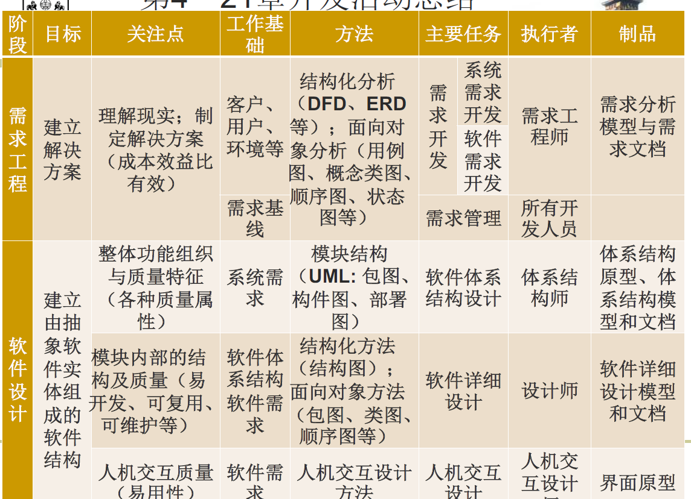

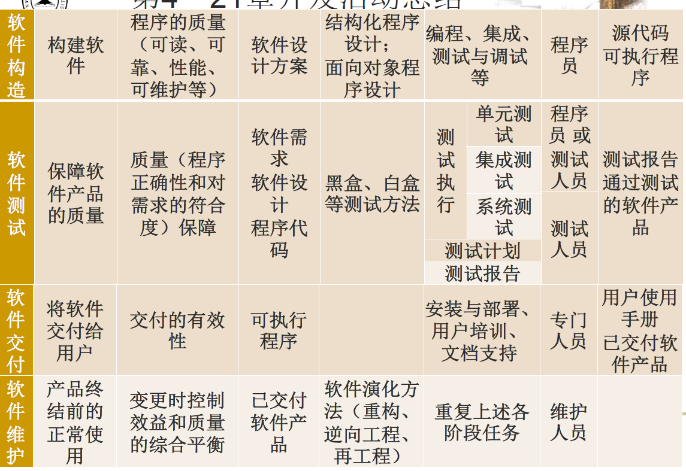

### 软件生命周期

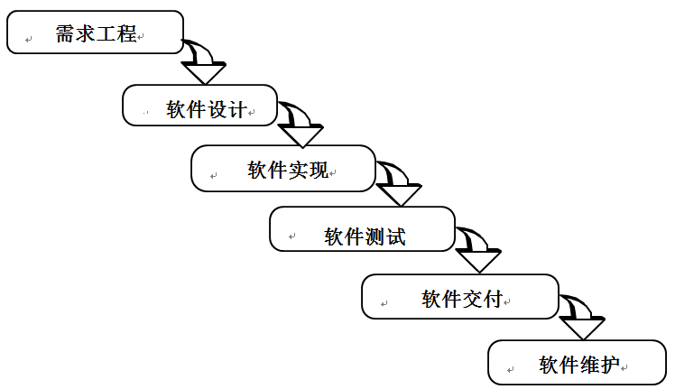

### 构建-修复模型

+ 最早也是最自然产生的软件开发模型
+ 不能算是一个软件过程模型，因为它对软件开发活动没有任何规划和组织，是完全依靠开发人员个人能力进行软件开发的方式。

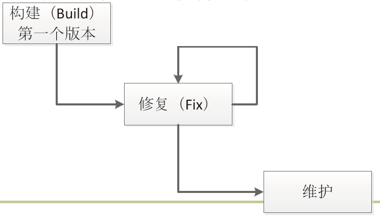

### 瀑布模型

+ 允许活动出现反复和迭代
+ 重点在于要求每个活动的结果必须要进行验证
+ 文档驱动：按照文档的划分、产生和验证来规划、组织和控制开发活动

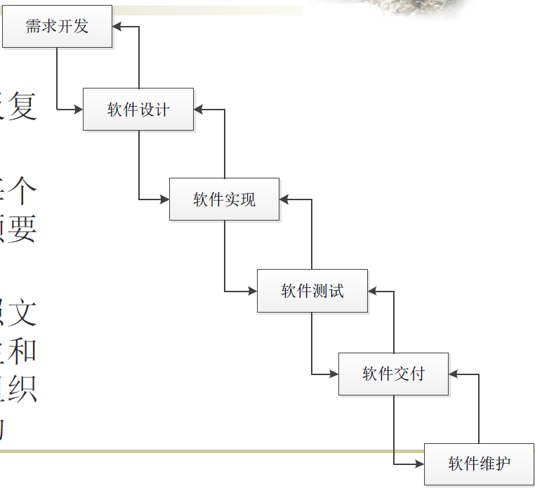

### 增量迭代模型

+ 增量迭代模型需要在项目早期就确定项目的目标和范围，项目需求要比较成熟和稳定
+ 少量的不确定性和影响不大的需求变更通过迭代的方式加以解决
+ 每个迭代的增量需求相对独立，被开发为产品的独立部分交付给用户
+ 第一个迭代完成的往往是产品的核心部门，满足基本的需求
+ 需求驱动：增量需求是增量迭代模型进行迭代规划、开发活动组织和控制的主要依据

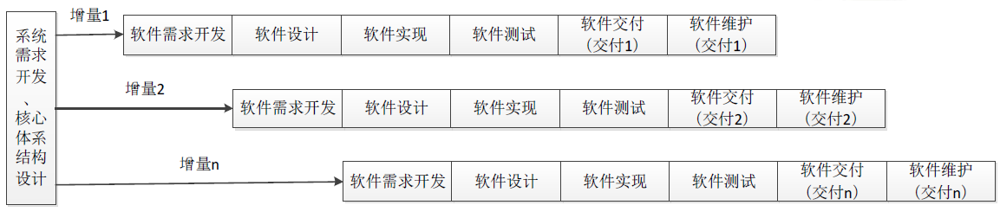

### 演化模型

+ 演化模型与增量迭代模型相比
  + 都是迭代、并行开发和渐进交付，都适合大规模软件开发
+ 演化模型能够更好地应对需求变更，更适用于需求变更比较频繁或不确定性较多的领域。
  + Ch21：演化模糊了维护与新开发的界限

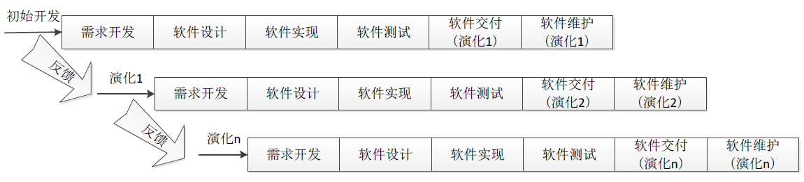

### 原型模型

+ 大量使用抛弃式原型解决需求不确定性的过程模型
+ 在抛弃式原型的帮助下，解决了不确定性之后，可以得到清晰的需求，此时再按照瀑布模型方式安排后续开发活动
+ 原型模型的基本特征是注重使用抛弃式原型，适用于不确定性较多的软件开发

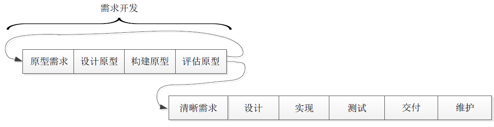

### 螺旋模型

+ 基本思想是尽早解决比较高的风险，如果有些问题实在无法解决，那么早发现比项目结束时再发现要好，至少损失要小得多。
+ 风险驱动，完全按照风险解决的方式组织软件开发活动。
  + 确定目标、解决方案和约束
  + 评估方案，发现风险
  + 寻找风险解决方法
  + 落实风险解决方案
  + 计划下一个迭代

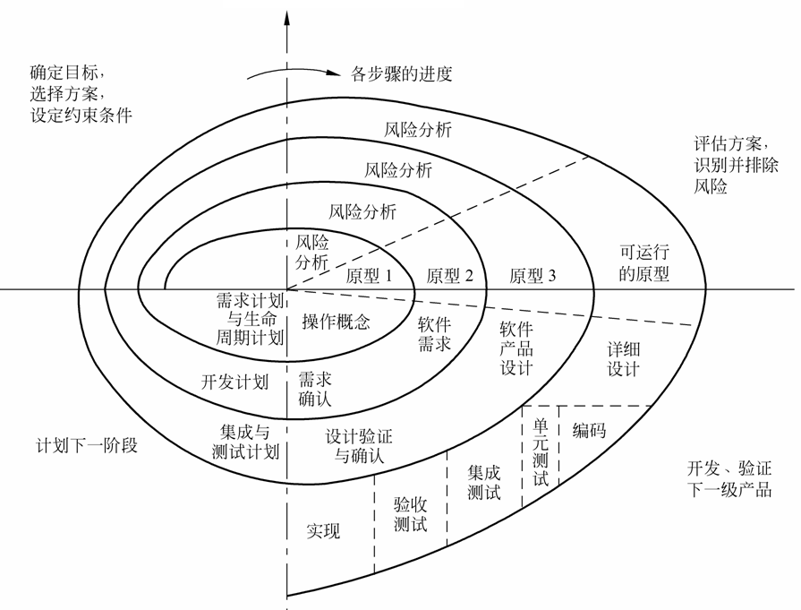

### Rational统一过程模型

+ 总结和借鉴传统上的各种有效经验，建立最佳实践方法的集合，并提供有效的过程定制手段，允许开发者根据特定的需要定制一个有效的过程模型。
+ 迭代式开发，这是过去被反复证明的最佳实践方法；
+ 管理需求，重视需求工程中除了需求开发之外的需求管理活动；
+ 使用基于组件的体系结构，它帮助建立一个可维护、易开发、易复用的软件体系结构；
+ 可视化建模，利用UML进行建模；
+ 验证软件质量，尽早和持续地开展验证，以尽早发现缺陷，降低风险和成本；
+ 控制软件变更，适应1990s以后需求变更越来越重要的事实。

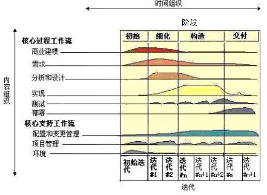

### 敏捷过程

+ 敏捷过程并不是要为软件开发活动组织提供一种特定的过程模型，而是倡导一些指导性的思想和原则
+ 最为重要的敏捷思想是敏捷联盟宣言所声明的价值观：
  + 个体和互动高于流程和工具
  + 工作的软件高于详尽的文档
  + 客户合作高于合同谈判
  + 响应变化高于遵循计划
+ 也就是说，尽管右项有其价值，敏捷方法更重视左项的价值。

## 23 - 软件工程职业基础

### 职业素质

+ 团队工作能力；
+ 交流沟通能力，包括与同事的交流，也包括与用户的交流；
+ 遵守职业的道德标准和操行规范；
+ 积极参与行业协会活动，遵守行业标准，推进行业发展；
+ 了解软件工程对社会、经济、法律等相关领域的影响、问题和观点。

### 知识体系

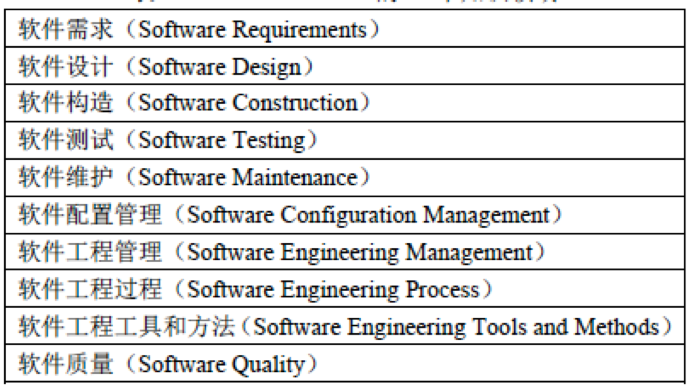

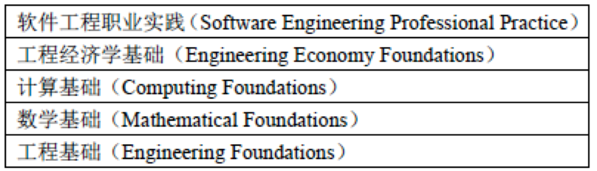

### 教育体系

+ 软件工程学科；
+ 指导原则；
+ SEEK；
+ SE教程设计与实施的指导原则；
+ 建议课程与课程顺序；
+ 对不同环境的适应；
+ 教育计划的实现与评价。

### 职业道德规范

1. PUBLIC - Software engineers shall act consistently with the public interest.
2. CLIENT AND EMPLOYER - Software engineers shall act in a manner that is in the best interests of their client and employer, consistent with the public interest.
3. PRODUCT - Software engineers shall ensure that their products and related modifications meet the highest professional standards possible.
4.  JUDGMENT - Software engineers shall maintain integrity and independence in their professional judgment.
5. MANAGEMENT - Software engineering managers and leaders shall subscribe to and promote an ethical approach to the management of software development and maintenance.
6. PROFESSION - Software engineers shall advance the integrity and reputation of the profession consistent with the public interest.
7. COLLEAGUES - Software engineers shall be fair to and supportive of their colleagues.
8. SELF - Software engineers shall participate in lifelong learning regarding the practice of their profession and shall promote an ethical approach to the practice of the profession.

### 认证体系

+ 教育鉴定
+ 职业认证
+ 从业执照

### 行业协会

+ 软件工程主要有两个专业协会提供支持：IEEE-CS（计算机学会）和ACM（ Association for Computing Machinery）。

### 行业标准

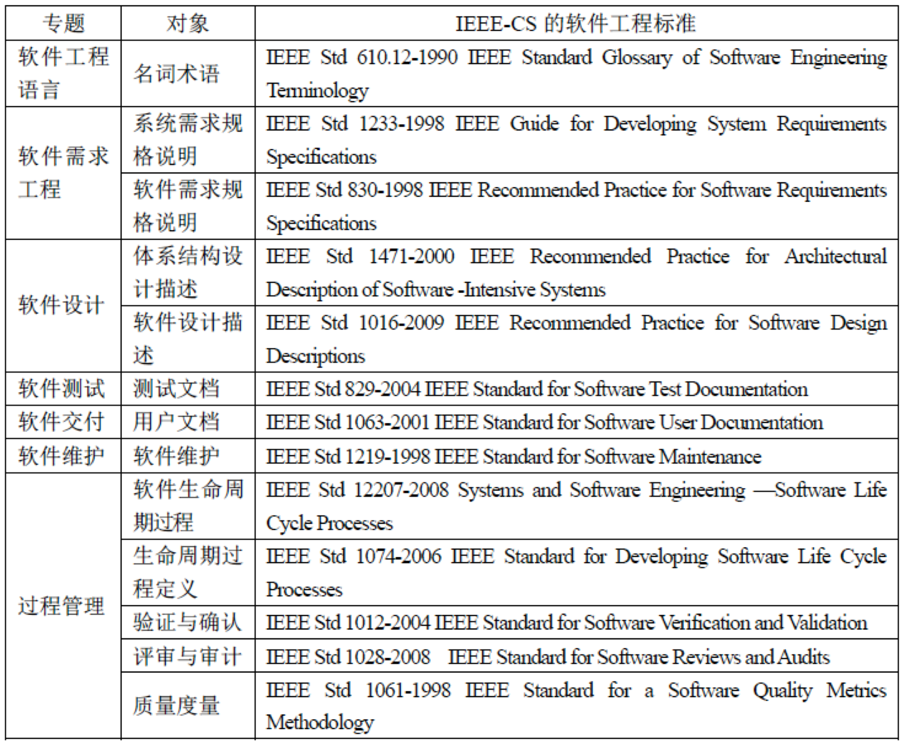