# 需求

## 05 - 基础

### 需求工程

+ 概念：
  + 所有需求处理活动的总和。它收集信息、分析问题、整合观点、记录需求并验证其正确性，最终描述出软件被应⽤后与其环境互动形成的期望效应。

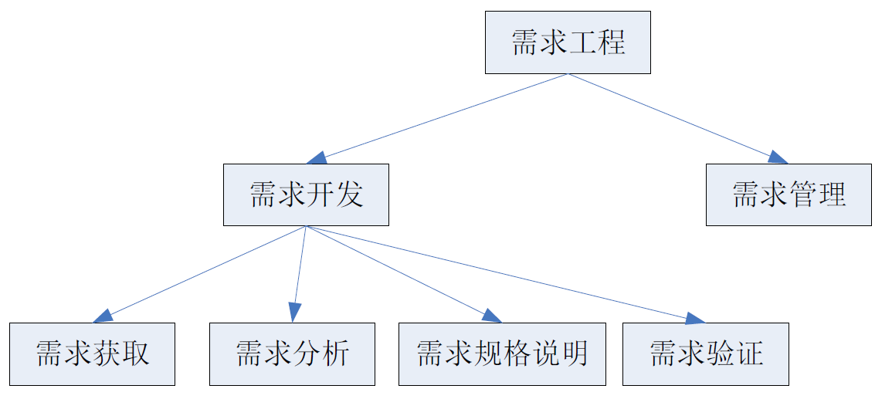

### 开发过程

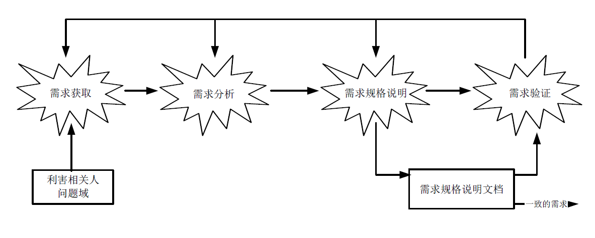

#### 需求获取

+ 从⼈、⽂档或者环境当中获取需求的过程
+ 要利⽤各种⽅法和技术来“发现”需求
+ ⽬标分析
  + ⑴根据问题确定⽬标
  + ⑵通过分析利害关系⼈确定⽬标

#### 需求分析

+ 通过建模来整合各种信息，以使得⼈们更好的理解问题。
+ 为问题定义出⼀个需求集合，这个集合能够为问题界定⼀个有效的解决⽅
  案。
+ 检查需求当中存在的错误、遗漏、不⼀致等各种缺陷，并加以修正。

#### 需求规格说明

+ 在系统⽤户之间交流需求信息
+ 要简洁、精确、⼀致和易于理解
+ 需求⼯程师在这个阶段的重要⼯作包括:
  + ⼀、定制⽂档模版
  + ⼆、编写⽂档

#### 需求验证

+ 需求规格说明⽂档⾄少要满⾜下⾯⼏个标准：
  + ⽂档内每条需求都正确、准确的反映了⽤户的意图；
  + ⽂档记录的需求集在整体上具有完整性和⼀致性；
  + ⽂档的组织⽅式和需求的书写⽅式具有可读性和可修改性。

#### 需求管理

+ 保证需求作⽤的持续、稳定和有效发挥

  + 在需求开发活动之后，设计、测试、实现等后续的软件系统开发活动都需
    要以围绕需求开展⼯作

+ 进⾏变更控制
  + 纳⼊和实现合理的变更请求，拒绝不合理的变更请求，控制变更的成本和
    影响范围

### 需求定义

+ ⑴⽤户为了解决问题或达到某些⽬标所需要的条件或能⼒；
+ ⑵系统或系统部件为了满⾜合同、标准、规范或其它正式⽂档所规定的要求⽽需要具备的条件或能⼒；
+ ⑶对⑴或⑵中的⼀个条件或⼀种能⼒的⼀种⽂档化表述。
+ 是⼀种期望
+ 源⾃现实⼜⾼于现实
+ 需求是多变和可调整的，项⽬可以依据实际情况调整需求的实现程度。

### 需求层次

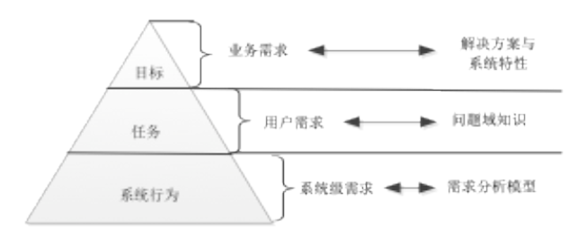

#### 业务需求

+ 系统建⽴的战略出发点，表现为⾼层次的⽬标（Objective），它描述了组织为什么要开发系统
+ 为了满⾜⽤户的业务需求，需求⼯程师需要描述系统⾼层次的解决⽅案，定义系统应该具备的特性（Feature）
+ 参与各⽅必须要对⾼层次的解决⽅案达成⼀致，以建⽴⼀个共同的前景（Vision）
+ 特性说明了系统为⽤户提供的各项功能，它限定了系统的范围（Scope）
+ Ex. 在系统使⽤3个⽉后，销售额度应该提⾼20%

#### 用户需求

+ 执⾏实际⼯作的⽤户对系统所能完成的具体任务的期望，描述了系统能够帮助⽤户做些什么
  + 直接⽤户（操作系统的人）
  + 间接⽤户（通⽤软件的销售⼈员和售后⽀持⼈员）
+ 对所有的⽤户需求，都应该有充分的问题域知识作为背景⽀持
+ 特性
  + 模糊、不清晰（允许适度的⽤形容词和副词）
  + 多特性混杂 （功能和⾮功能的混杂）
  + 多逻辑混杂 （⼀个任务需要多次系统交互才能完成）

+ Ex. 管理VIP顾客信息

#### 系统需求

+ ⽤户对系统⾏为的期望，每个系统级需求反映了⼀次外界与系统的交互⾏为，或者系统的⼀个实现细节
+ 描述了开发⼈员需要实现什么
+ 将⽤户需求转化为系统需求的过程是⼀个复杂的过程
  + ⾸先需要分析问题领域及其特性，从中发现问题域和计算机系统的共享知识，建⽴系统的知
    识模型；
  + 然后将⽤户需求部署到系统模型当中，即定义系列的系统⾏为，让它们联合起来实现⽤户需
    求，每⼀个系统⾏为即为⼀个系统需求。
  + 该过程就是需求⼯程当中最为重要的需求分析活动，⼜称建模与分析活动。

+ Ex. 系统应该允许客户经理查看会员的个⼈信息和购买信息。

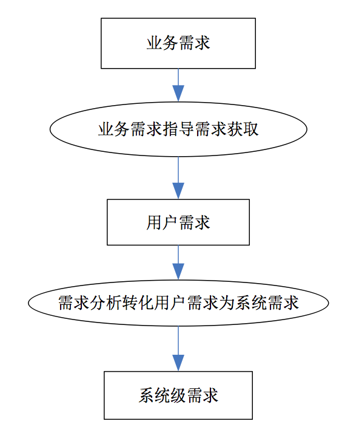

### 需求分类

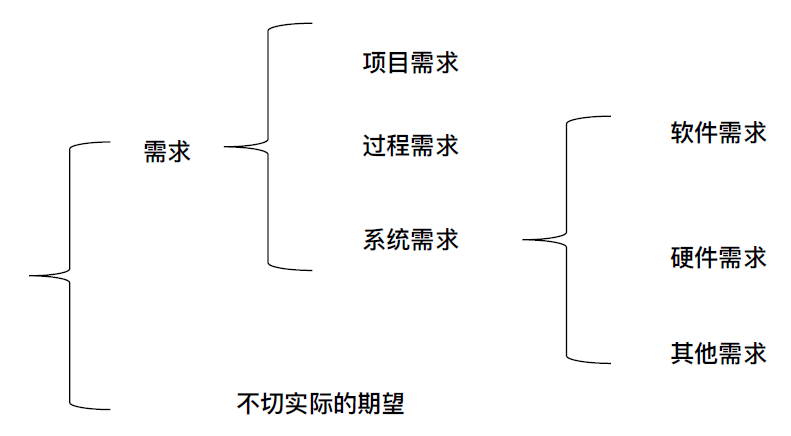

#### 案例

+ 项⽬需求
  + R5：项⽬的成本要控制在60万元⼈⺠币以下。
  + R6：项⽬要在6个⽉内完成。
+ 过程需求
  + R7：在开发中，开发者要提交软件需求规格说明⽂档、设计描述⽂档和测试报告。
  + R8：项⽬要使⽤持续集成⽅法进⾏开发。
+ 其他需求
  + R9：系统要购买专⽤服务器，其规格不低于….。
  + R10：系统投⼊使⽤时，需要对⽤户进⾏1个星期的集中培训。

### 需求的分类IEEE

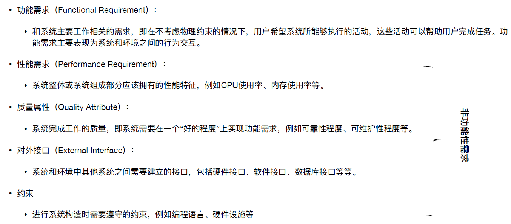

## 06 - 分析方法

### 任务

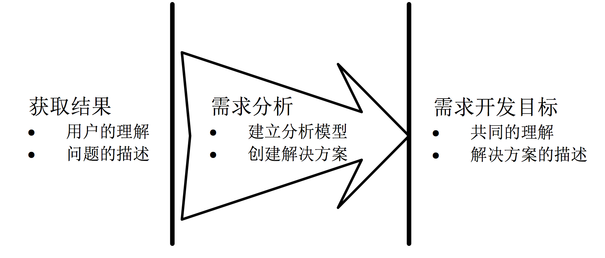

### 面向对象分析

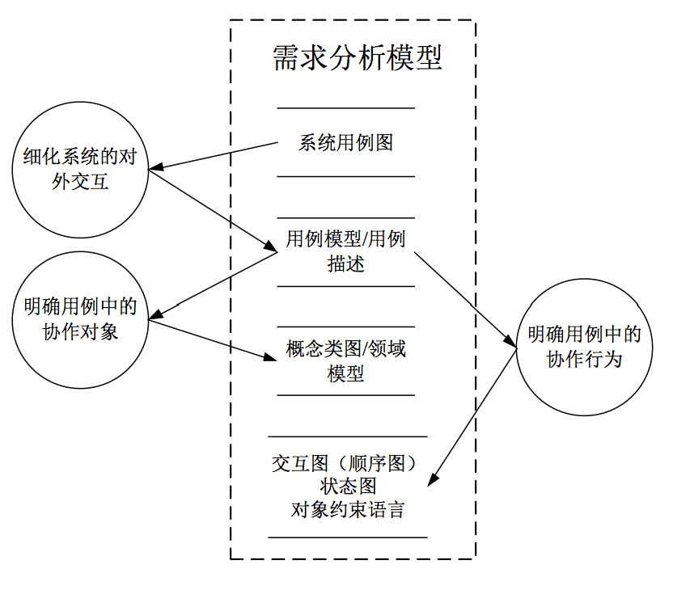

### 用例

+ 在系统(或者⼦系统或者类)和外部对象的交互当中所执⾏的⾏为序列的描述,包括各种不同的序列和错误的序列,它们能够联合提供⼀种有价值的服务
+ ⽤例描述了在不同条件下系统对 某⼀⽤户的请求的响应。根据⽤户的请求和请求时的系统条件,系统将执⾏不同的⾏为序列, 每⼀个⾏为序列被称为⼀个场景。⼀个⽤例是多个场景的集合。

### 用例图基本元素

#### 参与者

+ 以角色作为代表（不一定是人）
+ 可能一用户多角色，多用户一角色

#### 用例

+ v. + n. 描述
+ 表达需求

#### 系统边界

+ 决定做和不做

#### 关系

+ 前三者的关联

### 用例图建立

#### ⽬标分析与解决⽅向的确定

+ ×××连锁商店是⼀家刚刚发展起来的⼩型连锁商店，其前身是⼀家独⽴的⼩百货⻔⾯店。

#### 寻找参与者

+ 每个⽤户的任务（⽬标）都是⼀个独⽴⽤例

#### 寻找⽤例

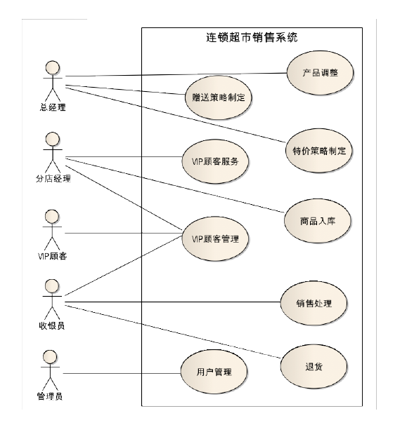

#### 细化⽤例

+ 如果⽤例的粒度不合适就需要进⾏细化和调整。
  + 判断标准是：⽤例描述了为应对⼀个业务事件，由⼀个⽤户发起，并在⼀个连续时间段内完成，可以增加业务价值的任务。
+ Ex. 特价策略制定、赠送策略制定两个⽤例的业务⽬的、发起源和过程基本相同，仅仅是业务数据不同，所以可以合并为⼀个⽤例销售策略制定。
+ Ex. 会员管理⽤例有两个明显不同的业务事件，可以被细化为发展会员和礼品赠送2个更细粒度的⽤例。

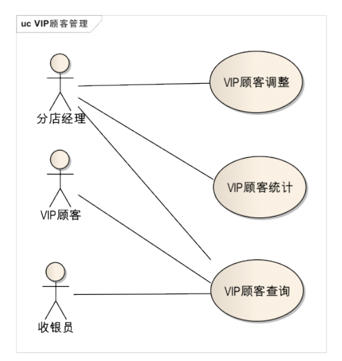

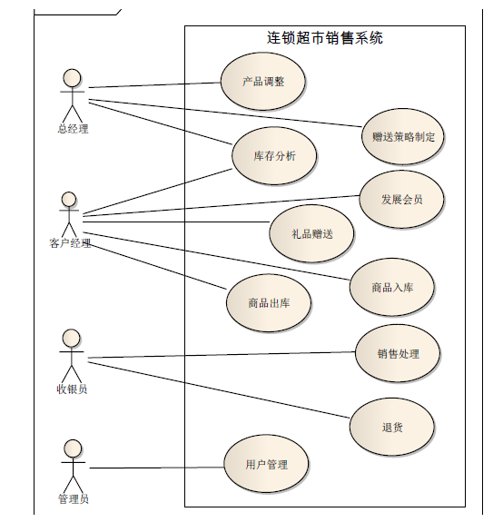

#### 常见错误

+ 不要将⽤例细化为单个操作
  + 例如,不要将⽤户管理细化 为增加、修改和删除三个更⼩的⽤例,因为它们要联合起来才能体现出业务价值。
+ 不要将同⼀个业务⽬标细化为不同⽤例
  + 例如特价策略制定和赠送策略制定。
+ 不要将没有业务价值的内容作为⽤例
  + 常⻅的错误有“登录”(应该描述为安全性 质量需求)、“数据验证”(应该描述为数据需求)、“连接数据库”(属性软件内部实 现⽽不是需求)等。

### 概念类图基本元素

#### 对象

+ 标示符
+ 状态
+ ⾏为

#### 类

+ 对象集合的抽象

#### 链接（link）（dependency）

+ 对象之间的互相协作的关系
+ 描述了对象之间的物理或业务联系

#### 关联

+ 对象之间链接的抽象
+ 聚合与组合

#### 继承

+ 泛化关系

### 概念类图建立

#### 识别候选类

+ 发现软件系统与外界交互时可能涉及的对象与类，它们就是候选类。
+ ⾏为分析、名词分析、CRC等很多种⽅法都可以⽤来分析⽤例⽂本描述

#### 确定概念类

+ 依据系统的需求
+ 该类的对象实例的状态与⾏为是否完全必要

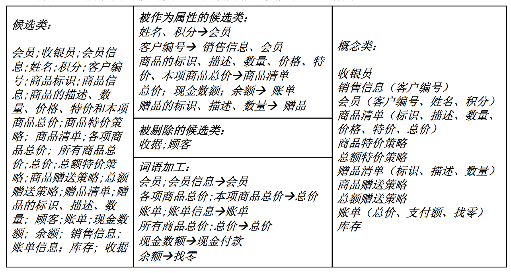

#### 识别关联

+ 分析⽤例⽂本描述，发现概念类之间的协作，需要协作的类之间需要建⽴关联。
+ 分析和补充问题域内的关系，例如概念类之间的整体部分关系和明显的语义联系。
+ 对问题域关系的补充要适可⽽⽌，不要把关系搞得过度复杂化。
+ 去除冗余关联和导出关联

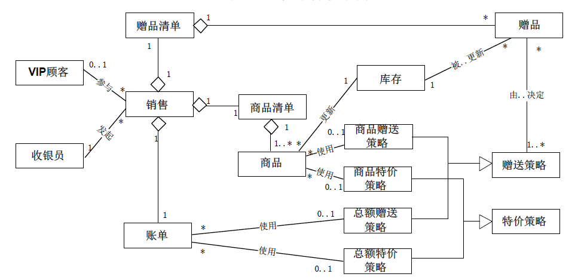

#### 识别重要属性

+ 这些属性往往是实现类协作时必要的信息，是协作的条件、输⼊、结果或者过程记录。
+ 通过分析⽤例的描述，并与⽤户交流，补充问题域信息，可以发现重要的属性信息。
+ 在分析每个单独的⽤例（场景）描述时，为各个概念类发现的重要属性可能不多，甚⾄有些概念类没有任何重要属性。但是，系统通常有多个⽤例和很多场景，会建⽴多个局部的概念类图，只有在合并所有局部概念类图之后，各个概念类的重要属性才能得到全⾯的体现。

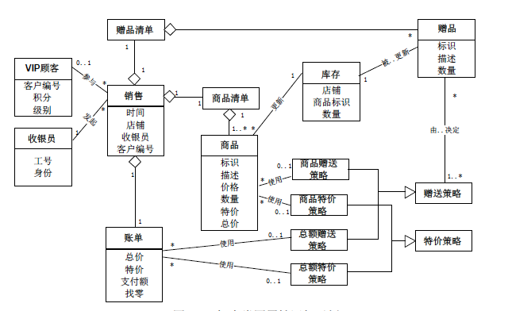

### 顺序图

#### 示例

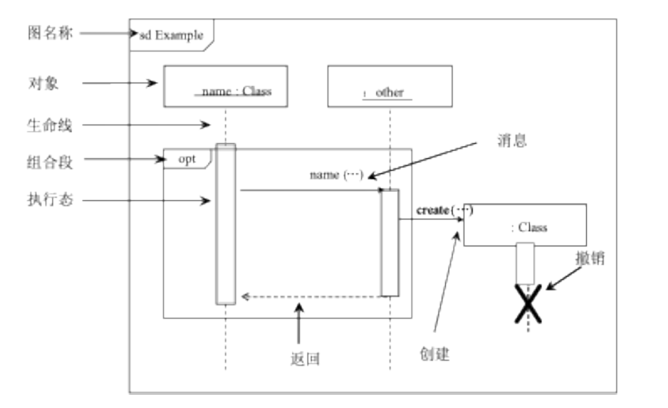

#### 系统顺序图

+ 同步消息是实线，三⻆箭头。
+ 异步消息是实线，线性箭头。
+ 返回消息应该是虚线
+ Opt 是可选项
+ loop 是循环
+ alt 多选⼀

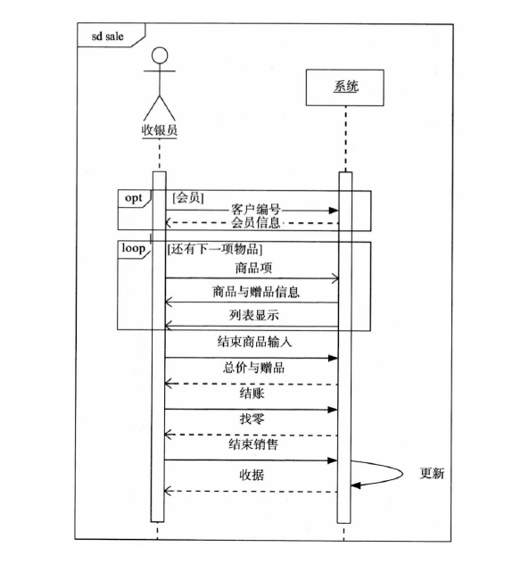

### 状态图

#### 示例

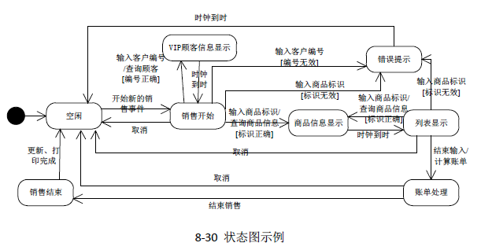

#### 建立

+ 确定上下⽂环境
  + 状态图是⽴⾜于状态快照进⾏⾏为描述的，因此建⽴状态图时⾸先要搞清楚状态的主体，确定状态的上下⽂环境。常⻅的状态主体有：类、⽤例、多个⽤例和整个系统。
+ 识别状态
  + 状态主体会表现出⼀些稳定的状态，它们需要被识别出来，并且标记出其中的初始状态和结束状态集。在有些情况下，可能会不存在确定的初始状态和结束状态。
+ 建⽴状态转换
  + 根据需求所描述的系统⾏为，建⽴各个稳定状态之间可能存在的转换。
+ 补充详细信息，完善状态图
  + 添加转换的触发事件、转换⾏为和监护条件等详细信息。

### 结构化分析过程

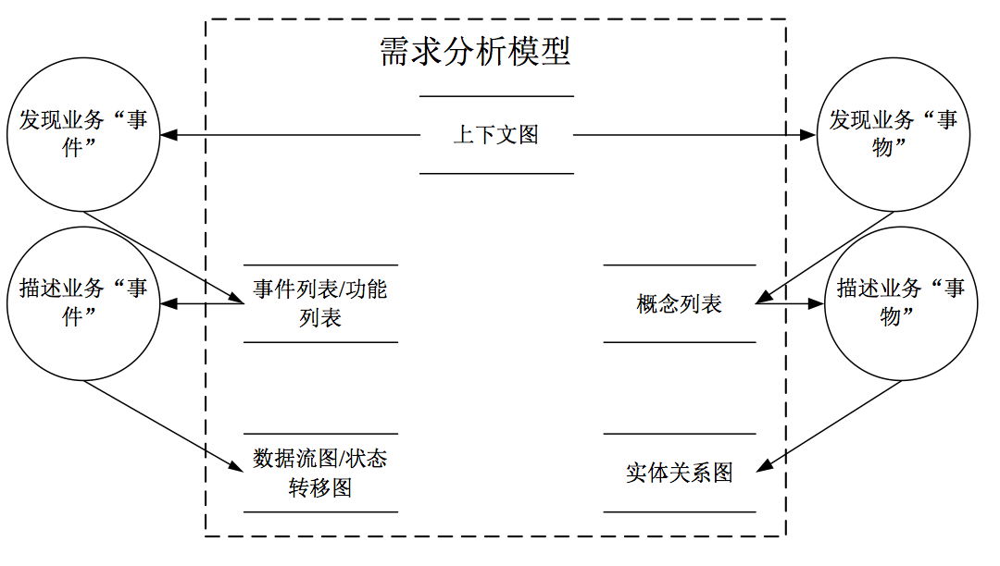

### 数据流图

#### 组件

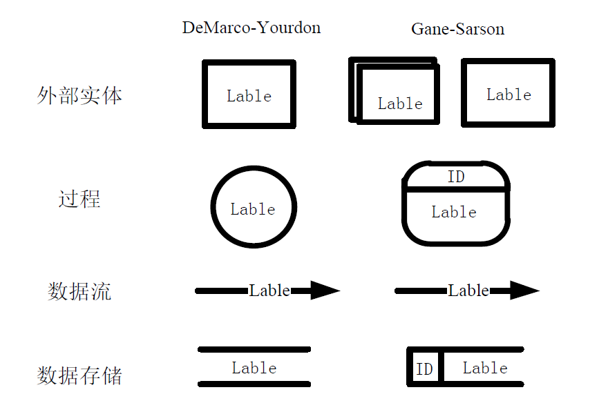

#### 上下文图

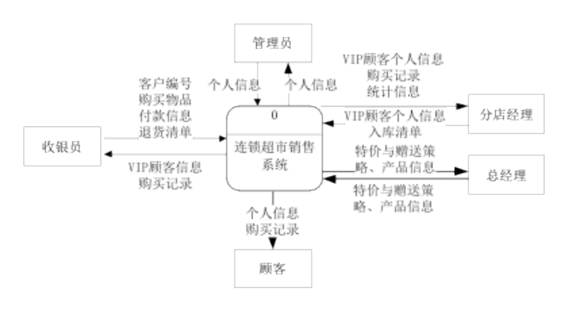

### 实体关系图

#### 组件

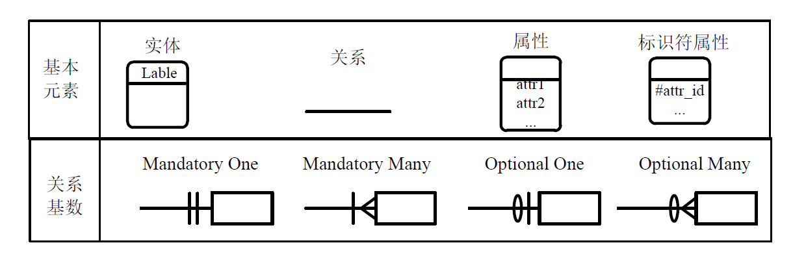

#### 示例

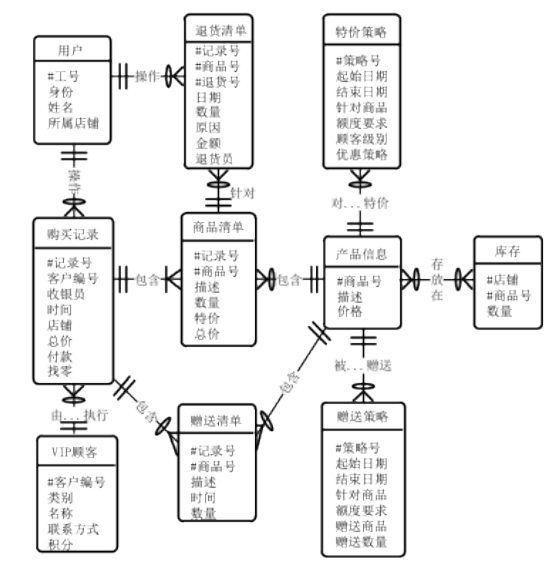

#### 键

+ 实体的⼀个或者多个属性能够唯⼀确定和标示每个实例，这些属性或者属性组合就被称为实体的标示符，或者键（Key）

### 功能

+ 系统顺序图有助于发现交互性的缺失

+ 概念类图有助于发现缺失
+ 状态图有助于发现界⾯的跳转

## 07 - 需求文档

### 用例文档

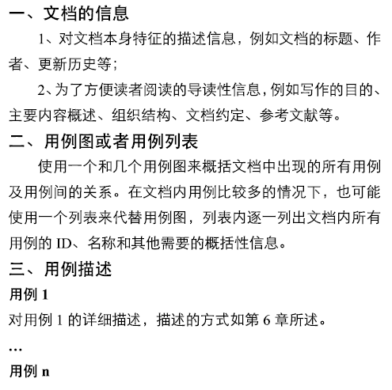

### 软件规格说明文档

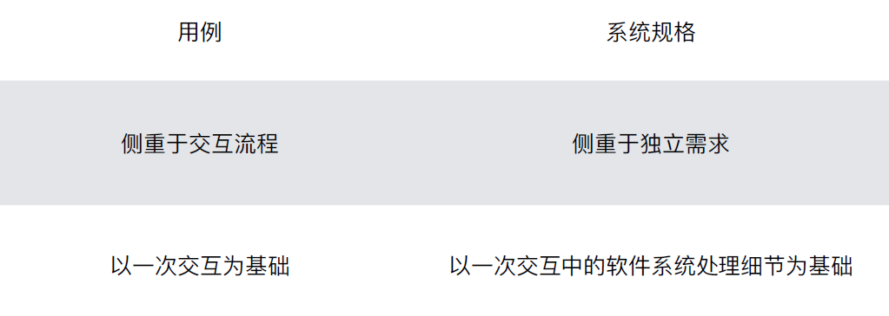

### 书写要点

+ 需求书写要点
  + 使⽤⽤户术语
  + 可验证
  + 可⾏性
+ 需求规格说明⽂档书写要点
  + 充分利⽤标准的⽂档模版，保持所有内容位置得当
  + 保持⽂档内的需求集具有完备性和⼀致性。
  + 为需求划分优先级