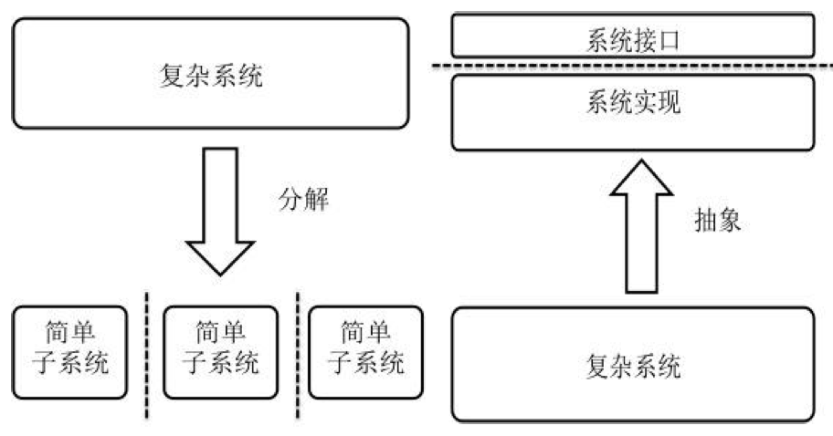
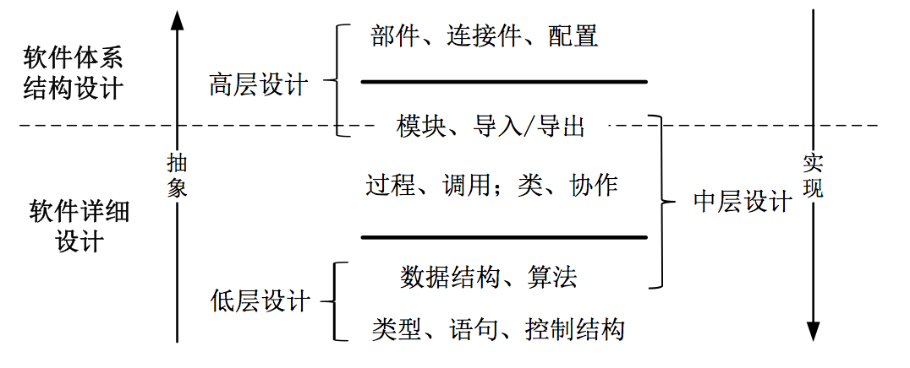
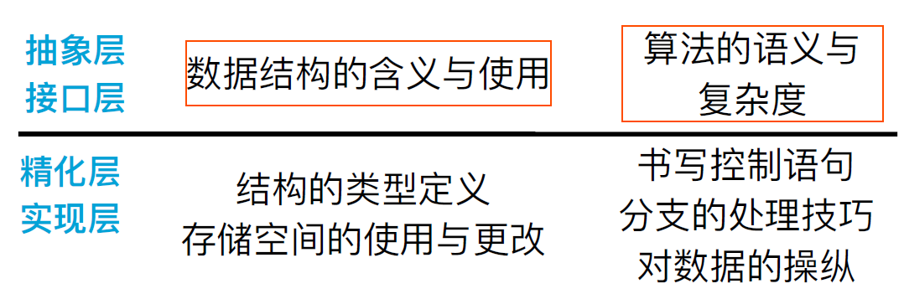
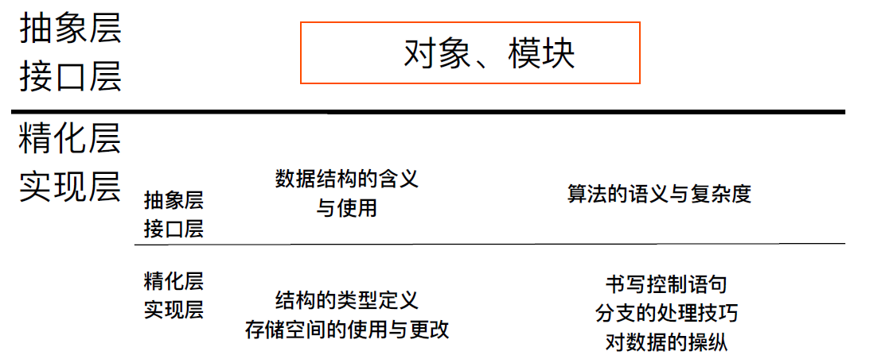
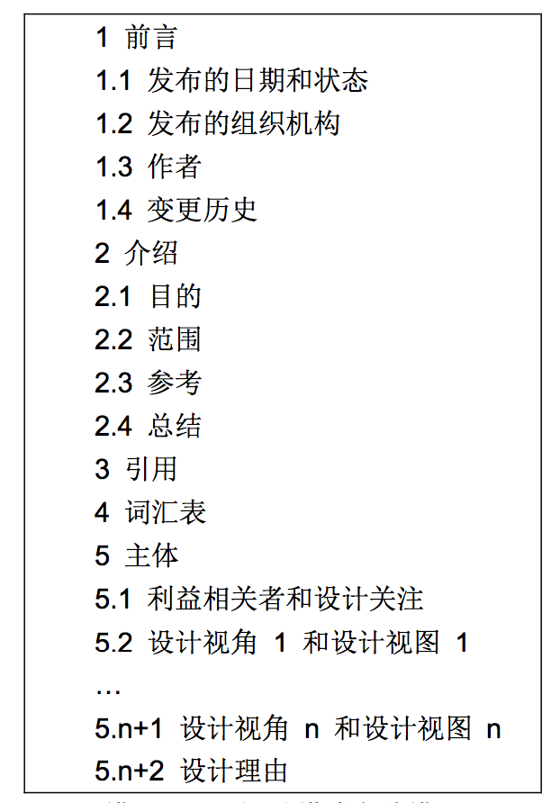

# 软件设计

## 08 - 设计基础

### 核心思想

+ 分解与抽象

### 分层

#### 低层设计

+ 代码设计
+ 屏蔽程序中复杂数据结构与算法的实现细节

#### 中层设计

+ 模块划分隐藏⼀些程序⽚段（数据结构+算法）的细节，暴露接⼝于外界

#### 高层设计

+ 部件与连接件都是抽象的类型定义（就像类定义），它们的实例（就像类的对象实例）组织构成软件系统的整体结构，配置将它们的实例连接起来

### 设计描述文档

