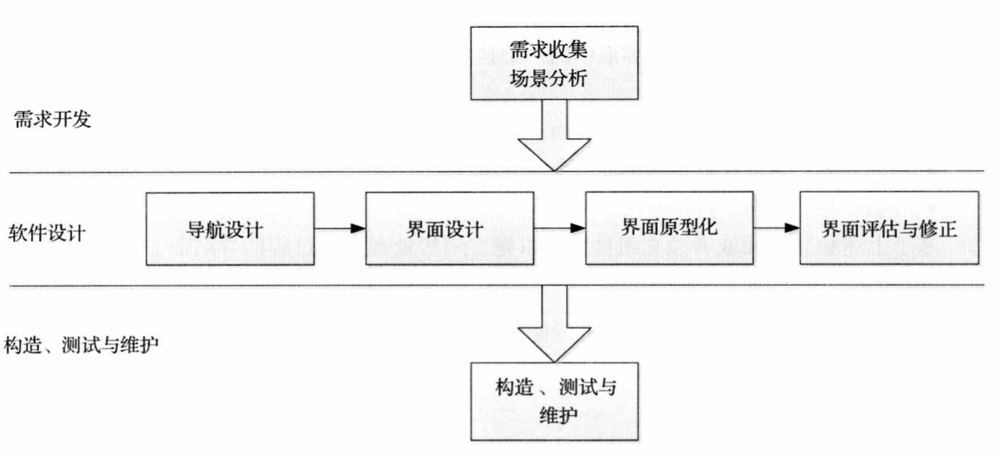

# 人机交互

## 11 - 人机交互

### 介绍

+ Human-Computer Interaction Design seeks to discover the most efficient way to design **usable** and **effective** experiences between the human and the computer interface

### 三要素

#### 人

+ 系统使用者
+ 好的⼈机交互应该为不同的⽤户群体提供差异化的交互机制。
  + 既为新⼿⽤户提供易学性⾼的⼈机交互机制（图形界⾯）
  + ⼜为专家⽤户提供效率⾼的⼈机交互机制（命令⾏、快捷⽅式、热键）

#### 电脑

+ 按照任务模型设计界⾯隐喻，同时不要把软件系统的内部构造机制暴露给⽤户
+ 可视化设计还应该基于界⾯隐喻，尽可能地把功能和任务细节表现出来

#### 交互

+ “交互”是双向的：
  + ⼀⽅⾯⽤户主动向软件系统提出请求（输⼊信息），软件系统给予⽤户响应（输出信息）；
  + 另⼀⽅⾯，软件系统也应该主动告知⽤户相应的信息，并等待⽤户的响应
+ 好的⼈机交互设计就像⼀个服务周到的推销员，能够主动将⾃⼰的产品和服务简明扼要地告诉⽤户，这个就是导航。

### 设计过程

### GUI设计

+ Key points
  + 观察用户
  + 知道自己的限制
  + 确定GUI可用且可达
+ Common GUI elements
  + 支持信息
  + 查询
  + 搜集
  + 拓展特色
+ Planning your GUI
+ Building your GUI
+ Ensuring usability
+ Ensuring accessibility

