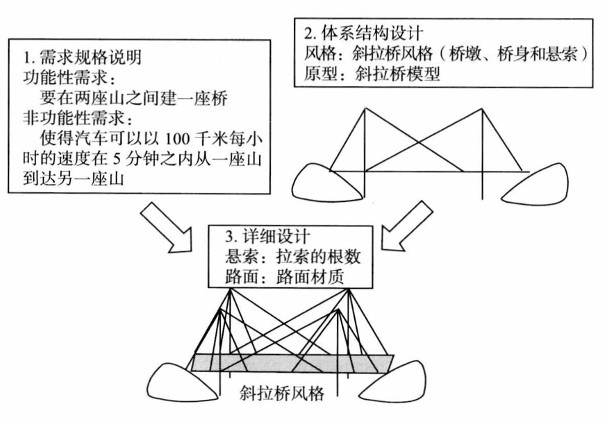
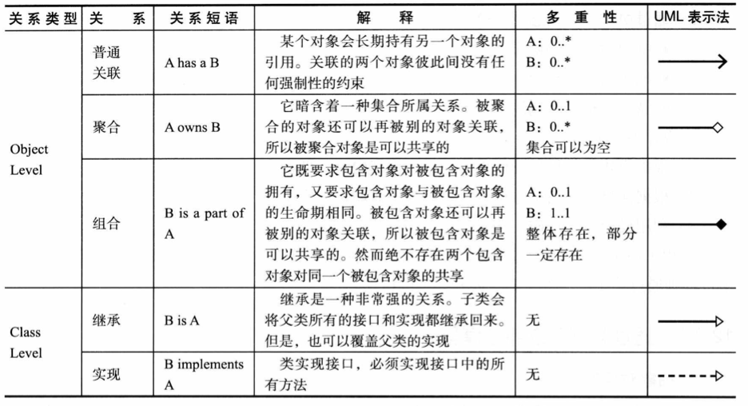
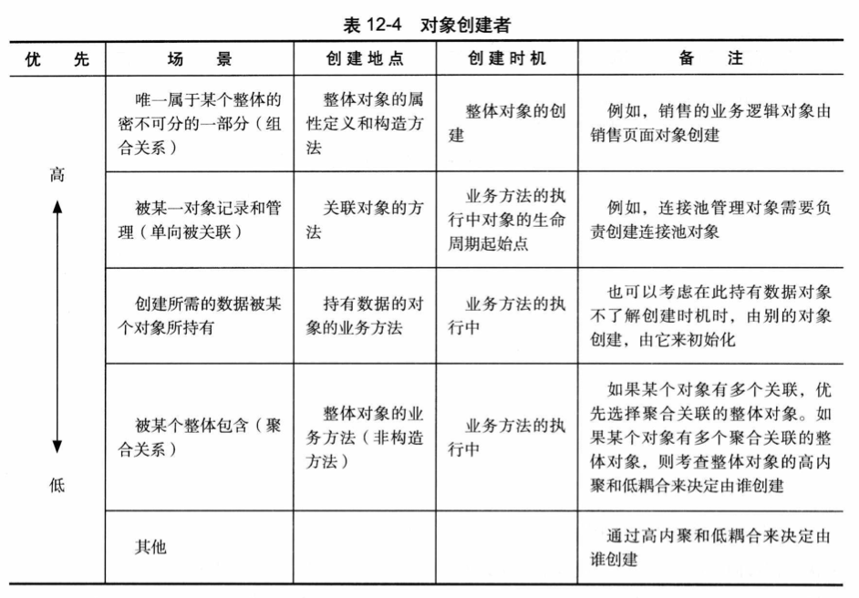
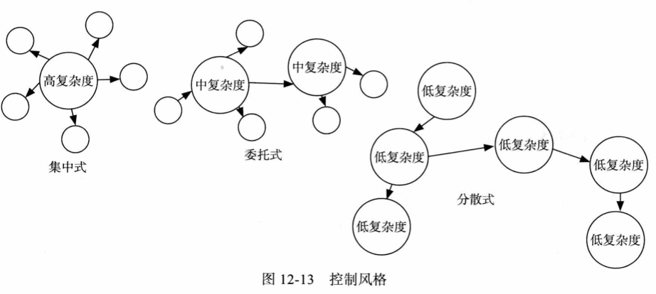
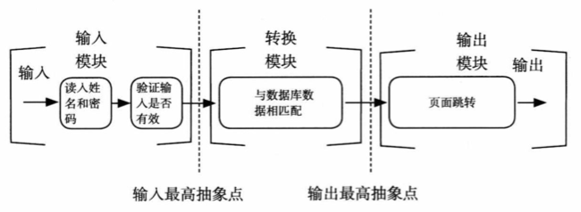
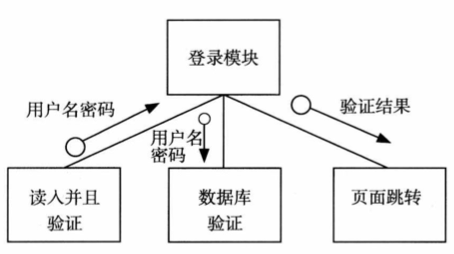
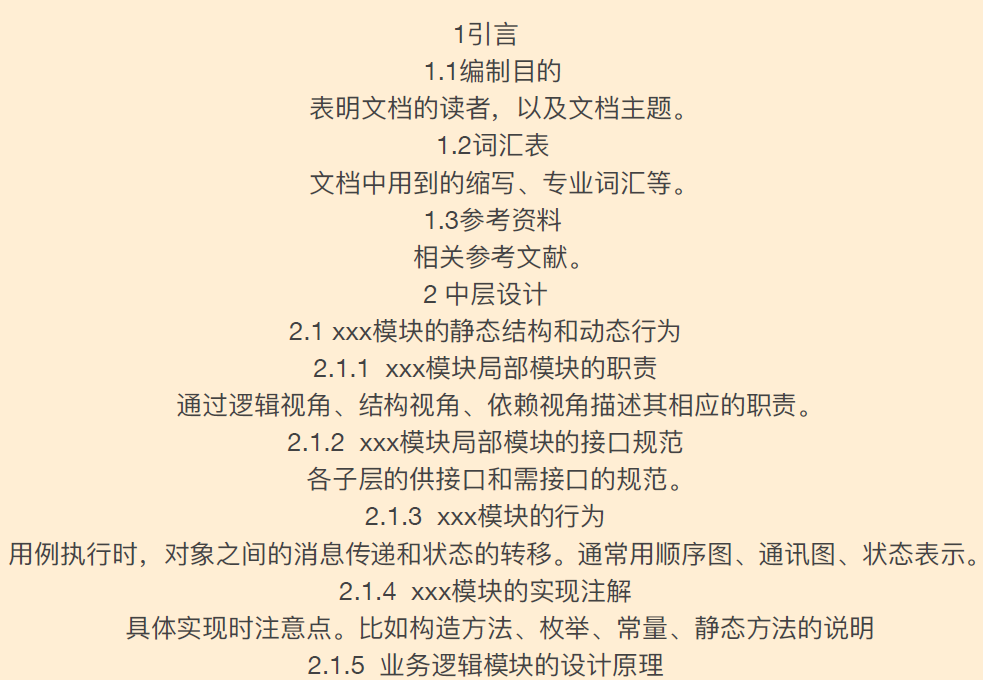
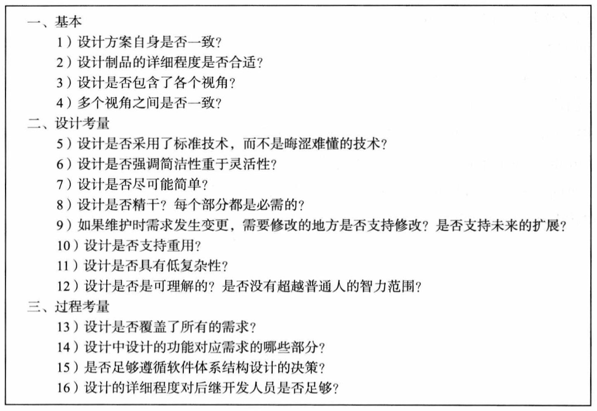

# 详细设计

## 12 - 详细设计

### 需求 -> 体系结构设计 -> 详细设计

### 面向对象设计思想

#### 职责

+ 执行任务与储存数据
+ 可被分解

#### 协作

+ 应用拆分成多个行为
+ 行为间协作

### 面向对象设计的过程

+ 设计模型建⽴

+ 通过职责建⽴静态设计模型

  + 抽象类的职责

    + 数据职责
    + ⾏为职责

  + 抽象类之间的关系

    

  + 添加辅助类

    + 接⼝类
    + 记录类(数据类)
    + 启动类
    + 控制器类
    + 实现数据类型的类
    + 容器类
  
+ 通过协作建⽴动态设计模型

  + 抽象对象之间协作

    + 从⼩到⼤,将对象的⼩职责聚合形成⼤职责;
    + 从⼤到⼩,将⼤职责分配给各个⼩对象。

  + 明确对象的创建

    

  + 选择合适的控制⻛格

    

+ 设计模型重构

  + 根据模块化的思想进⾏重构，⽬标为⾼内聚、低耦合
  + 根据信息隐藏的思想进⾏重构，⽬标为隐藏职责与变更
  + 利⽤设计模式重构

### 集成测试

+ 重点针对复杂逻辑（交互⽐较多）
+ ⾃顶向下或者⾃底向上的集成

### 数据流图 -> 结构图

### 详细设计文档

### 文档评审

