# 模块化与信息隐藏

## 13 - 结构化编程的模块化和信息隐藏

### 模块化

+ Modularity has long been seen as a key to cheap, high quality software.
+ Collection of programming units (procedures, classes, etc.)
  + with a well-defined interface and purpose within the entire system, that can be independently assigned to a developer

### 信息隐藏

+ Hide system details likely to change independently
+ Separate parts that are likely to have a different rate of change
+ Expose in interfaces assumptions unlikely to change

### KWIC

+ 简称KWIC，⼜称上下⽂关键词索引。
+ KWlC索引的的编制特点是：使⽤禁⽤词表选择标题中具有检索意义的词为关键词，并将其作为确定索引条⽬的依据；关键词的排检点设于标题的中部，所有索引条⽬按关键词的字顺竖向排列；保留⽂献篇名中关键词前后的上下⽂，如⽂献名称过⻓，可以以轮排的形式移⾄条⽬的前部或后部；款⽬后跟随该信息资源的位置。
+ 上述条⽬均按关键词的字顺排列在相应位置，检索时先在检索⼊⼝处查找与检索课题有关的关键词，再通过阅读上下⽂寻找符合检索要求的⽂献。可以按排检点为中⼼对同⼀关键词有关的资源集中检索查找，是这⼀索引的优点；不⾜是将索引的排检点设置在中部不符合⽤户使⽤习惯。

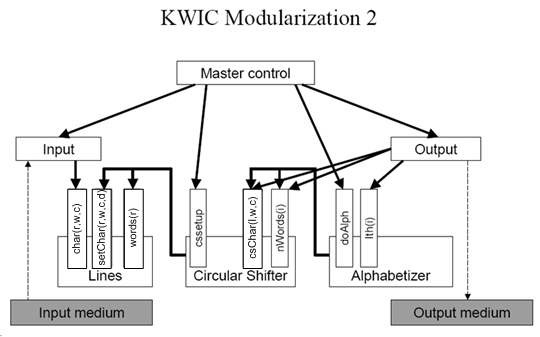

### 耦合

+ 分解后模块间的关系

#### 强度

+ 连接复杂度
+ 连接模块本身还是模块内部
+ 发送与接收的东西

#### 类型

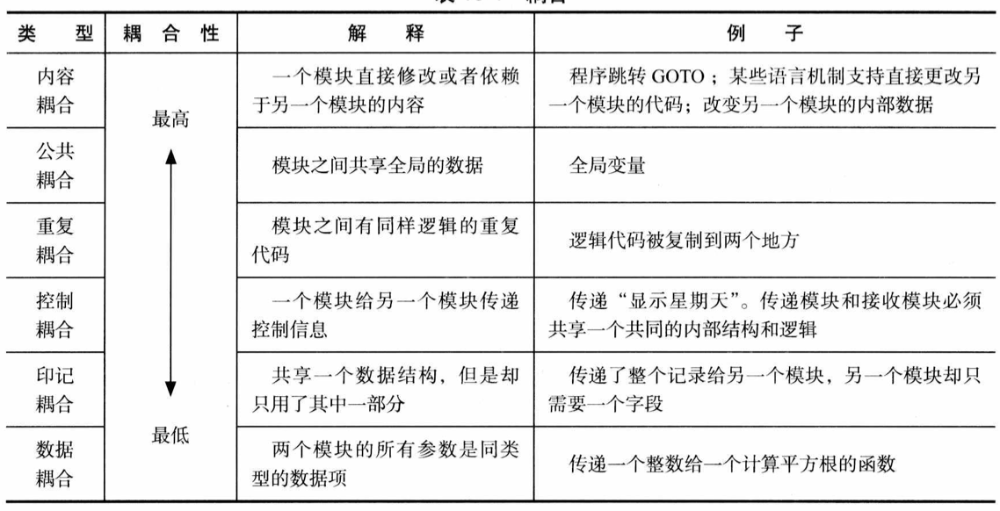

+ 耦合要尽量低

### 内聚

+ 模块内部联系的紧密性

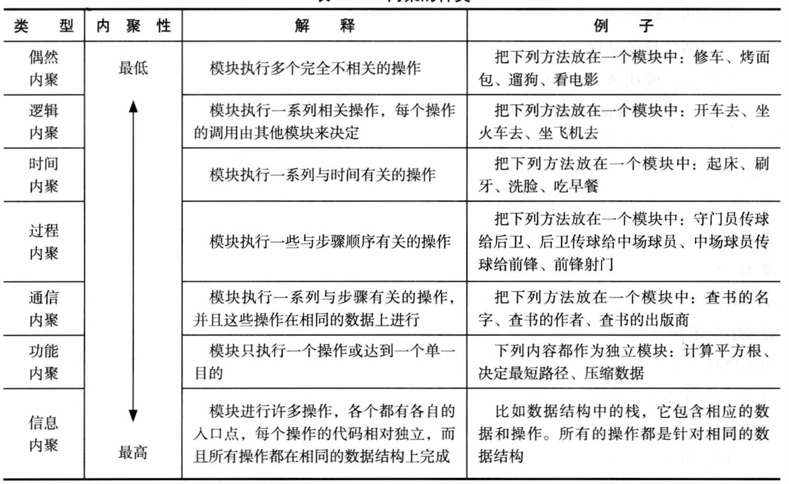

+ 内聚要尽量高

### 信息隐藏

#### 模块说明

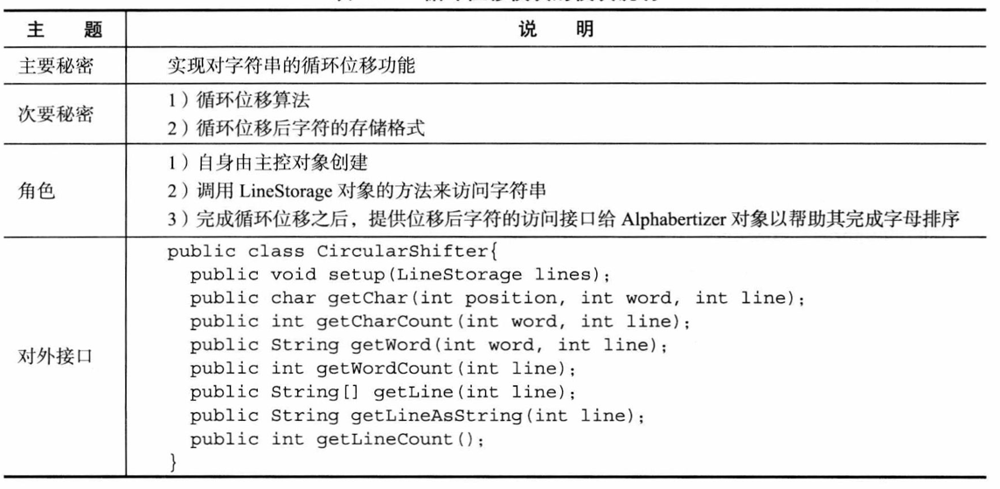

+ 信息隐藏就是将秘密隐藏起来

## 14 - 面向对象的模块化

### 模块

+ 面向对象的模块：类

### 访问耦合

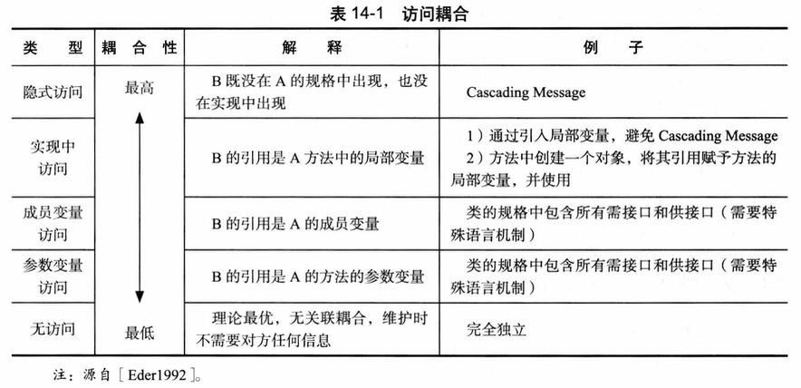

+ 避免隐式访问

#### 降低方法

+ 接口编程
+ 接口最小化/接口分离
+ 访问耦合的合理范围/迪米特法则

### 继承耦合

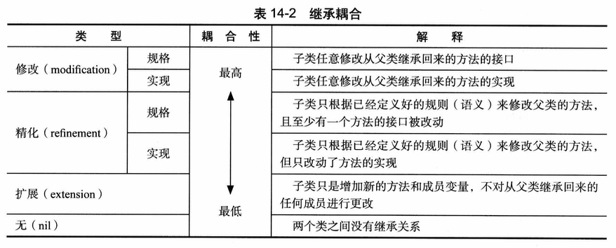

+ 避免修改规格、修改实现、精化规格

#### 降低方法

+ Liskov替换原则
+ 组合代替继承

### 内聚

+ 方法内聚
+ 类的内聚
+ 子类与父类继承的内聚

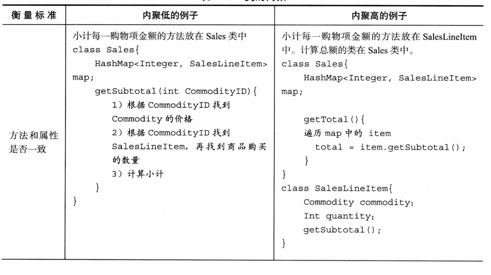

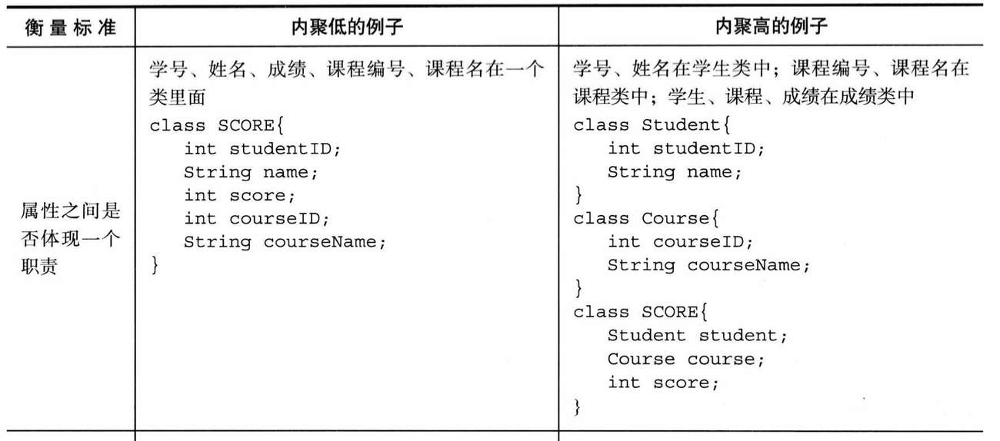

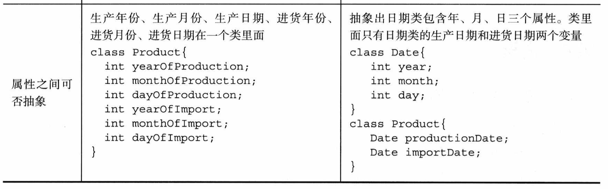

#### 提高方法

+ 集中信息与行为
+ 单一职责原则

### 耦合与内聚度量

#### 耦合度量

+ 方法调用耦合
+ 访问耦合
+ 继承耦合

#### 内聚度量

+ LCOM - Lack of Cohesion in Methods

## 15 - 面向对象的信息隐藏

### 封装

+ 类的职责
  + 类或对象维护⼀定的状态信息
  + 基于状态履⾏⾏为职能的能⼒。

#### 接口与实现分离

##### 接口任务

+ 对象之间交互的消息（⽅法名）
+ 消息中的所有参数
+ 消息返回结果的类型
+ 与状态⽆关的不变量
+ 需要处理的异常

#### 实现细节

+ 封装数据和⾏为
+ 封装内部结构
+ 封装其他对象的引⽤
+ 封装类型信息
+ 封装潜在变更

### OCP

+ Open/Closed Principle：开闭原则

+ 好的设计对拓展开放
+ 好的设计对修改关闭

### 多态

#### 分类

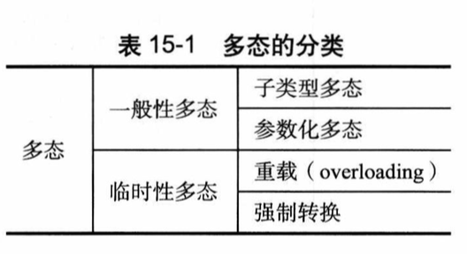

#### 实现

+ OCP
+ Use abstraction to gain explicit closure
+ Plan your classes based on what is likely to change.
  + minimizes future change locations
+ OCP needs DIP && LSP

### DIP

+ Dependency Inversion Principle - 依赖倒置原则
+ 抽象不依赖细节，细节依赖抽象
+ 高层不依赖底层，而是依赖抽象。高底层都不稳定，只有抽象是稳定的。

#### 传统 V.S. DIP

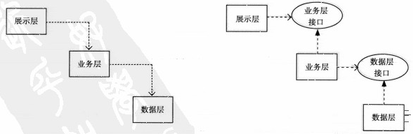