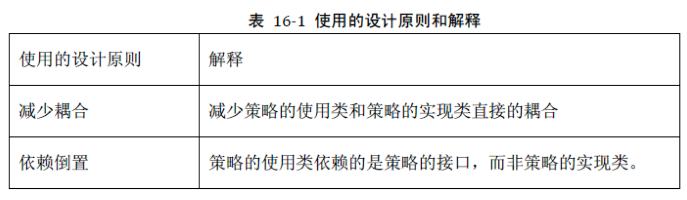
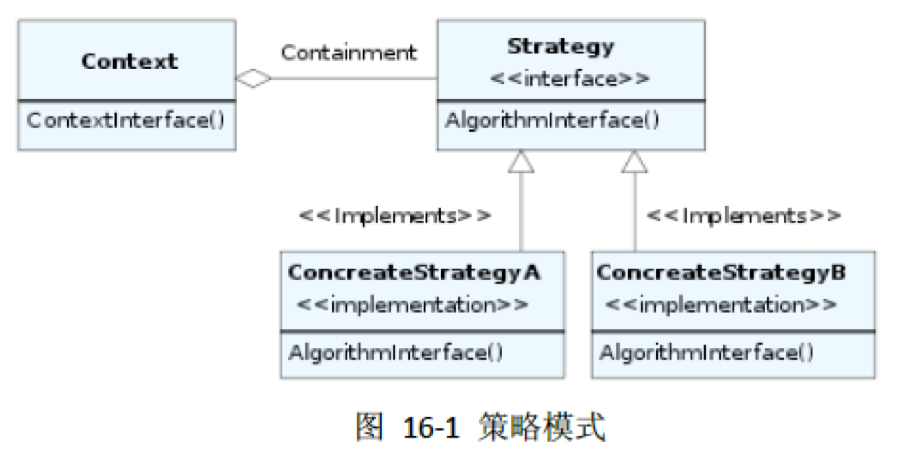
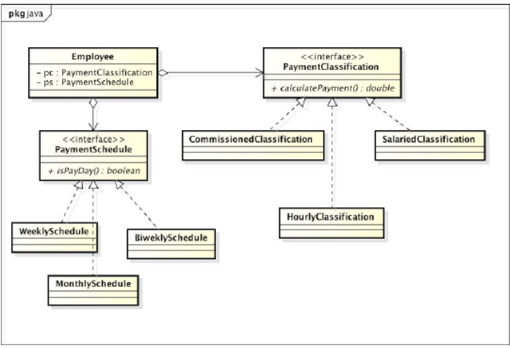
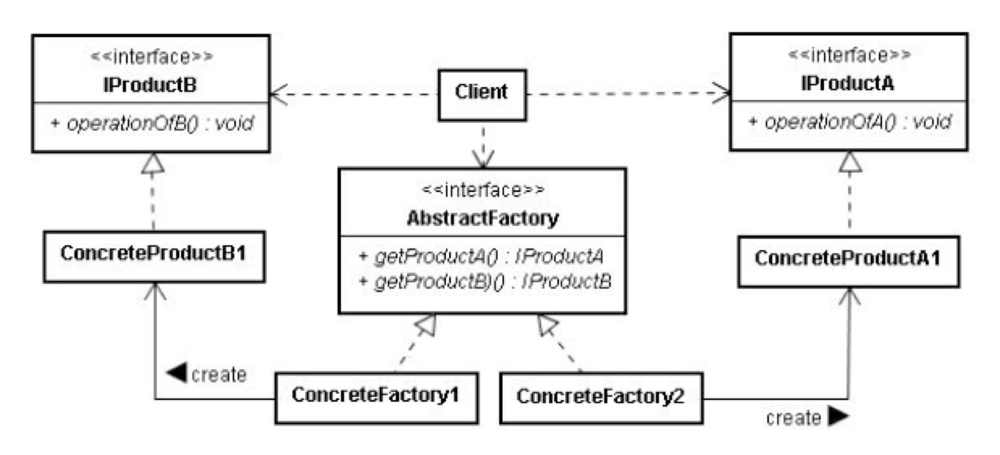
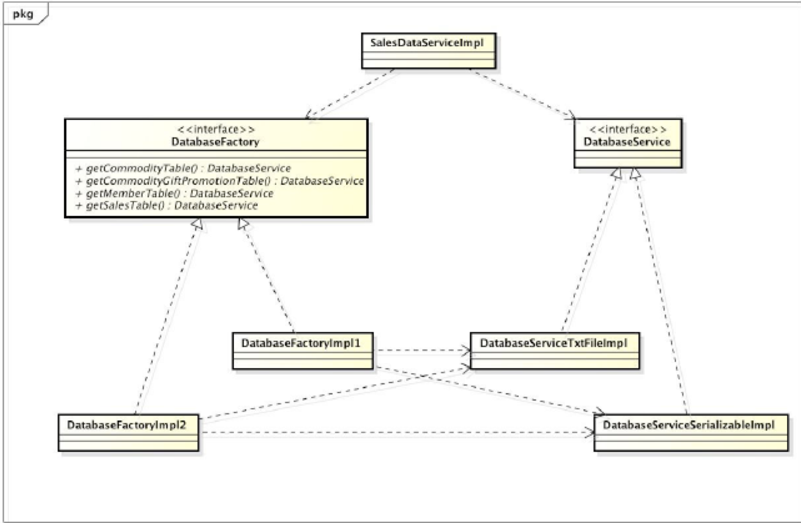
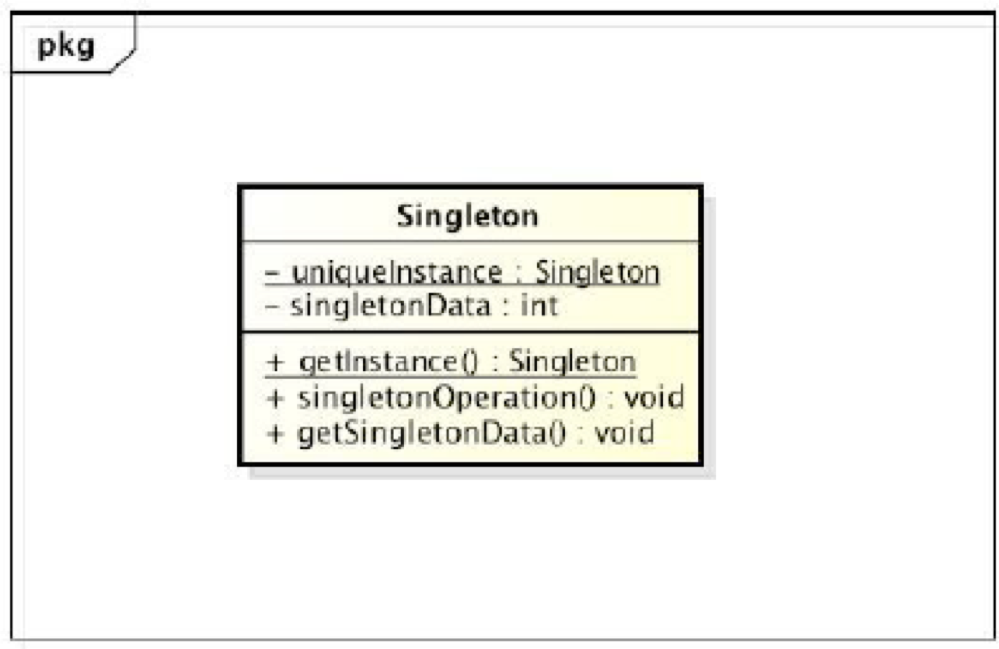
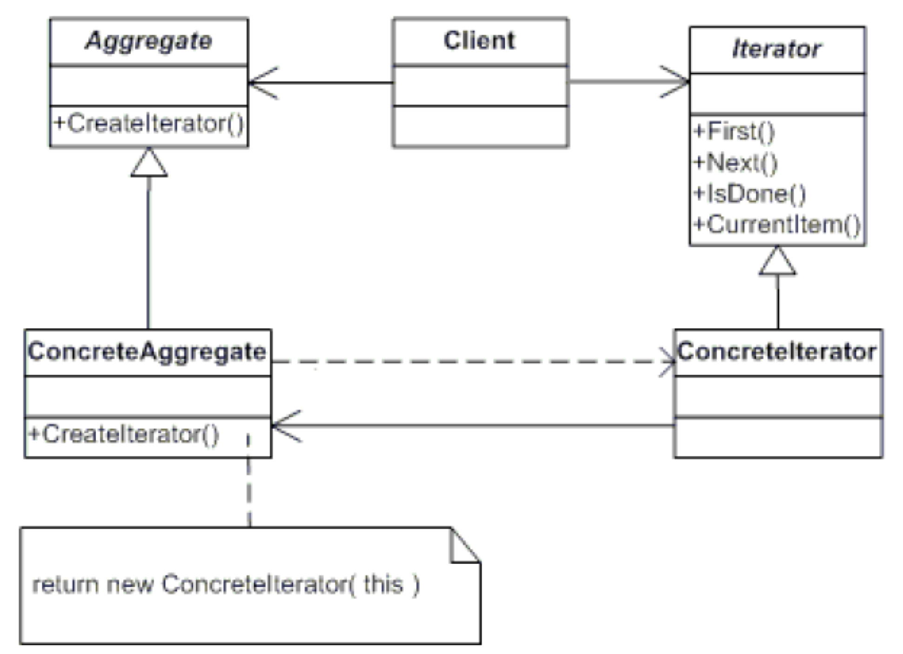
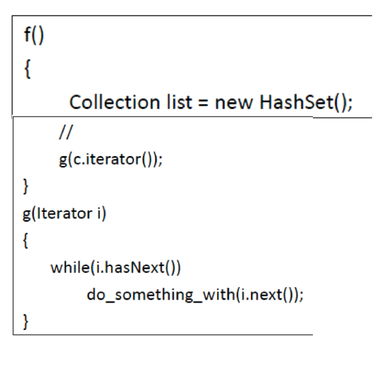

# 设计模式

## 16 - 设计模式

### 可修改性

+ (M)实现的可修改性
  + 对已有实现的修改
  + 例如：修改现有促销策略
+ (E)实现的可扩展性
  + 对新的实现的扩展
  + 例如：增加一条新的促销策略
+ (C)实现的灵活性
  + 对实现的动态配置
  + 例如：动态修改更改某商品对应促销策略

### 设计模式

+ 典型问题
+ 设计分析
+ 解决方案
+ 案例

### 策略模式

#### 典型问题

+ 在一个大规模的连锁超市中雇员的薪水支付可以分为很多种。其中雇员的薪酬支付方式和支付频率就有好几种：
  + 有些雇员是钟点工，按时薪来支付。薪水=时薪工作小时数。每周三支付。
  + 有些雇员按月薪支付。薪水=固定月薪。每月21日支付。
  + 有些雇员是提成制。薪水=销售额提成比率。每隔一周的周三支付

##### 潜在变化

+ 钟点工可能两星期支付一次；
  + (M)实现的可修改性
+ 现在是时薪以后可能会变为月薪；
  + (C)实现的灵活性 
+ 也有可能出现新的薪水支付方式和支付频率。
  + (E)实现的可扩展性

#### 设计分析

+ 首先，可以把上下文和策略分割为不同的类实现不同的职责。上下文Context类负责通过执行策略实现自己职责；而策略类Strategy只负责复杂策略的实现。
+ 其次，上下文类和策略类之间的关系是用组合比继承更加合适。
  + 组合使得上下文类和策略类之间的接口之间的耦合性会很低；
  + 策略类的接口和实现的修改都相对比较容易；
  + 此外，如果是继承关系，则上下文类只能在行为的n种实现里面n选一（对象创建时就选定了策略），而如果是组合关系，上下文类则可以维护一个策略队列，实现n选多，从而达到动态的配置。
+ 最后，各种策略则在具体策略类（ConcreteStrategy）中提供，而向上下文类提供统一的策略接口。
  + 由于策略和上下文独立开来，策略的增减、策略实现的修改都不会影响上下文和使用上下文的客户。
  + 当出现新的促销策略或现有的促销策略发生变化时，只需要实现新的具体策略类（实现策略的接口），由客户使用。

##### 设计原则

#### 解决方案

+ 定义了算法族，分别封装起来，让他们之间可以互相替换，此模式让算法的变化独立于使用算法的客户。

##### 应用场景

+ 当很多相关类只在它们的行为的实现上不一样。策略模式提供了一个很好的方式来配置某个类，让其具有上述多种实现之一。
+ 当我们需要同一个行为的不同实现（变体）的时候。策略模式可以用作实现这些变体。
+ 算法需要用到一些数据，而这些数据不应该被客户知道。我们可以通过策略模式隐藏复杂的算法和数据接口。
+ 一个类定义了很多行为，这些行为作为一个switch选择语句的分支执行部分。策略模式可以消除这些分支选择。

#### 案例

### 抽象工厂模式

#### 典型问题

+ 我们需要依赖一个专门类—工厂的创建方法。工厂模式就是为对象的创建提供一个接口，将具体创建的实现封装在接口之下，这样具体创建的实现的改变就不会对客户代码Client类产生影响。从而降低了Client类和ClassA1等多个具体类的耦合。

+ 而在软件系统中，经常面临着“多种对象”的创建工作，由于需求的变化，多种对象的具体实现有时候需要灵活组合。
+ 比如汽车由引擎、轮胎、车身、车门等各部件组成。而每一部件都有很多种。一个汽车装配车间会依赖不同种的各个部件装配出不同型号的车。如果这时候我们为每一型号的车根据工厂模式创建一个工厂，由于部件的组合关系，我们就会遇到“组合爆炸“问题，对这个装配车间需要创建“无数”个工厂。这就对工厂模式提出更高要求。

#### 设计分析

+ 分析具体的需求，我们可以发现，对客户Client来说需要同时实现工厂的灵活性和产品的灵活性。所以，我们提供了两套接口：一是表现出稳定的工厂行为（创建不同的对象）的工厂接口，二是表现出稳定产品行为的产品接口。从而，实现了工厂多态和产品多态。
+ 工厂接口既使得原本分布于代码各处的多种对象的实例化，现在变为集中到具体的工厂内部，又隔离了“对象实例化的组合”的变化。
+ 客户Client通过抽象工厂接口的方法得到ProductA和ProductB的实例，再利用产品接口来灵活使用具体的产品。

#### 解决方案

+ 定义了一个创建对象的接口，由子类决定要使实例化哪一个类。工厂方法让类的实例化延迟到子类。

##### 应用场景

+ 抽象工厂模式可以帮助系统独立于如何对产品的创建、构成、表现。
+ 抽象工厂模式可以让系统灵活配置拥有某多个产品族中的某一个。
+ 一个产品族的产品应该被一起使用，抽象工厂模式可以强调这个限制。
+ 如果你想提供一个产品的库，抽象工厂模式可以帮助暴露该库的接口，而不是实现。

#### 案例

+ 对于各个数据库表格数据，我们可以有不同的实现：TXT文件存储，对象序列化存储，数据库存储，甚至是混合式存储。

### 单件模式

#### 典型问题

+ 在有些场景中，对于某个类，在内存中只希望有唯一一个对象存在。每次想得到这个类的一个对象的引用的时候，都指向唯一的那
  个对象。无论我创建多少次这个类的对象，其实总共还是只创建了一个对象。

#### 设计分析

+ 为了实现只创建一个对象
  + 首先要让类的构造方法变为私有的；
  + 然后只能通过getInstance方法获得Singleton类型的对象的引用。
  + 这其中类的成员变量中拥有一个静态的Singleton类型的引用变量uniqueInstance。
  + getInstance方法返回引用变量uniqueInstance，如果uniqueInstance等于null，则说明首次创建，通过关键字new创建Singleton对象，并且将该对象的引用变量赋值给uniqueInstance；否则不等与null，则说明不是首次创建，每次只需要返回已创建的对象的引用uniqueInstance即可。

#### 解决方案

+ 单件模式确保一个类只有一个实例，并提供一个全局访问点。

#### 案例

### 迭代器模式

#### 典型问题

+ 在这样一个场景中，对于某个方法f()，可能需要调用g()。g()有参数是一个链表集合的引用，并且完成对一个链表集合的操作。
+ 如果我们的需求发生改变，需要对这个集合进行快速的查询，这个时候用链表就不太合适了，用散列集合就更加合适。所以，g()的参数如果是某个具体的集合类型，灵活性就不足。所以，我们可以改为一个抽象的类型，比如Collection。
+ 对于g()的来说，往往可能只是希望挨个访问某个聚合结构。而且我们往往并不希望让g()知道到底是什么样的聚合结构，是LinkedList还是HashSet，是Collection还是Map。这个时候，迭代器模式就可以帮我们。
+ 此外，对于集合类型作为参数，我们可以对集合类的修改会直接修改原集合，从而使得我们通常意义上的所向往的“值传递”失效，所以，大大增强了耦合性。而这个问题，迭代器也可以帮我们解决。

#### 设计分析

+ 为了满足前面说的需求，其实我们只需要对遍历操作进行抽象。而对于遍历这件事情来说，主要有两个行为：1）是否有下一个元素；2）得到下一个元素。所以，我们设计迭代器接口hasNext()和next()，分别对应与前面两个行为。有了这两个接口，就可以完成遍历操作。这样，g()的参数转换为一个迭代器的引用之后，就会具有更大的灵活性。
+ 迭代器提供的方法只提供了对集合的访问的方法，却屏蔽了对集合修改的方法，这样就对我们把集合作为参数可以做到对集合的“值传递”的效果。

#### 解决方案

+ 迭代器模式提供一种顺序访问一个聚合对象的各个元素，而不暴露其内部表示。

##### 应用场景

+ 访问一个聚合对象的内容而无需暴露它的内部实现。
+ 支持对聚合对象的多种遍历。
+ 为遍历不同的聚合结构提供一个统一的接口。

#### 案例

+ 再看看具体的集合的实现HashSet与g()之间的耦合

