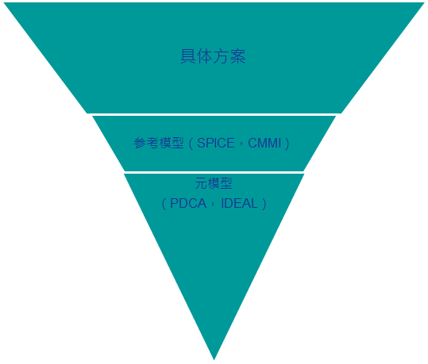
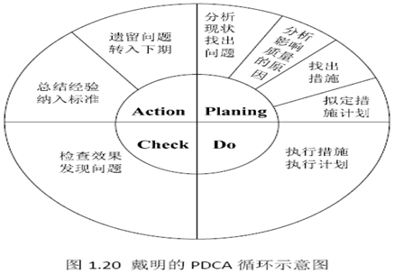
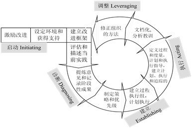
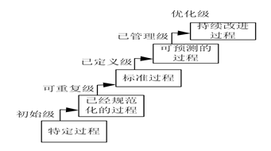
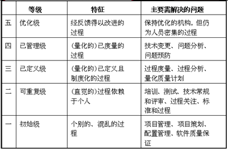
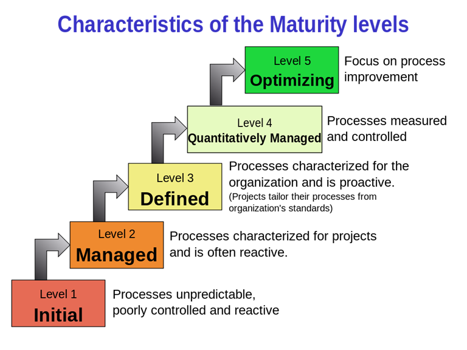
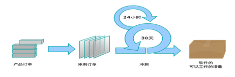

# 软件模型

## 生命周期模型

### 定义

+ 对软件过程的一种人为的划分，同样的软件开发过程,因为目的不一样，可能会被划分和命名成不同的生命周期模型。例如：为了突出后续验证确认阶段与上游开发阶段之间的对应关系，一个单一顺序的软件开发过程可以划分和命名成V模型。但是,同样的软件开发过程,通常也可以划分成为一个典型的瀑布模型。
+ 软件开发过程的主框架、粗粒度划分。比如:在一个典型的瀑布模型中，会包含一个需求分析阶段；然而需求分析阶段的具体步骤和流程，则一般不会在生命周期模型中给出描述。
+ 生命周期模型不包含技术实践。生命周期模型中往往只定义管理实践（例如，项目计划、风险分析等）；而一些典型的技术类实践（例如：重构、测试驱动开发等）则不会出现在生命周期模型的描述当中。

### 典型例子

+ 瀑布模型、迭代式模型、增量模型、螺旋模型、原型法等等。

### 瀑布模型理解

+ 瀑布模型不是单一模型，是一系列模型，覆盖最简单场景（过程元素少）到最复杂场景（过程元素多）
+ 软件项目应该更加实际情况选择合适过程元素的瀑布模型，基本原则是，项目面临困难和挑战越多，选择的模型应该越复杂
+ 软件项目团队往往低估项目的挑战，选择过于简单的瀑布模型

## 过程模型

### 参考模型

+ 软件过程管理参考模型 CMM/CMMI, SPICE等
+ 软件过程改进参考元模型 PDCA，IDEAL
+ 软件过程管理，管理项目的方法够不够好 CMM、CMMI、SPICE
+ 软件过程管理=软件过程改进 PDCA（planning\Do\Check\Action）、IDEAL

### PDCA模型

+ planning\Do\Check\Action

### IDEAL模型

  1） 包括软件过程改进周期的五个阶段

I: Initiating 开始  

D: Diagnosing 诊断、评价  

E: Establishing 建立  

A: Acting 执行  

L: Leveraging 调整  

2）   

### CMM模型

CMM 的全称为：Capability Maturity Model ，即能力成熟度模型。

1. 初始级——软件过程的特点是杂乱无章，有时甚至很混乱，几乎没有明确定义XX步骤，成功完全依赖个人努力和英雄式的核心任务。
2. 可重复级——建立了基本的项目管理过程来跟踪成本、进度和机能，有必要的过程准则来重复以往在同类项目中在成功。
3. 已定义级——管理和工程的软件过程已经文档化、标准化，并综合成整个软件开发组织的标准软件过程。所有项目都采用根据实际情况修改后得到的标准软件过程来开展和维护软件。
4. 已管理级——制定了软件工程和产品质量的详细度量标准。软件过程和产品的质量都被开发组织的成员所理解和控制。
5. 优化级——加强了定量分析，通过来自过程质量反馈和来自新观念、新技术的反馈过程能持续不断地改进。

### CMMI模型

CMMI 的全称为：Capability Maturity Model Integration，即能力成熟度模型集成。

1. Initial 原始级别，开发相对混乱，依赖个人英雄主义，没有过程概念，救火文化盛行；
2. Managed 已经管理级别，项目小组级体现着项目管理的特征，有项目计划和跟踪，需求管理、配置管理等等；
3. Defined，已经定义级别，在公司层有标准流程和相应的裁剪规范，每个项目小组可以据此定义自己的过程，使得优秀的做法可以在公司层共享；
4. Quantitatively Managed, 定量管理，构建预测模型，已统计过程控制的手段来管理过程项目；
5. Optimizing 持续优化，继续应用统计方法识别过程偏差，找到问题根源并消除，避免未来继续发生类似问题。

### ISO/IEC

1） 也叫SPICE（Software Process Improvement and Capability Determination）

2） 过程类别共有五种，分别是

+ 客户-供应商(CUS)过程
+ 工程（ENG）过程
+ 支持（SUP）过程
+ 管理（MAN）过程
+ 组织（ORG）过程 

1） 重点关注“过程质量”，强调“持续改进”

2）获得ISO 9000标准认证的企业应该具有CMM第2~3级的水平

## 软件过程

### 典型过程与实践

+ 方法之一：形式化方法

+ 方法之二：结构化程序设计和瀑布模型

+ 问题和不足（效率和质量）
  + 形式化在扩展性和可用性方面存在不足
  + 瀑布模型成为一个重文档，慢节奏的过程

### DevOps

+ （Development和Operations的组合词）是一组过程、方法与系统的统称
+ 它是一种重视“软件开发人员（Dev）”和“IT运维技术人员（Ops）”之间沟通合作的文化、运动或惯例。
+ 方法论基础是敏捷软件开发、精益思想以及看板Kanban方法。
+ 以领域驱动设计为指导的微服务架构方式
+ 大量虚拟化技术的使用
+ 一切皆服务XaaS(X as a Service)的理念指导
  + IaaS (infrastructure as a service)
  + PaaS (platform as a service)开发
  + SaaS, FaaS
+ 构建了强大的工具链，支持高水平自动化

## 敏捷开发

### 迭代式

+ 大型软件系统的开发过程也是一个逐步学习和交流的过程，软件系统的交付不是一次完成，而是通过多个迭代周期，逐步来完成交付。
  + 迭代式开发不是只是把过程分成小部分
  + 迭代式没有优先级
  + 需求是没有办法提前决定的

### 敏捷开发

+ 雪鸟会议和敏捷宣言

  + 个体和互动胜过流程和工具
  + 可以工作的软件胜过详尽的文档
  + 客户合作胜过合同谈判
  + 响应变化胜过遵循计划
  + 尽管右项有其价值，我们更重视左项的价值。（如果没有的话，敏捷宣言是不正确的）
  + 敏捷的principle：不要过多地考虑未来

+ 开源软件开发方法：是一种基于并行开发模式的软件开发的组织与管理方式 

  + “Linus定律”：“如果有足够多的beta测试者和合作开发者，几乎所有问题都会很快显现，然后自然有人会把它解决。”

  + “早发布，常发布，倾听用户的反馈 ”、“把你的用户当成开发合作者对待，如果想让代码质量快速提升并有效排错，这是最省心的途径”、“设计上的完美不是没有东西可以再加，而是没有东西可以再减”

  + 代码管理：严格的代码提交社区审核制度

+ 一些演化

  + 内部开源（inner source）

  + 众包（Crowdsourcing）

## 极限编程XP

偏重于一些工程实践的描述

eXtreme Programming，极限的含义是指把好的开发实践运用到极致

### 价值观

四大价值观：沟通、简单、反馈、勇气和尊重。

### 极限编程的有效实践

+ 客户作为开发团队的成员——客户代表 

+ 使用用户素材 

+ 短交付周期 

+ 验收测试 

+ 结对编程——结对编程就是由两名开发人员在同一台计算机上共同编写解决同一个问题的程序代码，通常一个人编码，另一个人对代码进行审查与测试，以保证代码的正确性与可读性。结对编程是加强开发人员相互沟通与评审的一种方式。 

+ 测试驱动开发——极限编程强调“测试先行”。在编码之前，应该首先设计好测试方案，然后再编程，直至所有测试都获得通过之后才可以结束工作。 

+ 集体所有
+ 持续集成 
+ 可持续的开发速度 <=40h/week
+ 开放的工作空间
+ 重构 
+ 使用隐喻 

## SCRUM

### 定义

+ 典型SCRUM团队由一名产品负责人、开发团队和一名SCRUM Master组成
+ SCRUM团队是跨职能的自组织团队
+ Scrum不是过程/技术，而是一个框架。框架主要描述迭代式、不包含任何技术实践，而是管理实践（如何估算，如何跟踪，处理需求变更）。
+ Sprint 冲刺（一周以内，甚至每日）
+ 迭代式增量软件开发过程
  + 在每一次冲刺（一个15到30 天周期），开发团队创建可用的软件的一个增量。
    + 每一个冲刺所要实现的特性来自产品订单， 产品订单是按照优先级排列的要完成的工作的概要的需求。

    + 哪些订单项会被加入一次冲刺由冲刺计划会议决定。 在会议中，产品负责人告诉开发团队他需要完成产品订单中的哪些订单项。开发团队决定在下一次冲刺中他们能够承诺完成多少订单项。 
    + 在冲刺的过程中，没有人能够变更冲刺订单（sprint backlog），这意味着在一个冲刺中需求是被冻结的。

+ Empirical Process Control VS. Statistical Process Control，不同于统计过程控制方法（也叫预测式、计划式）不能解决不可预见的需求变化问题，Scrum采用的实证过程控制承认问题无法完全理解或定义，即用户可以在项目过程中变更需求，关注于如何使开发团队快速推出和响应需求变化的能力最大化

+ Scrum VS. XP
  + 迭代周期不同。XP迭代周期为1-2周，而Scrum迭代周期为2-4周
  + 迭代中是否允许需求变更。XP中只要变更需求与原需求所需时间资源相等即可变更，而Scrum在迭代中需求被冻结
  + 迭代中，需求是否严格按照优先级来实现。XP中务必遵守优先级别，Scrum中则比较灵活，原因是可能有需求依赖问题
  + 过程工程化。Scrum开发过程并未工程化，要求开发者自觉保证，但XP则对开发流程定义严格，例如TDD，结对编程，重构等

### 产品负责人

+ 产品负责人的职责是将开发团队开发的产品价值最大化。 
+ 产品负责人是负责管理产品待办列表的唯一负责人。产品待办列表的管理包括： 
  + 清晰地表述产品待办列表项；
  + 对产品待办列表项进行排序，使其最好地实现目标和使命；
  + 优化开发团队所执行工作的价值；
  + 确保产品待办列表对所有人是可见、透明和清晰的，同时显示 Scrum 团队下一步要做的工作；以及确保开发团队对产品待办列表项有足够深的了解。

### 开发团队

+ 负责在每个 Sprint 结束时交付潜在可发布并且“完成”的产品增量。
+ 开发团队由组织组建并得到授权，团队自己组织和管理他们的工作。开发团队具有下列特点：
  + 他们是自组织的。没有人（即使是 Scrum Master）有权告诉开发团队应该如何把产品待办列表变成潜在可发布的功能增量；
  + 开发团队是跨职能的团队，团队作为一个整体，拥有创建产品增量所需的全部技能；
  + Scrum 不认可开发团队成员的任何头衔，不管其承担何种工作（他们都叫开发人员）。
  + Scrum 不认可开发团队中所谓的“子团队”，无论其需要处理的领域是诸如测试、架构、运维或业务分析
  + 开发团队中的每个成员也许有特长和专注的领域，但是责任属于整个开发团队。 

### SCRUM Master

+ 促进和支持 SCRUM 
+ 帮助每个人理解 SCRUM 理论、实践、规则和价值
+ SCRUM Master 是一位服务型领导。
  + 帮助 SCRUM 团队之外的人了解如何与 SCRUM 团队交互是有益的
  + 改变SCRUM 团队之外的人与 SCRUM 团队的互动方式来最大化 SCRUM 团队所创造的价值。

+ Scrum Master 服务于产品负责人

  + 确保 Scrum 团队中的每个人都尽可能地理解目标、范围和产品域；

  + 找到有效管理产品待办列表的技巧；

  + 帮助 Scrum 团队理解为何需要清晰且简明的产品待办列表项；
  + 理解在经验主义的环境中的产品规划；
  + 确保产品负责人懂得如何来安排产品待办列表使其达到最大化价值；
  + 理解并实践敏捷性；以及当被请求或需要时，引导 Scrum 事件。

+ Scrum Master 以各种方式服务于开发团队，包括

  + 作为教练在自组织和跨职能方面给予开发团队以指导；
  + 帮助开发团队创造高价值的产品；

  + 移除开发团队工作进展中的障碍；

  + 按被请求或需要时，引导 Scrum 事件；以及，

  + 在 Scrum 还未完全采纳和理解的组织环境中，作为教练指导开发团队。

+ Scrum Master 以各种方式服务于组织，包括：
  + 带领并作为教练指导组织采纳 Scrum；
  + 在组织范围内规划 Scrum 的实施；
  + 帮助员工和利益攸关者理解并实施 Scrum 和经验导向的产品开发；
  + 引发能够提升 Scrum 团队生产率的改变；以及，
  + 与其他 Scrum Master 一起工作，增强组织中 Scrum 应用的有效性。

## 看板（Kanban）

### 介绍

+ 精益生产（丰田制造法）的具体实现
+ 一种组织工作、提高效率的工具。和Scrum相似的地方在于，看板也支持将工作拆分为可执行的小任务，并使用看板（长得很像Scrum Board）实现工作的流转。
+ Scrum需要限制的是完成特定工作量，所允许的时间（即scrum是严格规定冲刺周期的）
+ 而看板限制的是同一条件下允许的工作量（只有规定数目的任务可以进行，只有规定数目的可以在列表。）
+ 看板不规定角色
+ 可视化工作流、限定WIP（WIP限制决定了每种情况下的工作流中可以存续的最大工作量）、管理周期时间

## 一些讨论

### XP与CMM/CMMI是对立的两种软件开发方法。

这句话最大的问题：CMM不是软件开发方法

CMM：

1. 若要开发出高效率、高质量及低成本的软件，就必须从改善软件生产流程着手
2. CMM的二级就是要制定计划，按照计划来工作，一旦出现偏差，需要纠正。
3. CMM更广泛的，XP更适用某具体小型迭代快的项目。

XP：

1. 敏捷考虑的是当前，是一种适应。
2. 更强调可适应性而不是可预测性，极限编程的主要目标在于降低因需求变更而带来的成本
3. 重构是考虑改善代码结构，降低未来修改的风险，是一种对未来的考虑。
4. 是一种开发方法，而CMM不是一种开发方法，这两种属性不一样。过程改进的参考模型和具体的项目管理方法是两回事。但大部分是人为制造出来的。
5. XP的基础并不牢靠，它的起源是一个失败的项目（XP被提出后，因为千年虫问题，项目目标没有被完全实现）。

### CMM/CMMI不适合当今互联网环境的项目管理需求。

不正确，CMM的目的是针对特定的软件组织，找到一个适合它的方法。适合是指能够支撑业务需求的方法。前提是不能教条式地理解CMM和CMMI。

### PDCA和IDEAL不适合在敏捷环境中使用。

很多敏捷过程中的改进原理就是PDCA。如果我们说项目管理，可以说再某种场景下比较适合。

### 不同的软件开发过程应该使用不同的生命周期模型，反之亦如此。

不正确，注意软件开发过程和生命周期概念的不同。生命周期是粗粒度的划分，所以即使软件开发过程不一样，生命周期概念可能也一样。Eg. TPD测试用例在前面写和后面写，从开发过程来说不一样，但是划分生命周期时，都是属于实现阶段。单元测试不是属于测试阶段，属于开发/实现阶段。

反过来，不对的。瀑布型和V字形是两个不同的生命周期模型。究其主要阶段，是相同的。（V字形，详细设计对应集成测试）因此不同模型的开发过程不同是不一定的

### CMMI是过程改进模型而非软件过程或者软件过程模型

+ CMMI不是软件过程，也不是软件过程模型，它是过程改进模型（软件从不成熟到成熟的路线图）

### CMMI不是过程优劣的标准，也不适合用作公司之间的能力比较

+ 一开始提出是为了帮助国防部区分哪些供应商是好的，哪些是不好的
+ 举个例子，现在达到3级水平，只能说现在的商业目标和能力是匹配的，但是如果业务目标变了，很有可能就不是3级了，因此这只是一个相对的评级
+ 在特定的时间点，因为业务目标和过程能力（过程输出）匹配
+ 原来能够实现的业务目标

### 为什么CMMI VS. Agile是一个伪命题？

+ Agile 敏捷过程或方法，这是一种软件开发方法，是软件过程
+ CMMI 过程管理参考模型
+ CMMI与Agile的比较没有意义

