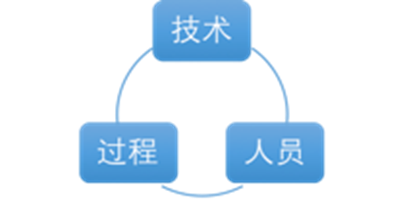
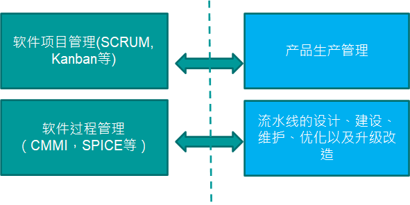

# 历史演变与经典工作

## 软件历史

### 《没有银弹》

+ 本质难题是
  + 不可见性
  + 复杂性
  + 可变性
  + 一致性

+ 三个本质难题因项目而异（复杂性、可变性、一致性）
+ 四大本质难题相互促进
+ 本质难题变化带动软件方法（过程）演变（场景 -> 本质难题 -> 方法学变化）

### 三大阶段

+ 软硬件一体化阶段（50年代~70年代）
  + 软件完全依附于硬件
  + 软件作坊

+ 软件成为独立的产品（70年代~90年代）
+ 网络化和服务化（90年代中期迄今）

### 软硬件一体化

#### 软件完全依附于硬件

+ 软件应用典型特征
  + 软件支持硬件完成计算任务
  + 功能单一
  + 复杂度有限
  + 几乎不需要需求变更

+ 软件开发典型特征
  + 硬件太贵
  + 团队以硬件工程师和数学家为主

#### 软件作坊

+ 软件应用典型特征
  + 功能简单
  + 规模小

+ 软件开发典型特征
  + 很多非专业领域的人员涌入软件开发领域
  + 高级程序语言出现
  + 质疑权威文化盛行

### 软件成为独立的产品

+ 软件应用特征
  + 摆脱了硬件束缚（OS）
  + 功能强大
  + 规模和复杂度剧增
  + 个人电脑出现 -> 普通人成为软件用户

+ 需求多变
+ 兼容性要求
+ 来自市场的压力

### 网络化和服务化

+ 软件应用特征
  + 功能更复杂，规模更大
  + 用户数量急剧增加（这会带来什么问题？）
  + 快速演化和需求不确定
  + 分发方式的变化（SaaS）
+ 随着网络技术的发展，对于软件的应用看到一些特征。
  + 每隔18个月软件规模翻番；每5年，规模编程原来的10倍
  + 需求的快速演化和不确定
  + 摩尔定律：每隔18个月，硬件性能翻一番，价格减半。（每隔18个月，晶体管数量翻一倍）
  + 反摩尔定律：软件系统功能延迟交付一年半，获取的收益会减半
  + 一天更新1000+次，保证服务正常对外提供，只有DevOps能实现不中断服务下的高频更新
  + 容器比起虚拟机，更轻量级

### 发展现状

+ 软件应用典型特征
  + 进一步服务化和网络化（移动是主流）
  + 用户需求多样性进一步凸显
  + 软件产品和服务的地位变化
  + 错综复杂的部署环境

+ 近乎苛刻的用户期望

  + 多：功能丰富，个性化
  + 快：快速使用，及时更新，快速解决问题
  + 好：稳定，可靠，安全，可信
  + 省：用户的获得成本低，最好免费

+ 空前强大的开发和部署环境——XaaS

  + IaaS
+ PaaS
  + SaaS, FaaS
+ 盛行共享和开源
  + 潜在支撑获得了长足进步（AI，Bigdata， Cloud，etc.）

## 软件项目管理

### 本质困难

+ 复杂性：规模上，软件实体可能比任何由人类创造的其他实体要复杂，因为没有任何 两个软件部分是相同的(至少是在语句的级别)。数字计算机本身就比人类建造的大多数东西复杂。计算机拥有大量的状态，这使得构 思、描述和测试都非常困难。软件系统的状态又比计算机系统状态多若干个数量级。软件的复杂度是必要属性，不是次要因素。

+ 不可见性：软件是不可见的和无法可视化的。软件的客观存在不具有空间的形体特征。因此，没有已有的表达方式，就像陆地海洋 有地图、硅片有膜片图、计算机有电路图一样。当我们试图用图形来描述软件结构时，我们 发现它不仅仅包含一个，而是很多相互关联、重叠在一起的图形。这些图形可能描绘控制流 程、数据流、依赖关系、时间序列、名字空间的相互关系等等。它们通常不是有较少层次的 扁平结构。

+ 可变性：软件实体经常会遭受到持续的变更压力。其中部分的原因是因为系统中的软件包含了很多功能，而功能是最容易感受变更压力 的部分。另外的原因是因为软件可以很容易地进行修改——它是纯粹思维活动的产物，可以无限扩展。日常生活中，建筑有可能发生变化，但众所周知，建筑修改的成本很高，从而打 消了那些想提出修改的人的念头。

  所有成功的软件都会发生变更。现实工作中，经常发生两种情况。当人们发现软件很 有用时，会在原有应用范围的边界，或者在超越边界的情况下使用软件。功能扩展的压力主 要来自那些喜欢基本功能，又对软件提出了很多新用法的用户们。

+ 一致性（兼容）：某些情况下，因为是开发最新的软件，所以它必须遵循各种接口。另一些情况下，软件的开发目标就是兼容性。在上述的所有情况中，很多复杂性来自保持与其他接口的一致， 对软件的任何再设计，都无法简化这些复杂特性。

不可见性是软件固有的特点，另外三个会随着环境的变化而变化

这四点不是单独影响软件开发，而是相互促进

### 软件危机

+ 软件行业的摩尔定律：功能类似的软件，每隔18个月规模（比如代码行）翻番，用户获取该软件或服务的代价下降。

+ 落后的软件生产方式无法满足迅速增长的计算机软件需求，软件开发与维护出现问题。

+ 软件所占比例增加，软件的决定性在逐渐增加

+ 软件自身的变化—比例、规模度越来越大、规模==复杂度 -> 开发的难度在增加

+ 主要表现：

  1） 软件开发费用和进度失控

  2） 软件可靠性差

  3） 生产出来的软件难以维护

  4） 用户对“已完成”系统不满意现象经常发生

### 软件工程

+ 研究用工程化方法构建和维护有效的、实用的和高质量的软件的学科。
+ 软件工程的核心问题
  + 软件工程的管理视角：“成功是否可复制”
  + 软件工程的技术视角：“问题是否可以解决得更好” （已经假设，成功可以复制）

### 软件项目管理

+ 软件项目管理是应用方法、工具、技术及人员能力来完成软件项目，实现项目目标的过程。
+ 估算、计划、跟踪、风险管理、范围管理、人员管理、沟通管理，等等。

#### 三要素

+ 目标（必须有办法判断项目有没有实现，“我要实现一个高质量项目”不是一个好的目标） 
+ 状态（跟踪目标的实现与否，偏差与否的状态）
+ 纠偏（避免开发出现偏差，及时进行偏差纠正）

#### 三目标

+ 成本
+ 质量
+ 工期

## 软件过程

### 定义

+ “成功是否可以复制？”
+ 尽可能使现在项目的做法和以前一样，需求、编码、测试
+ 软件过程是为了实现一个或者多个事先定义的目标而建立起来的一组实践的集合。
+ 这组实践之间往往有一定的先后顺序，作为一个整体来实现事先定义的一个或者多个目标。

### 广义定义

+ 技术 + 人员 + 狭义过程
+ 同义词
  + 软件开发方法、软件开发过程：净室cleanroom方法、极限编程方法、SCRUM方法、Gate方法；更一般的，敏捷软件过程/方法，轻量型过程/方法以及重型过程/方法等描述也是适当的。

## 软件过程管理

### 定义

+ 软件过程管理的管理对象就是软件过程
+ 目的是为了让软件过程在开发效率和质量性能方面有更好的性能
+ 核心问题：“能否复制成功”

+ 软件项目管理，关心项目目标能否实现

### 关注

+ 偏**管理**的实践更关注 成功是否能复制

+ 偏**技术**的实践更关注 问题能够更好解决

## 一些讨论

### 软件过程管理是软件项目管理应该要实现目标。

不正确

### “在公司导入敏捷过程是我们今年过程改进的主要目标。”

概念上看没有问题

### 从软件发展的三大历史阶段以及软件过程的演变当中，我们可以总结出哪些规律性的东西？

（1） 需求不确定性

（2） 迭代式开发：用户和开发方式相互影响的过程。实证软件过程=经验软件过程

（3） 软件开发的四大本质难题，虽然在第二阶段提出，但总结的涵盖至今的本质难题。

（4） 所有软件过程无法脱离技术存在，典型的是敏捷方法（面向对象的技术）。