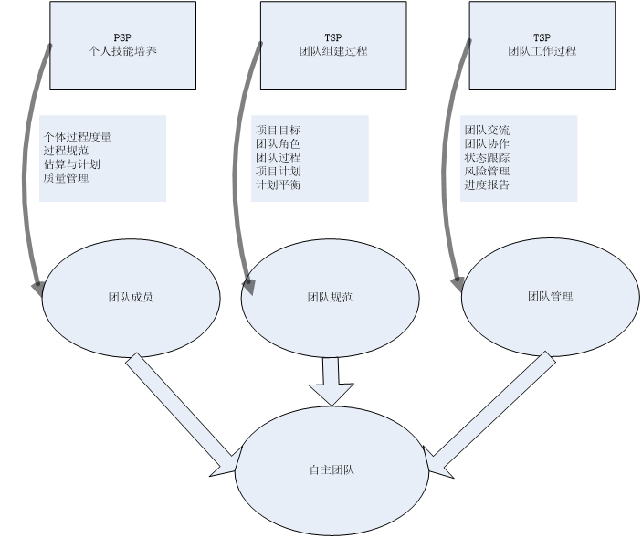
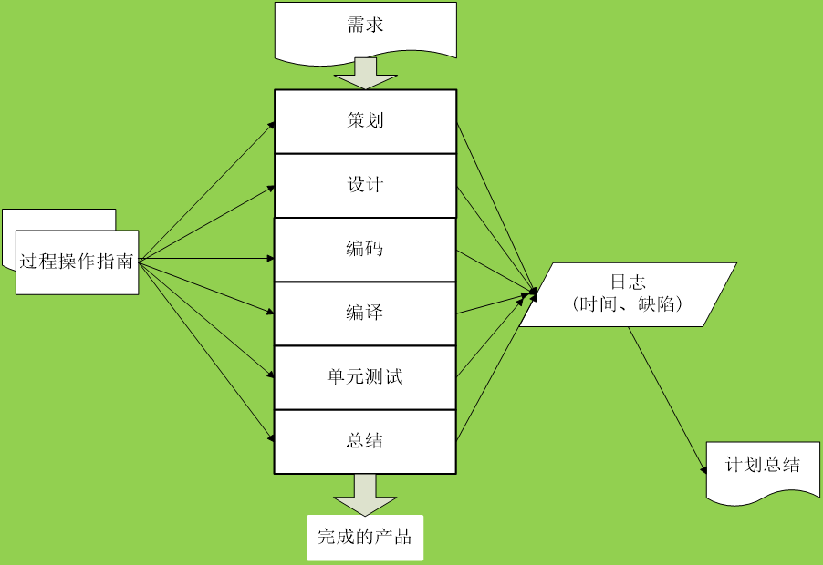
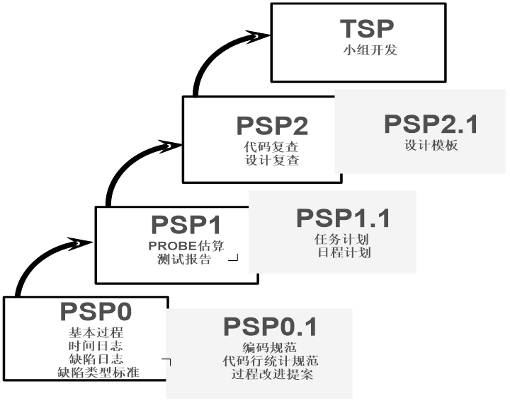
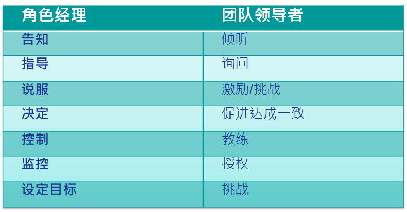

# 团队动力学

## 软件开发

### 软件开发是知识工作

+ 软件开发是一项既复杂又富有创造性的知识工作

+ 软件开发——智力劳动
  + 处理和讨论极其抽象的概念
  + 把不同的部分（不可见）整合成一个可以工作的系统

+ 这就要求从事软件开发的工程师
  + 必须全身心地参与工作
  + 主观意愿上努力追求卓越

+ 这就要求管理者激励并且维持激励
  + 激励手段
  + 维持激励手段

### 知识工作管理

+ 管理知识工作的关键规则是：管理者无法管理工作者，知识工作者必须实现并且学会自我管理。

+ 要自我管理，知识工作者必须
  + 有积极性
  + 能做出准确的估算和计划
  + 懂得协商承诺
  + 有效跟踪他们的计划
  + 持续地按计划交付高质量产物

## 领导者

### 介绍

+ 知识工作者的管理需要的是领导者，而不是经理。
+ 简单讨论知识工作的领导者具有什么特点？

### 激励手段

1. 威逼

2. 利诱

3. 鼓励承诺

### 领导方式

+ 交易型领导方式
  + 承诺奖励激励
  + 人们通常能找到新的方式来获得奖励，同时少做工作。
  + 威逼和利诱属于交易型领导方式。

+ 转变型领导方式
  + 用成就激励
  + 鼓励承诺属于转变型领导方式。

+ 由于交易型领导方式很少能产生成功的并且有创造性的团队，因此转变型领导方式是首选。

### 承诺形式的激励

+ 在个人级别，有很大的差异
  + 有些人对待承诺十分认真。
  + 有些人对待承诺十分轻率。

+ 当满足以下情况，团队承诺比个人承诺的激励作用更大
  + 所有团队成员共同参与作出承诺。
  + 团队依赖于每一位成员履行自己的承诺。

+ 一个软件开发团队在制定承诺时，要保证
  + 承诺是自愿的
  + 承诺是公开的
  + 承诺是可信（行）的
  + 向团队承诺

+ 维持激励需要及时的绩效反馈。

+ 这些反馈包括
  + 根据一个详细计划衡量进度
  + 当前计划不准确时重做计划，想想为什么？
  + 为漫长而富有挑战性的项目提供中间反馈，即里程碑，想想为什么？

### 马斯洛需求层次理论

+ 按照马斯洛关于人的需求层次的理论，人的需求大致分成五个不同的层次。
  + 第一层：生理需求
  + 第二次：安全感
  + 第三层：爱和归属感
  + 第四层：获得尊敬
  + 第五层：自我实现
+ 自我实现是最高的层次
+ 激励来自为没有满足的需求而努力奋斗
+ 低层次的需求必须在高层次需求满足之前得到满足
+ 满足高层次的需求的途径比满足低层次的途径更为广泛

## 自主团队

### 定义

+ 自行定义项目的目标、团队组成形式、成员角色、开发策略、开发过程、开发计划、度量，管理和控制项目工作

### 支持

+ 在项目进展过程中获得管理层的支持
  + 严格遵循定义好的开发过程开展项目开发工作。
  + 维护和更新项目成员的个人计划和团队计划。
  + 对产品质量进行管理。
  + 跟踪项目进展，并定期向管理层报告。
  + 持续地向管理层展现优异的项目表现。

## PSP

Personal Software Process

### 渊源

+ 过程改进运动
  + TQM(Total Quality Management)：全面质量管理
  + Humphrey早期工作
  + PSP/TSP

+ PSP作用
  + 个人级管理实践和过程估算和计划
  + 承诺和拒绝承诺
  + 理解和改进
  + 工业水准的过程和规范
  + 客观决策的数据

### 简介

+ PSP是包括了数据记录表格、过程操作指南和规程在内的结构化框架。（过程操作指南也称过程脚本。这些真实日志的记录，为在最后制作计划总结提供了数据依据。）
+ 一个基本的PSP流程包括策划、设计、编码、编译、单元测试以及总结等阶段。
+ 在每个阶段，都有相应的过程操作指南，用以指导该阶段的开发活动
+ 所有的开发活动都需要记录相应的时间日志与缺陷日志。

### 典型过程

### 基本原理

+ 软件系统的整体质量由该系统中质量最差的某些组件所决定；

+ 软件组件的质量取决于开发这些组件的软件工程师，更加确切的说，是由这些工程师所使用的开发过程所决定；

+ 作为合格的软件工程师，应当自己度量、跟踪自己的工作，应当自己管理软件组件的质量；

+ 作为合格的软件工程师，应当从自己开发过程的偏差中学习、总结，并将这些经验教训整合到自己的开发实践中，也就是说，应当建立持续地自我改进机制。
+ 上述基本原理除了继续肯定“过程质量决定最终产品质量”这一软件过程改进的基石之外，更加突出了个体软件工程师在管理和改进自身过程中的能动性。这也就形成了PSP的理论基础。

### 级别

+ PSP3.0(TSP)之前，每一个步骤是上一个步骤增加了一点东西。而PSP3.0是自定义（而不是把前面的东西拿过来）
+ 到2.0以上，应该具备自己定义过程，改进过程的能力（可以是编码+改错）
+ 经过训练后定义出的编码+改错
+ 敏捷这个标签是有负面作用的，没有必要说方法是敏捷的。在有的地方会把PSP TSP当作敏捷的方法，也有的地方会当作敏捷的对立面
+ 严格的方法，计划驱动方法（是经不起推敲的）
+ PSP3.0强调个人  TSP强调团队 视角不一样，讲的东西一样，过程自定义

## TSP

### 流程

### 角色

+ 项目组长
+ 计划经理
+ 开发经理
+ 质量经理
+ 过程经理 
+ 支持经理
+ 开发人员

### 领导者 V.S. 经理

### 项目组长

+ 建设和维持高效率的团队
+ 激励团队成员积极工作
+ 合理处理团队成员问题
+ 向管理层提供项目进度相关的完整信息
+ 充当合格的会议组织者和协调者
+ 主持项目周例会
+ 每周汇报项目状态
+ 分配工作任务

### 计划经理

+ 开发完整的、准确的团队计划和个人计划
+ 每周准确的报告项目小组状态
+ 跟踪项目进度
+ 参与项目总结

### 开发经理

+ 开发优秀的软件产品
+ 充分利用团队成员的技能
+ 制定开发策略
+ 开展产品规模估算和所需时间资源的估算
+ 实现软件产品
+ 集成测试和系统测试
+ 各类文档

### 质量经理

+ 项目团队严格按照质量计划开展工作，开发出高质量的软件产品
+ 所有的小组评审工作都正常开展，并且都形成了评审报告
+ 开发和跟踪质量计划
+ 软件产品提交配置管理之前，对其进行评审，以消除质量问题
+ 项目小组评审的组织者和协调者
+ 参与项目总结

### 过程经理

+ 所有团队成员准确的记录、报告和跟踪过程数据。
+ 所有的团队会议都有相应会议记录
+ 建立和维护团队的开发标准

### 支持经理

+ 项目小组在整个开发过程中都有合适的工具和环境
+ 对于基线产品，不存在非授权的变更
+ 项目小组的风险和问题得到跟踪
+ 项目小组在开发过程中满足复用目标
+ 主持配置管理委员会，管理配置管理系统
