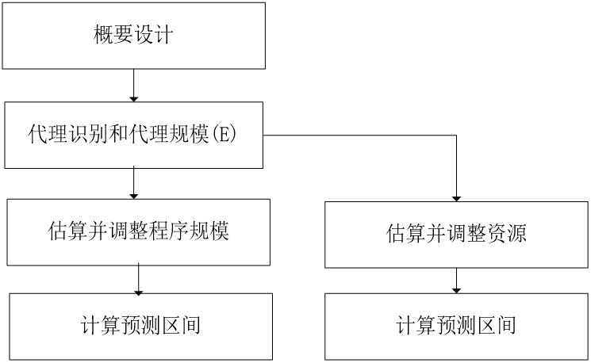
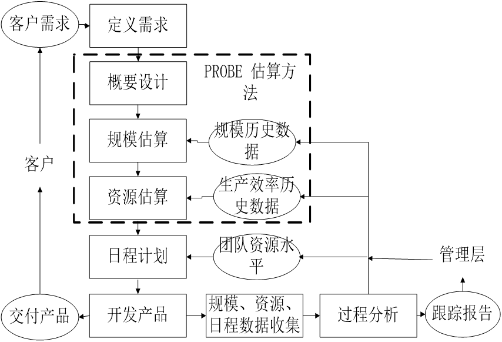
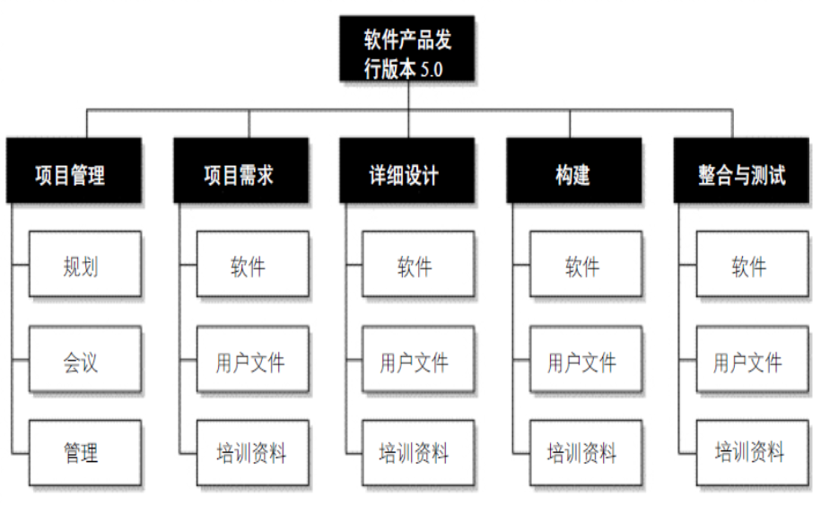
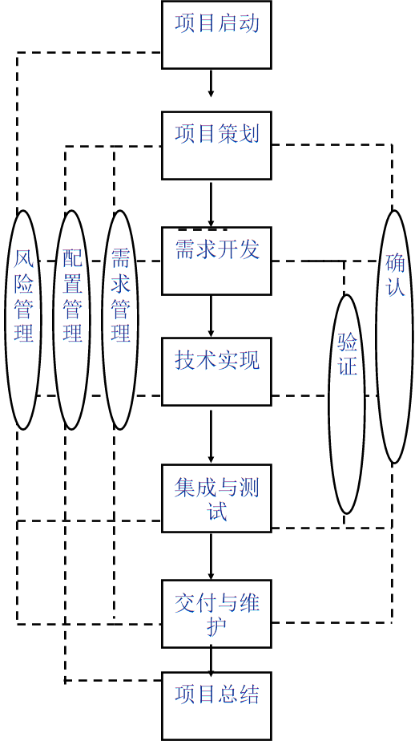
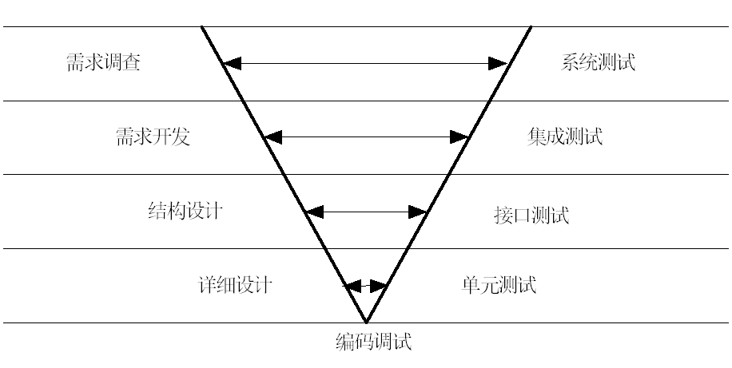
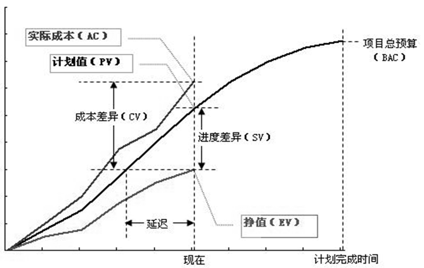
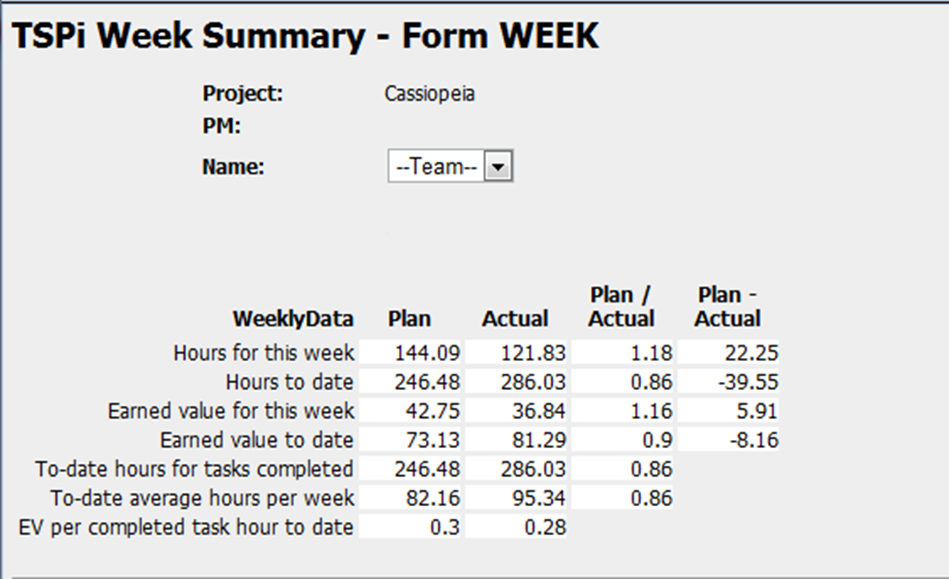

# 估算、计划和跟踪

## 估算

### 简介

+ 管理的三个元素： 目标，状态，纠偏，估算对应第一个元素目标

#### 过程度量

+ 关于度量的争议
+ 度量体现着决策者对试图要实现的目标的关切程度
+ GQM 和 GQM+度量体系构建（Goals-Questions-Metrics，GQM）
  + GQM从管理的目标出发，将目标归纳、分解为度量的指标, 并把这些指标提炼成可以测量的值
  + 示例
    + G：最大化所有团队贡献者的生产力
    + Q：开发人员所能够完成分配给他们的任务吗？或者他们遇到障碍了吗？
    + M：有个体或者工作组产生的项目工件的量级
+ PSP基本度项
  + 规模
  + 时间
  + 缺陷
  + 日程（TSP）
+ 度量帮助过程的实践者了解过程状态，理解过程偏差。
+ 选择的规模度量方式必须反映开发成本；
+ 选择的度量方式必须精确；
+ 选择的度量方式必须能用自动化方法来统计；
+ 选择的度量方式必须有助于早期规划；

### PROBE

#### 规模度量困境

+ 精确的度量方式往往不便于早期规划；

+ 有助于早期规划的度量往往难以产生精确度量结果；
+ LOC VS. FP?
+ PROBE的作用

#### 原理

+ Proxy Based Estimation
+ 不是直接的估算（不直接估计代码行）
+ 估算的目的：所有的利益相关方达成共识，数字本身是多少不重要，这个数字可以乘任何系数，估算出的结果涉及的利益相关方能否达成共识
+ PROBE估算方法主要用来估算待开发过程程序的规模和所需资源
+ 如果需求定义不是错的，那就不能怀疑估算结果

#### 估算流程

#### 通用计划框架

+ 由于估算本质上是一种主观判断，因此难免出现偏差，这种偏差不能简单地根据上一次的偏差进行补偿修正
+ 使用线性回归调整规模估算
+ 使用线性回归调整时间估算

### 历史数据处理

| 类   | 方法数 | 代码行（LOC） |
| ---- | ------ | ------------- |
| A    | 3      | 39            |
| B    | 5      | 127           |
| C    | 2      | 64            |
| D    | 3      | 28            |
| E    | 1      | 12            |
| F    | 2      | 21            |

计算每个方法的代码行数，可以得出如下的数据：13、25.4、32、9.333、12、10.5。

#### 简单方法

+ 基本思想是:
  + 将每个方法的代码行数进行排序
  + 选择最小值作为VS；
  + 选择最大值作为VL；
  + 选择中值作为M；
  + 选择VS与M的均值作为S；
  + 选择VL与M的均值作为L。

+ 计算结果：VS = 9.333，VL = 32，M = 12 或者13，S = 11.2，L = 22.5。

#### 正态分布

+ 使用正态分布法的计算方法如下：
  + 选择所有数据的均值作为M，计算所有数据的标准差 σ。
  + 那么S = M- σ ，VS = M-2 σ ，L = M+ σ ，VL = M+2 σ 。

+ 计算结果：
  + 在上述例子中，VS = -1.67，S =7.68，M = 17.04，L = 26.39，VL = 35.75。

#### 对数正态分布

+ 大部分人习惯写很多规模很小的程序，少量规模较大的程序
+ 此外，程序的规模不可能出现负数

+ 计算方法：
  + 以e为底计算所有数据的自然对数；
  + 计算取对数之后的值的均值作为M，计算相应标准差 σ。
  + 那么S = M- σ ，VS = M-2 σ ，L = M+ σ ，VL = M+2 σ 。
  + 取反对数；

+ 计算结果：
  + VS = 5.55，S =9.19，M = 15.22，L = 25.21，VL = 41.75。

#### 对比

+ 简单方法：计算简单，但是，不稳定
+ 正态分布法：相对稳定，在历史数据基本符合正态分布的情况下，可以给出非常好的相对大小矩阵
+ 对数正态分布法：更加符合人们对于程序的规模的直观感觉

#### 有限历史数据

+ Probe方法依赖历史数据，但是实际历史数据有可能
  + 历史数据少于3个数据点；
  + 有足够的历史数据，但是数据的质量不高

#### 相关性

+ 相关性描述的是两组变化的数据之间相互关联的程度;

+ 在PSP中为确保估算质量，对于历史数据的相关性要求r≥0.7。

#### 显著性

+ 它描述的是上述两组数据的相关关系出现的偶然性
+ 因此，显著性越小越好。在PSP中要求显著性s≤0.05

#### 极端数据

+ PROBE A方法和B方法的时候，对于数据的相关性有要求。
+ 然而很多时候，历史数据中的一些极端数据会造成相关性的“假象”

### 历史数据质量

| PROBE方法 | 数据要求                                   | 数据质量要求                                    | 计算方法     |
| --------- | ------------------------------------------ | ----------------------------------------------- | ------------ |
| A         | 3组或者3组以上代理规模(E)与实际开发时间。  | r≥0.7；  s≤0.05；  β0≤估算结果的25%；  0.5≤β1≤2 | 略。         |
| B         | 3组或者3组以上计划程序规模与实际开发时间。 | r≥0.7；  s≤0.05；  β0≤估算结果的25%；  0.5≤β1≤2 | 略。         |
| C         | 有历史数据                                 | 无                                              | 按比例调整。 |
| D         | 没有历史数据                               | 无                                              | 猜测。       |

## 计划和跟踪

### 工作分解结构

#### 定义

+ 工作分解结构(Work Breakdown Structure，简称WBS)是以可交付成果为导向对满足项目目标和开发交付产物的项目相关工作进行的分解。它归纳和定义了项目的整个工作范围，每下降一层代表对项目工作的更详细定义

#### 作用

+ 范围基线
+ 提供整体观
+ 不遗漏可交付物
+ 明确各个角色的责任
+ 工作包定义
+ 估算和计划的基础
+ 理解工作，分析风险

#### 示例

#### 创建方法

+ 识别和分析可交付成果及相关工作；
+ 确定工作分解结构的结构与编排方法；
+ 自上而下逐层细化分解；
+ 为工作分解结构组成部分制定和分配标志编码；
+ 核实工作分解的程度是必要且充分的

#### 检查标准

+ 最底层要素不能重复，即任何一个工作包应该在WBS中的一个地方且只应该在WBS中的一个地方出现。
+ 所有要素必须清晰完整定义，即相应的数据词典必须完整定义。
+ 最底层要素必须有定义清晰的责任人，可以支持成本估算和进度安排。
+ 最底层的要素是实现目标的成分必要条件，即项目的工作范围得到完整体现。

#### 范围管理

+ 包括确保项目做且只做成功完成项目所需的全部工作的各过程。
+ WBS为范围管理提供了基准。
  + 收集需求
  + 定义范围
  + 创建WBS
  + 核实范围
  + 控制范围变更

#### 开发策略

+ 开发策略是在产品组件需求基础之上，明确每个产品组件的获得方式与顺序，从而在项目团队内部建立起大家都理解的产品开发策略。
+ 注意事项
  + WBS的使用
  + 产品组件开发顺序的考虑
  + 产品组件获得方式的考虑

### 生命周期模型

#### 过程框架

#### V字形

### 计划

#### 日程计划

+ 任务计划和日程计划
  + 前者描述了项目所有的任务清单、任务之间的先后顺序以及每个任务所需时间资源；后者描述了整个各个任务在日程上的安排，即各个任务计划哪天开始和计划哪天结束。
+ 典型计划流程回顾
  + 估算规模
  + 估算资源
  + 规划日程

#### 质量计划

+ 项目的质量计划中应当确定需要开展的质量保证活动。
+ 典型的质量保证活动包括个人评审、团队评审、单元测试、集成测试、系统测试以及验收测试等。

+ 在质量计划中需要解决的关键的问题是该开展哪些活动，以及这些活动开展的程度，如时间、人数和目标分别是什么。
+ 需要将项目总体质量目标细分成若干小的目标，这样便于在过程中进行管理和控制。结合本书第3章中介绍的质量管理指标，yield， PQI以及A/FR等，图 6‑4给出了质量管理计划的示例。途中右下角是质量总体目标，即整个系统在系统测试之后总的缺陷数应当小于6.63个。那么相应需要开展的质量保证活动以及每个活动的yield可以根据历史数据或者一般的行业数据确定。而每个质量管理活动所需时间则由PQI指标和A/FR指标加以确定。事实上，PQI和A/FR指标也是为了确保yield目标的实现。

#### 风险计划

+ 风险管理的目的是在风险发生前，识别出潜在的问题，以便在产品或项目的生命周期中规划和实施风险管理活动，以消除潜在问题对项目产生的负面影响。
+ 风险管理大致分成两部分，即风险识别和风险应对。
+ 风险管理是一个持续的、前瞻的过程，此过程是项目管理的重要部分。有效的风险管理是通过相关干系人的合作与参与，尽早且积极地识别风险，制定项目风险管理计划。风险管理须同时考虑有关成本、进度、绩效及其他风险的内部及外部来源。
+ 因为在项目初期进行变更或修正的工作负荷，通常比在项目后期来得容易、花费较低及较不具破坏性，所以，早期及积极的风险侦测是重要的。
+ 风险管理大致分成两部分，即风险识别和风险应对。

##### 风险识别

+ 识别与成本、进度及绩效相关的风险
+ 审查可能影响项目的环境因素
+ 审查工作分解结构的所有组件，作为风险识别的一部分，以协助确保所有的工作投入均已考虑
+ 审查项目计划的所有组件，作为风险识别的一部分，以确保项目在各方面均已考虑
+ 记录风险的内容、条件及可能的结果
+ 识别每一风险相关的干系人
+ 利用已定义的风险参数，评估已识别的风险
+ 依照定义的风险类别，将风险分类并分组、
+ 排列降低风险的优先级

##### 风险应对

+ 识别风险之后，就应当制定相应的风险管理策略，以应对各类风险。

+ 典型的策略包括
  + 风险转嫁：风险转嫁是指通过某种安排，在放弃部分利益的同时，将部分的项目风险转嫁到其他的团队或者组织。比如有的公司采取外包的方式，把一部分有技术风险的产品组件交由其他公司开发，在放弃部分收益的同时，也规避了技术风险。
  + 风险解决：风险解决是指采取一些有效措施，使得风险的来源不再存在。这往往是一种预防性的手段。比如针对项目面临的技术风险，采取技术调研或者引进技术专家的手段，使得原有的风险来源不再存在或者存在可能性极低，从而测试解决该风险。
  + 风险缓解：风险缓解是指容忍风险的存在，采取一些措施监控风险，不让风险对项目最终目标的实现造成负面影响。一般情况下，都需要制定相应的风险缓解计划。理性对待每个关键性的风险，研究可选择的应对方案，并对每个风险皆制定相应的行动过程，是风险缓解计划的关键内容。特定风险的风险缓解计划包括规避、降低及控制风险发生可能性的技术和方法，或降低风险发生时遭受的损失程度的方法，或上述两者。监控风险，当风险超过设定的阈值时，实施风险缓解计划，以使受冲击的部分回归到可接受的风险等级。只有当风险结果评定为高或无法接受时，才相应制定风险缓解计划和紧急应变计划，其它其他情况只需要适当监控即可。

### 计划评审

+ 项目各项计划完成之后，需要与各类计划的相关干系人开展评审工作，解决计划中相互矛盾与不一致的地方，并获得参与项目的各方对项目计划的承诺。
  + 识别每一项计划所需支持，并与相关干系人协商承诺。
    + 可用WBS为基础检查表，以确保所有工作都获得承诺。另外，在项目小组的沟通计划中，也可以定义每一项计划所需沟通和承诺的对象。
  + 记录所有的承诺，包括完整的承诺和临时的承诺，并确保由适当层次的人员签署。
    + 承诺必须文档化，以确保一致的相互理解，并可追踪及维护。临时性的承诺应附有相互关系的风险描述。
  + 适时与资深管理人员一起审查承诺。
    + 待审查的承诺包括内部承诺和外部承诺，关键是识别各个承诺的最新状态，进而判断各个承诺可被满足的程度。必要时，需要采取纠正措施

### 项目跟踪

+ 在项目进展过程中开展跟踪活动的目的在于了解项目进度，以便在项目实际进展与计划产生严重偏离时，可采取适当的纠正措施。

+ 项目进度滞后与否需要参照物，即项目计划。

+ 项目跟踪需要管理针对偏差而采取的纠偏措施。
+ 正如Brooks在《人月神话》一书中指出的那样，项目延迟整整一年是一次延迟一天慢慢积累起来的。开展及时有效的项目跟踪就是期望及时发现项目实际进展与计划之间的偏差，及时处理这些偏差，从而消除累计的偏差对项目造成的负面影响。
+ 例如，在软件工程实践中，有一条流传非常广泛的经验总结，即向一个已经落后的项目中增加人手，往往导致项目更加落后。而在实践中，一旦出现项目落后的情况，往往都会采取增加人手的方法来应对。

### 挣值管理

#### 简介

+ 项目的挣值管理方法(Earned Value Management，简称EVM)是用来客观度量项目进度的一种项目管理方法。
  + 任务与工作包要小
  + 每项任务实现附以一定价值（credit）
  + 100%完成该项任务，就获得相应价值（99%完成也没有价值）

+ EVM采用与进度计划、成本预算和实际成本相联系的三个独立的变量，进行项目绩效测量。

  + 简单实现

    + 这种方式仅仅关注进度差异。
    + 在实现时，首先需要建立WBS，定义工作范围；其次为WBS中每一项工作定义一个价值（PV）；最后按照一定的规则将某一数值赋给已经完成的工作或者正在进行的工作。常用规则分别为0-100规则和50-50规则，前者只有当某项任务完成时，该任务的PV值将转化成EV值；后者只需要开始某项任务，即可以赋原PV值的50%作为EV值，完成时，再加上另外的50%。而实际完成的工作所需成本AC不对EV值产生任何影响。

  + 中级实现

    + 在简单实现的基础上，加入日程偏差的计算。典型计算方式有：

    + 日程偏差SV = EV – PV;

    + 日程偏差指数SPI = EV/PV；

  + 高级实现

    + 在中级实现的基础上，还需要考察项目的实际成本。

#### 图示

#### EVM常用度量

+ BAC表示按照PV值的曲线，当项目完成的时候所需预算或者时间
+ 成本差异CV = EV-AC，表示的是已经完成的工作与所消耗的成本的差异。可以表示为消耗的时间，也可以表示为消耗的资金。
+ 成本差异指数CPI = EV/AC，表示单位成本创造的价值，很显然，CPI<1说明成本超支；CPI=1说明成本与预期一致；CPI>1说明成本低于预期
+ 日程偏差SV = EV – PV，表示进度偏差。显然SV<0表示进度落后；SV=0表示进度正常；SV>0表示进度超前。
+ 日程偏差指数SPI = EV/PV
+ 预计完成成本EAC = AC+(BAC-EV)/CPI = BAC/CPI，表示的是按照目前的进展已经成本消耗情况，整个项目完成的时候所需消耗的成本。

#### 例题

#### EVM的变形——燃尽图

+ 中间蓝色 > 红色表示项目的进度提前

#### EVM局限性

+ EVM这种方式也有一定的局限性。
  + EVM一般不能应用软件项目的质量管理。
  + EVM需要定量化的管理机制，这就使其在一些探索型项目以及常用的敏捷开发方法中的应用受到限制。
  + EVM完全依赖项目的准确估算，然而在项目早期，很难对项目进行非常准确的估算。

### 里程碑评审

#### 简介

+ 软件项目的里程碑往往是指某个时间点，用以标记某项工作的完成或者阶段的结束。
+ 典型的用以表示里程碑的事件有完成某项工作、获得干系人签字认可、完成某产物的评审和修改或者交付某产物等。里程碑的作用除了表示某项工作的完成并借以体现工作的进度之外，里程碑也可用来考察项目其他方面的状态，如质量、性能甚至包括实现策略等。里程碑评审就是为了实现上述目标的活动。

+ 审查的内容包括：
  + 项目相关的承诺，如日期、规格、质量等等；
  + 项目各项计划的执行状况；
  + 项目当前的状态讨论；
  + 项目面临的风险讨论等。
+ 进度评审：团队内
+ 里程碑评审：团队外

### 纠偏活动管理

+ 典型的纠偏活动包括
  + 偏差原因分析
  + 纠偏措施定义
  + 纠偏措施管理
+ 对于项目各类计划进行跟踪的结果无非有两种，一种是项目按照计划在正常开展，另外一种是项目显著偏离了计划。
+ 前者不需要项目小组采取特别的措施，而后者则要求项目小组必须采取相应的纠偏措施，而且需要管理纠偏措施直到结项。
+ 当然，这里的显著偏离计划，往往要求项目小组根据实际情况定义一定的控制阈值。即当偏差超出阈值的时候，才需要采取措施。高级项目管理往往需要引入统计过程控制方法来识别阈值。

## 项目总结

### 意义

+ 软件项目的特点决定了持续改善对于软件工程师的重要性。

+ Rita Mae Brown在书中写到的那样“所谓的愚蠢（Insanity）就是反复做同样的事情，但是期望有不同的结果”

+ 提供一个系统化的方式来总结经验教训、防止犯同样的错误、评估项目团队绩效、积累过程数据等。提供给项目团队成员持续学习和改进的机会。
+ 软件在社会生活中将扮演越来越重要的角色，软件的时效、经济、质量等因素的影响也会越来越大。
+ 这样的发展趋势给软件工程师带来极大的挑战。软件工程师应当将每一次项目经历都当成是一次学习和提高的机会。
+ 在项目总结过程中，软件工程师对比计划检验实际完成状况，找寻改进机会。其背后的基本思想是应当采取更聪明合理的方式来做事，而不是更加努力的方式来做事。也就是说，要改变的是做事的方式，而不是态度。在项目总结中，团队成员评价完成的产品的质量状况、消耗的开发代价以及相应的开发过程，判断计划的准确性和过程的合理性。识别问题和导致问题的根本原因，开发改进的方法以避免类似的错误反复发生。总结项目经验和教训，也会对组织中其他项目以及公司的项目管理体系建设起到重要的作用。

### 过程

+ 项目总结需要系统化有条理的进行，才能不遗漏重要的内容。因此往往需要事先定义总结过程，然后按部就班开展总结工作。
+ 一般情况下，项目总结都包括
  + 准备阶段
  + 总结阶段
  + 报告阶段

## PMBOK总结

+ 范围管理、时间管理、成本管理、质量管理、人力资源管理、沟通管理、风险管理、采购管理和整合管理9大知识领域。

### 范围管理

+ 项目范围包括产品范围和项目范围。对项目范围管理的总结应当主要关注项目的需求开发过程与变更管理中的得失，对需求管理实际执行情况的差距进行原因分析，找到改进的机会。典型的问题包括
  + 是否有未被识别的需求？
  + 是否有没有得到响应的需求变更？
  + 需求是否出现蔓延现象等。

### 时间管理

+ 项目时间管理所关注的就是项目的日程计划以及对日程计划的跟踪和管理状况。因此主要考察计划的准确程度以及各个里程碑的偏差情况。
  + 估算偏差有多大？
  + 日程计划准确程度如何？
  + 里程碑偏差有多大？
  + 日程计划有什么变更？为什么？ 

### 成本管理

+ 成本管理包括对成本进行估算、预算和控制的各个过程，从而确保项目在批准的预算内完工
  + 项目计划投入总时间是多少？实际是多少？
  + 各个阶段计划投入时间是多少？实际是多少？
  + 偏差的原因是什么？

### 质量管理

+ 项目质量管理包括执行组织确定质量政策、目标与职责的各过程和活动，从而使项目满足其预定的需求。
  + 项目整体质量状况如何？
  + 验收测试缺陷率是多少？
  + 有没有办法在前期消除这些缺陷？

### 项目人力资源管理

+ 项目人力资源管理包括组织、管理与领导项目团队的各个过程。
  + 项目的生产效率如何？
  + 每个人的生成效率如何？
  + 每个人对项目的满意程度如何？
  + 有没有提升的办法？ 

### 项目沟通管理

+ 项目沟通管理包括为确保项目信息及时且恰当地生成、收集、发布、存储、调用并最终处置所需的各个过程
  + 项目有没有因为沟通不够导致问题？
  + 各个项目干系人沟通手段有哪些？有没有需要总结的经验教训？
  + 什么样的沟通方法最为有效？

### 项目风险管理

+ 项目风险管理包括风险管理规划、风险识别、风险分析、风险应对规划和风险监控等各个过程。
  + 哪些问题在前期没有预料的相应的风险？为什么？
  + 哪些风险应对措施比较有效？
  + 就组织层面考察，哪些风险发生的频度较高？
  + 整个风险管理有哪些经验教训？

### 采购管理

+ 项目采购管理包括从项目组织外部采购或获得所需产品、服务或成果的各个过程。
  + 项目方案是否合理？
  + 各类采购而得的工具是否合用？
  + 供应商服务的评价？
  + 采购相应的成本和风险考虑？
  + 项目合同管理的经验教训有哪些？

### 整合管理

+ 项目整合管理包括为识别、定义、组合、统一与协调项目管理过程组的各过程及项目管理活动而进行的各种过程和活动
  + 各类计划之间是否协调一致？
  + 团队章程的执行状况怎样？
  + 项目变更的处理流程是否有效？
  + 项目完成之后相应的产物是否得到妥善保存？
  + 有没有对组织过程资产的更新？

### TSP项目总结

#### 介绍

+ TSP也提供了一种项目总结的方式，在这种方式当中，团队成员结合自己的角色，总结自己角色相关工作的得失，提出下一个开发周期的改进建议。

+ 典型角色包括项目组长、计划经理、开发经理、质量经理、过程经理和支持经理等。

#### 阶段

+ 准备阶段
  + 在准备阶段，TSP 教练将向整个开发团队详细解释总结过程的各个步骤，强调过程数据的重要性，解释总结报告的格式和内容等。
+ 过程数据评审阶段
  + 该阶段往往由过程经理或者质量经理带领整个团队分析过程数据，识别过程改进机会。
  + 可以结合典型TSP团队角色，逐个讨论改进领域。如团队领导力、计划准确性、过程优劣、质量管理能力、开发环境以及配置管理等。
  + 此外，也可以就TSP教练的作用进行评价。
  + 过程数据评审阶段还要求开发团队的所有成员都整理过程改进提案（PIP）。
  + PIP是TSP过程中供开发人员在日程工作中记录改进想法的工具。其基本思想是积累小的改进，慢慢形成大的改进。在软件开发过程中，重大的改进机会不多，因此，往往需要从小做起，慢慢积累之后，就会形成对原有过程的显著改进。小的改进机会虽然多，但是容易被遗忘，PIP的作用就在于提供了一个标准表格工具，允许软件工程师时时记录改进方案。在项目总结阶段，将开发过程中记录的所有PIP整理出来，形成整个开发周期的过程改进提案，供讨论，以确定下个开发周期要实施的过程改进。
+ 人员角色评价阶段
  + 项目组长
    + 项目组长的角色评审应当从领导力角度开考察团队的表现。
    + 重点关注团队激励和团队承诺方面的问题。
    + 项目会议的组织情况也需要总结。比如，会议效果、讨论技巧等。
    + 此外，还应当就如何在下一周期做得更好提出改进建议。
  + 计划经理
    + 计划经理主要关注项目进度，因此，在总结阶段需要就估算、生产效率、里程碑等话题进行总结。
  + 开发经理
    + 开发经理进行总结的时候，应当从开发内容和开发策略角度出发，总结得失。
    + 此外，开发经理也应当就质量话题提出见解。
  + 质量经理
    + 质量经理的总结则应该从项目整体质量状况出发，总结质量目标的实现过程，并找出改进机会。
  + 过程经理
    + 过程经理关注团队遵循过程的程度和过程改进方案。
  + 支持经理
    + 支持经理主要关注配置管理状况、问题和风险跟踪机制以及复用策略的支持等话题。
  + 工程师
    + 由于大部分角色经理同时充当着软件工程师的角色，因此，还需要就工程师角色的工作状况进行总结。工程师重点关注的就是个人的绩效（生产效率、质量水平等）。
+ 总结报告撰写阶段

