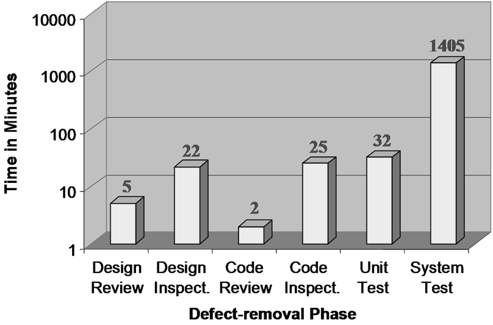
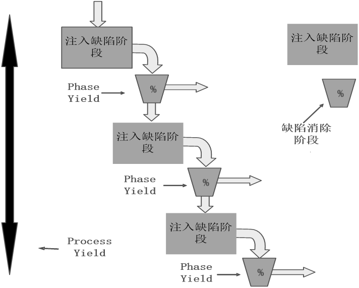
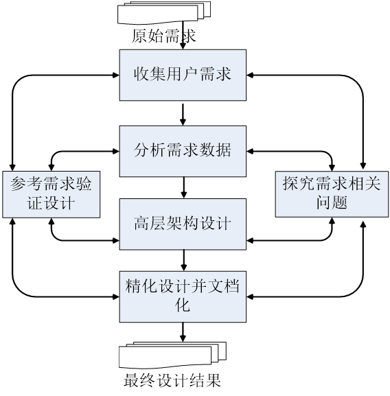
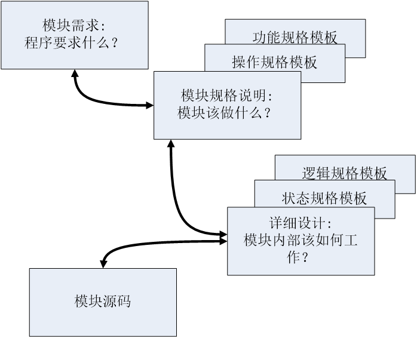
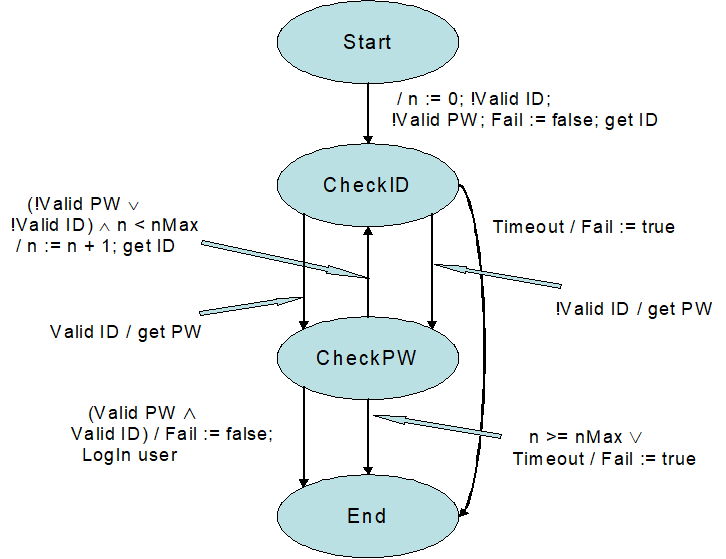

# 质量管理

## 管理对象

### 质量概念

+ 软件质量为“与软件产品满足规定的和隐含的需求能力有关的特征或者特性的全体”。 [ANSI/IEEE STd 729]

+ 软件质量为内外两部分的特性：其外部质量特性面向软件产品的最终用户，其内部质量特性则不直接面向最终用户。 《代码大全》

+ 软件质量为软件产品可以改变世界，使世界更加美好的程度。从用户的角度考察软件质量，用户满意度是最为重要的判断标准。 [Tom Demarco]

+ 软件质量为对人（用户）的价值。这一定义强调了质量的主观性，即对同一款软件而言，不同的用户对其质量有不同的体验。 [Gerald Weinberg]

### 优先级

最大化满足用户需求

### 质量期望

+ 这款软件产品必须能够工作；（必须第一个被满足）

+ 这款软件产品最好有较快的执行速度；

+ 这款软件产品最好在安全性、保密性、可用性、可靠性、兼容性、可维护性、可移植性等方面表现优异；

这样的列表可以一直列举下去，列表中各项内容的顺序也可以变化，这取决于用户期望、开发环境和应用环境等因素。但是，相信几乎在任何一个列表中，都会把软件产品能够工作作为一个最基本的期望。

## 质量策略

### PSP质量策略

+ 用缺陷管理来替代质量管理；

+ 高质量产品也就意味着要求组成软件产品的各个组件基本无缺陷；
+ 用缺陷管理来替代质量管理；
+ 高质量产品也就意味着要求组成软件产品的各个组件基本无缺陷；
+ 各个组件的高质量是通过高质量评审来实现的；

### 不同方法消除缺陷效率

### 消除缺陷流程

+ 发现待测程序的一个异常行为；

+ 理解程序的工作方式；

+ 调试程序，找出出错的位置，确定出错原因；

+ 确定修改方案，修改缺陷；
+ 回归测试，以确认修改有效；

在上述的步骤当中，有一些步骤极耗时间。比如步骤③，在项目的后期，往往会消耗数天甚至数周的时间。此外，在有些软件项目中，开发团队、测试团队和正式发布团队往往分开。那么如果用户在使用软件的过程中发现缺陷，再通过正式沟通渠道将信息反馈到开发团队，然后等待修改和发布，重新安装补丁，这一流程消耗数月时间也是常事。

## 评审过程

### 典型流程

+ 遵循评审者的逻辑来理解程序流程；

+ 发现缺陷的同时，也知道了缺陷的位置和原因；
+ 修正缺陷；

### 评审质量

+ 评审检查表（检查表根据之前的缺陷日志）
+ 质量控制指标
+ 其他因素
  + 环境
  + 评审时机
  + 个人评审和小组评审
  + 缺陷预防

### 其他考虑因素

+ 打印后评审往往效果更好
  + 当评审对象比较复杂的时候，单个屏幕往往不能体现评审对象的整体结构、整体安全、整体性能以及其他整体属性。
  + 其次，基于屏幕的评审，往往容易受到干扰，从而不易集中注意力。
  + 而打印之后的评审，评审人员完全脱离计算机环境，更容易集中注意力。

+ 评审时机选择
  + 编译（UT）之前 VS. 之后（评审的目的是要找出所有的错误）

+ 个人评审和小组评审
  + 小组评审意义
  + 先后顺序

## Yield

### 概念

+ Yield指标用以度量每个阶段在消除缺陷方面的效率。
+ 缺陷日志记录了注入消除阶段和消除阶段
+ 预期实现80%的缺陷消除
+ Yield只能估算，不能度量。因为遗留的缺陷数不知道

### 计算公式

+ Phase Yield = 100 * (某阶段发现的缺陷个数)/(某阶段注入的缺陷个数+进入该阶段前遗留的缺陷个数)

+ Process Yield = 100 * (第一次编译前发现的缺陷个数)/(第一次编译前注入的缺陷个数)；

### 流程图

长方形：注入缺陷阶段

垂直箭头：缺陷的流向

横向箭头：缺陷的清除

梯形：缺陷消除阶段

每一阶段进行缺陷注入与缺陷消除

### 例题

|      | Inspect（注入） | Remove（消除） | Remain（保留） | Yield |
| ---- | --------------- | -------------- | -------------- | ----- |
| DLD  | 10              | 0              | 10             | 0     |
| DLDR | 0               | 6              | 4              | 60%   |
| CODE | 20              | 0              | 24             | 0     |
| CR   | 0               | 12             | 12             | 50%   |
| VT   | 0               | 12             | 0              | 100%  |

|      | Inspect（注入） | Remove（消除） | Remain（保留） | Yield |
| ---- | --------------- | -------------- | -------------- | ----- |
| DLD  | 14              | 0              | 14             | 0     |
| DLDR | 0               | 6              | 8              | 42.8% |
| CODE | 28              | 0              | 36             | 0     |
| CR   | 0               | 12             | 24             | 33%   |
| VT   | 0               | 12             | 12             | 50%   |

## A/FR

### 概念

+ 质检失效比
+ A/FR = PSP质检成本/PSP失效成本
+ 理论上，A/FR的值越大，往往意味着越高的质量。
+ 过高的A/FR往往意味着做了过多的评审，反而会导致开发效率的下降。作为指南，
+ 在PSP中A/FR的期望值就是2.0
+ 也就是说，为了确保较高的质量水平，软件工程师应当花费两倍与编译加测试的时间进行评审工作。评审的对象为设计和代码。

### 计算公式

（DLDR + CR）/（compile + 单元测试时间）= 质检失效比

（DLDR和CR占开发时间的百分比）/（compile + 单元测试）* total = 原始定义

PSP质检成本 = 设计评审时间 + 代码评审时间。

PSP失效成本 = 编译时间 + 单元测试时间。

### 应用

+ 可以判断某一模块的开发状态（质量状态）
+ 可以规划质量和资源分配（高质量开发都是计划出来的）

## PQI

### 概念

+ PQI指标范围[0, 1]
+ PQI越高，质量越好
+ PQI为过程质量指标，用以度量PSP过程的整体质量。PQI为设计质量、设计评审质量、代码评审质量、代码质量、程序质量这5个过程质量指标数据乘积

### 计算公式

+ 5个数据乘积
  + 设计质量：设计的时间应该大于编码的时间（min{PLD/code, 1}）
  + 设计评审质量：设计评审的时间应该大于设计时间的50%（min{2评审时间/设计时间, 1}）
  + 代码评审质量：代码评审时间应该大于编码时间的50%（min{2CR/code, 1}）
  + 代码质量：代码的编译缺陷密度应当小于10个/千行（min{10/10+VT, 1}）
  + 程序质量：代码单元测试缺陷密度应当小于5个/千行（min{10/5+VT, 1}）

### 作用

+ 一个模块级别开发质量
+ 做质量计划
+ 识别改进的机会

## 评审速度

### 概念

+ 评审的速度(Review Rate)是一个用以指导软件工程师开展有效评审的指标
+ 高质量的评审需要软件工程师投入足够的时间进行评审
+ 在PSP的实践中，代码评审速度小于200 LOC/小时，文档评审速度小于4 Page/小时
+ 然而如果不计成本的投入大量时间进行评审，尽管可能发现较多的缺陷，但是又会影响到整个软件过程的生产效率。因此，应当为评审设置一个恰当的速度。

## DRL

### 概念

+ 缺陷消除效率比度量的是不同缺陷消除手段消除缺陷的效率。
+ 其计算方式是以某个测试阶段（一般为单元测试）每小时发现的缺陷数为基础，其他阶段每小时发现缺陷数与该测试阶段每小时发现的缺陷的比值就是DRL。
+ 期望大于等于1

| 阶段     | 缺陷个数/小时 | DRL（UT） |
| -------- | ------------- | --------- |
| 设计评审 | 3.6           | 1.03      |
| 编码评审 | 8             | 2.29      |
| 单元测试 | 3.5           | 1         |

## 软件质量

### 质量路径

+ 为了追求极高的质量，你有哪些手段？
  + Step 1：各种测试
  + Step 2：进入测试之前的产物质量提升
  + Step 3：评审过程度量和稳定
  + Step 4：质量意识和主人翁态度
  + Step 5：个体review的度量和稳定
  + Step 6：诉诸设计
  + Step 7：缺陷预防
  + Step 8：用户质量观——其他质量属性

### 设计与质量

+ 低劣的设计是导致在软件开发中返工、不易维护以及用户不满的主要原因。
+ 充分设计可以显著减少最终程序的规模，提升质量
+ 设计本身也是一种排错的过程。

### 设计过程

### 设计模板

+ 操作规格模板（Operational Specification Template， 简称OST）

+ 功能规格模板（Functional Specification Template， 简称FST）

+ 状态规格模板（State Specification Template，简称SST）
+ 逻辑规格模板（Logical Specification Template，简称LST）

|              | 动态信息                          | 静态信息                           |
| ------------ | --------------------------------- | ---------------------------------- |
| **外部信息** | OST/FST——交互信息（服务、消息等） | FST——功能（继承、类结构等）        |
| **内部信息** | SST——行为信息（状态机）           | LST ——结构信息（属性、业务逻辑等） |

### OST

+ OST描述的是系统与外界的交互，具体而言，是描述“用户”与待设计系统的正常情况和异常情况下的交互

+ OST可以用来定义测试场景和测试用例，也可以作为和系统用户讨论需求的基础，特别是操作相关的需求描述。

### FST

+ FST描述的是系统对外的接口，这是一种静态信息的描述。

+ 在FST中提供的典型信息包括类和继承关系，外部可见的属性和外部可见的方法等。

+ 在使用FST模板的时候，消除二义性非常重要。因此，如果有可能，尽可能用形式化符号来描述方法等行为。

### SST

+ SST可以精确定义程序的所有的状态、状态之间的转换以及伴随着每次状态转换的动作。

+ 在SST模板中，需要描述如下的信息：
  + 所有状态的名称；
  + 所有状态的简要描述；
  + 在SST中需要使用的参数和方法的名称与描述；
  + 状态转换的条件；
  + 状态转换是发生的动作；

+ 使用SST，软件设计人员可以定义状态机结构，分析状态机设计结果，从而消除设计中引入的逻辑缺陷。

### LST

+ LST可以精确描述系统的内部静态逻辑。为了消除描述的二义性，一般建议用伪代码配合形式化符号来描述设计结果。

+ 在LST模板中，需要描述如下的信息：
  + 关键方法的静态逻辑；
  + 方法的调用；
  + 外部引用；
  + 关键数据的类型和定义；

## UML

### 与PSP设计模板关系

+ UML的用例图和时序图提供了与PSP中OST同样的信息；
+ UML中的时序图和类图所描述的类之间的关系以及对象之间的交互信息在PSP4个设计模板中没有对应的内容；
+ UML类图中记录了方法的型构，然而方法的行为没有描述，这一点在PSP的FST中有相应的内容；
+ PSP中的LST用以描述程序的静态逻辑，这在UML没有对应的图示方法；
+ UML中的状态图与SST描述的状态图类似，但是SST中描述的关于状态、状态转换条件以及状态转换中的动作没有对应的UML图示方法。

### 设计层次

## 设计验证方法

### 意义

+ 简单评审不足以发现复杂缺陷

### 方法

+ 状态机验证
+ 符号化执行验证
+ 执行表验证
+ 跟踪表验证
+ 正确性验证

### 状态机示例

### 符号化

+ 符号化验证方法的基本思想是将描述设计的逻辑规格（一般用伪代码程序表示）用代数符号来表示，然后系统地开展分析和验证。具体步骤如下：
  + 识别伪码程序中的关键变量；
  + 将这些变量用代数符号表示，重写伪码程序；
  + 分析伪码程序的行为。

| #    | 指令    | X    | Y    |
| ---- | ------- | ---- | ---- |
|      | 初始值  | A    | B    |
| 1    | X:=X+Y; | A+B  |      |
| 2    | Y:=X-Y; |      | A    |
| 3    | X:=X-Y; | B    |      |
|      | 结果    | B    | A    |

#### 优缺点

+ 符号化验证的方法实施简单，可以给出一般化的验证结果，很多时候往往是唯一提供全面验证的方式。

+ 这种方法通常用在验证一些复杂算法中，特别是对遗留系统的改造中，往往应用这种方法来识别和理解原有的设计。

+ 但是这种验证方法不适用于有复杂逻辑的场合，而且，纯手工的验证方法也容易引入一些人为的错误。

### 跟踪表验证

+ 跟踪表验证方法是对执行表验证方法的一种扩充。具体步骤如下：
  + 识别伪码程序的关键变量；
  + 构建表格，表格左侧填入主要程序步骤，右侧填入关键变量；
  + 初始化被选定的变量；
  + **识别将伪码程序符号化的机会，并加以符号化；**
  + **定义并且优化用例组合；**
  + 跟踪被选择的关键变量的变化情况，从而判断程序行为。

+ 执行表一般只能用以验证单独的用例，跟踪表应用符号化以及用例识别等方法，对程序的一般化行为进行验证，从而提供更加高效地开展验证工作。

### 正确性验证

+ 正确性检验将伪码程序当成数学定理，采用形式化方法加以推理和验证。这种方法的步骤如下：
  + 分析和识别用例；
  + 对于复杂伪码程序的结构，应用正确性检验的标准问题逐项加以验证；
  + 对于不能明确判断的复杂程序结构，使用跟踪表等辅助验证。

#### while-do

典型while循环如下：

while (condition)

begin

​	states;

end

+ 一个正确的while循环设计应当满足如下条件：
  + 条件1： condition是否最终一定会为“假”，从而使得循环可以结束；
  + 条件2： condition为“真”的时候，单独的循环结构执行结果与循环体再加一个循环结构，其执行结果是否一致？
  + 条件3： condition为“假”的时候，循环体内所有变量是否未被修改？

