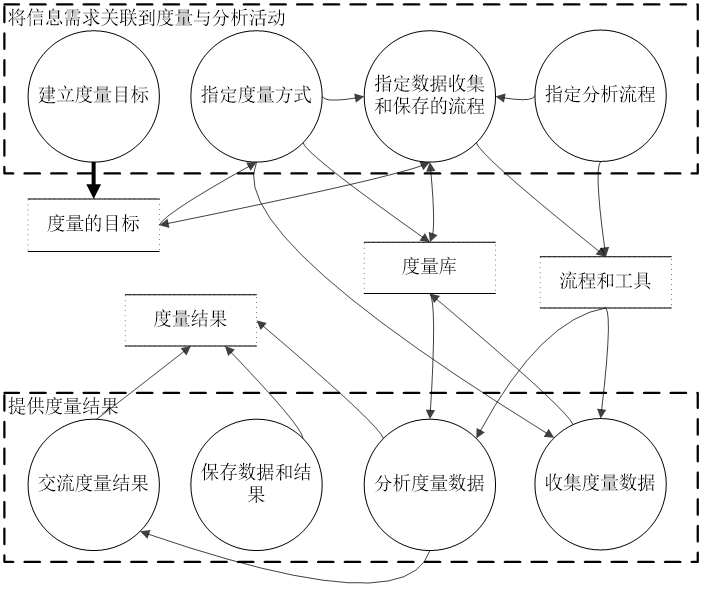
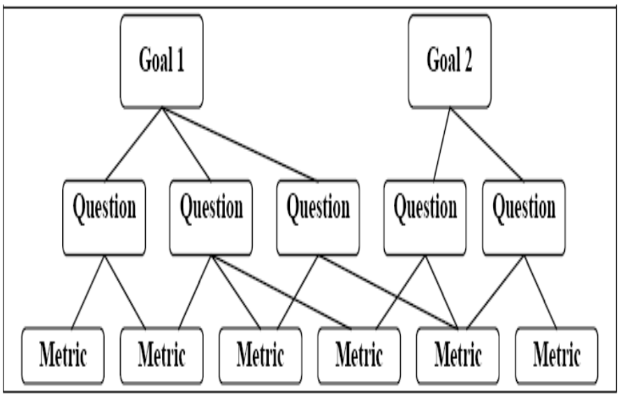
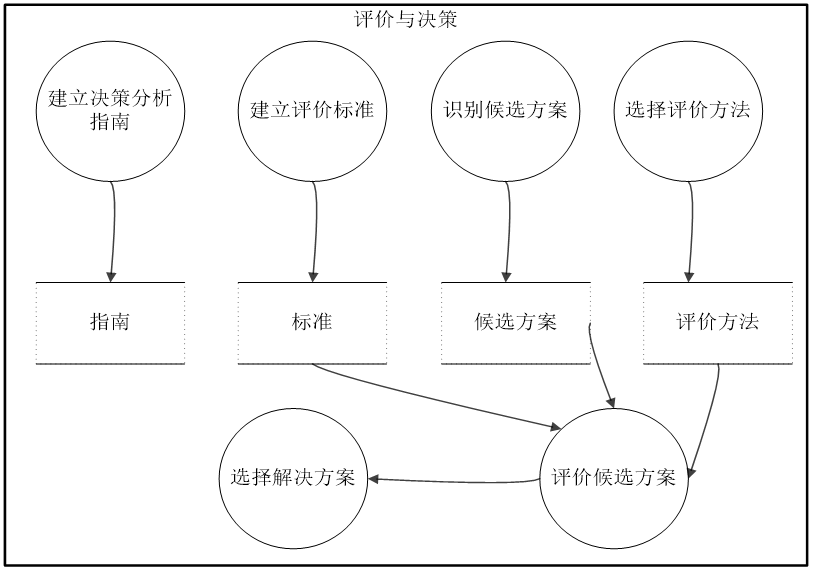
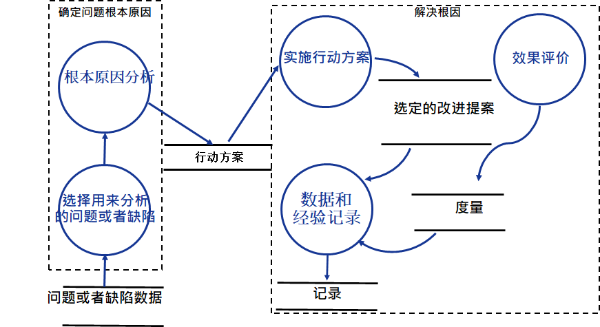

# 项目支持活动

## 配置管理

### 基本概念

+ 配置项
  + 一开始定义的内容
  + 配置项是在配置管理当中作为单独实体进行管理和控制的工作产品集合
  + 按模块划分配置项
+ 基栈
  + 配置项组合（文档或其他软件产品）
  + 经过正式评审和认可的一组软件配置项，此后他们将作为下一步开发工作的基础，而且只有通过正式的变更控制流程才能被更改。
  + 目的是把各个阶段的工作划分的更加明确，是本来连续的工作在这些节点上断开，以便于验证和确认的开发成果。

+ 典型的可能作为配置项纳入配置管理的工作产品包括：过程说明文档、项目开发计划文档、需求规格说明书设计规格说明书、设计图表、产品规格说明书、程序代码、开发环境，如特定版本的编译器等、产品数据文件、产品技术文件、用户支持文档
+ 主要功能
  + 版本控制：采用相应的流程和工具，对软件开发过程中产生的各种文件的版本进行管理。是软件配置管理的核心内容。
  + 变更管理：为防止开发人员对软件的随意变更而进行的管理上的审核过程，包括变更请求、变更评估、变更批准/拒绝、变更实现。
  + 其它：配置审计、配置状态统计等。

### 仓库

+ 工作库：本机备份

+ 配置库：单元测试后的稳定版本

+ 管理库：基栈库 -> 产品库（最终产品）

### 流程

+ 识别和记录配置项的物理特性和功能特性。这是第一步，目的是减少管理的对象

+ 控制上述特性的变更；

+ 记录和报告变更过程和相应的配置项状态；

+ 验证配置项是否与需求一致。

## 度量和分析

### 意义

+ 作为项目管理支持类的活动，度量和分析活动可以支持如下的项目管理活动：
  + 客观的估计与计划
  + 根据建立的计划和目标，跟踪实际进展
  + 识别与解决过程改进相关议题
  + 提供将度量结果纳入未来其他过程的基础

+ 在软件项目管理决策的过程中，基于客观的数据很重要，这种客观决策可以显著消除错误决策的风险。而这些客观数据的获得，必须依照一定的流程以正确的方式获得和使用。度量和分析活动就定义了上述客观数据的获取与使用方式。

### 流程

### GQM

#### 简介

+ GQM是一种应用非常广泛的建立软件度量体系的方法。由美国马里兰大学的Victor Basili 教授和NASA软件工程实验室的David M. Weiss等人提出的一种面向目标的度量软件产品和过程的方法。
+ GQM从管理的目标出发，将目标归纳、分解为度量的指标, 并把这些指标提炼成可以测量的值,是一种科学的、系统的思考问题的方式。
+ 打分标准有不同权重，通过不同权重体现利益诉求

#### 架构

#### 概念层(目标)

目标是为某个特定的对象而定义的。这里的对象是指软件产品、软件过程以及相关的资源等。定义的目标基于不同原因和不同质量模型,也要参考不同的角色视图与特定的环境。

#### 操作层(问题)

基于一定的刻画上述目标是否达成或者目标达成的进展情况的模型，使用一系列的问题来定义所研究的对象, 然后得出评价或评估特定目标达成进展情况。所选择的问题应当尽量体现质量相关的话题。

#### 量化层( 度量)

试图以量化的方式回答上述操作层识别出来的问题。

#### 示例

PM：

G: 确保稳定性、可预测性的开发过程来满足计划的里程碑。

Q: 我的项目是否按照计划的轨迹前进，计划的里程碑都能实现吗？

M: 软件项目开发工作的挥发性（分支、流、变更管理（**UCM**）活动）。

DM：

G: 最大化所有团队贡献者的生产力。

Q: 开发人员能够完成分配给他们的任务吗，或者他们遇到障碍了吗？*

M: 由个体或者工作组产生的项目工件的数量

## 决策分析

### 简介

+ 软件项目开发过程中往往面临很多需要决策的地方。尽管并不是所有的问题都需要一个严格的决策过程，但是，错误的决策往往会给项目带来灾难性后果。为了降低这种错误决策的风险，往往需要尽可能基于客观事实和正确的流程来开展决策与分析活动。
+ 一个正式评估过程往往包含下列的活动：
  + 建立评估备选方案的准则
  + 识别备选解决方案
  + 选择评估备选方案的方法
  + 使用已建立的准则与方法，评估备选解决方案
  + 依据评估准则，从备选方案中选择建议方案

### 流程

## 根因分析

### 简介

+ 避免类似错误反复发生

+ 一个正式根因分析过程往往包含下列的活动：
  + 识别和选定问题
  + 根因分析
  + 建立改进的行动方案
  + 实施改进，评估效果

### 流程

