# 定量管理与仿真建模

## 定量管理

### CMMI

Level 4，5 高成熟的项目管理，即定量管理

Level1，2，3 一般的项目管理

### 一般与定量

+ 一般
  + 根据当前现状进行决策
+ 定量
  + 对偏差的理解

### 基本范式

+ 构建定量模型
  + 子过程能力基线
  + 过程模型

+ 应用模型
  + 监控影响子过程的关键因素

### 基本概念

#### 过程性能

+ 遵循某个特定过程后的量化描述
+ Y = ax1 + bx2 + cx3 + d
+ 过程度量Xi（例如，时间、缺陷消除效率、工时等），产物度量Yi（例如，缺陷密度，相应时间等）。
+ Ex. Y = 需求评审发现的缺陷个数 -> 不可控
  + x1 = 文档页数，x2 = 评审人数，x3 = 评审时间 -> 可控

#### 过程性能基线

+ 上述过程性能的一个定量化的刻画，一般包括均值和范围。通常用作过程性能的benchmark。
+ z = a‘Y1 + b’Y2 + c（Y跟过程有关）

#### 过程或子过程性能模型

依据子过程的逻辑关系构建相应的数学模型，描述子过程性能基线和整体过程有意义的性能输出（例如，质量、生产效率、成本等）之间关系。例如过程Yield和Phase Yield。

#### 定量模型构建流程

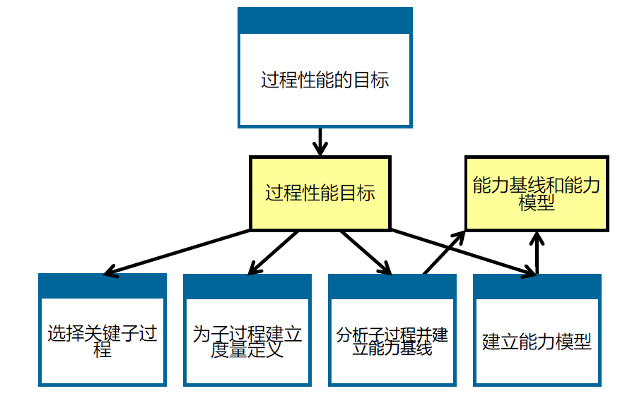

#### 练习

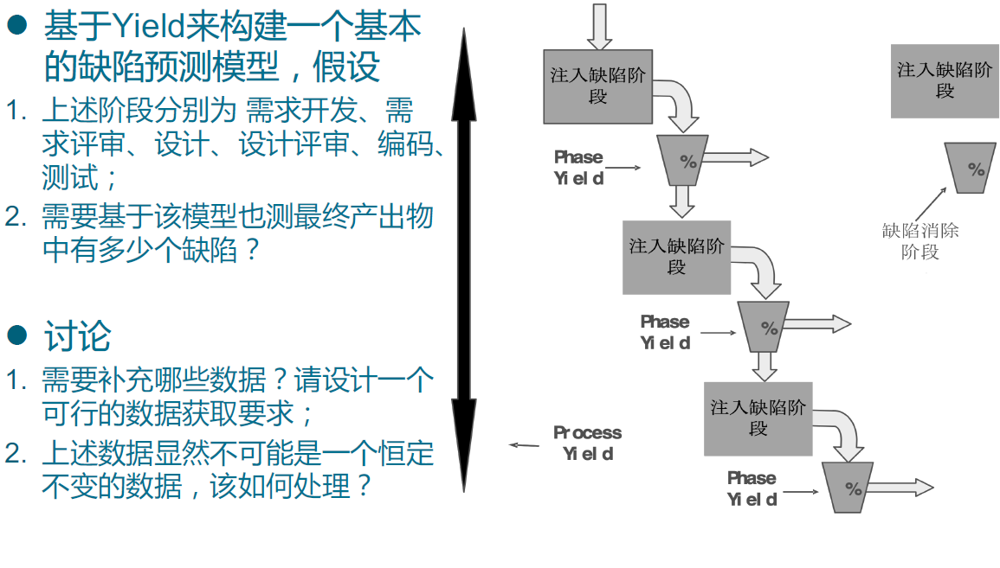

根据Yield模型的构建，获取历史数据，我们可以计算每个阶段发现的缺陷个数（单位：个/小时），每个阶段的缺陷消除率（个/小时），而每个阶段注入的缺陷个数（个/小时），并将其转换为正态分布，并进行蒙特卡罗尔模拟，能够模拟出根据历史数据得出的缺陷个数，可以根据这个分布进行开发周期的修正。

#### 定量管理流程

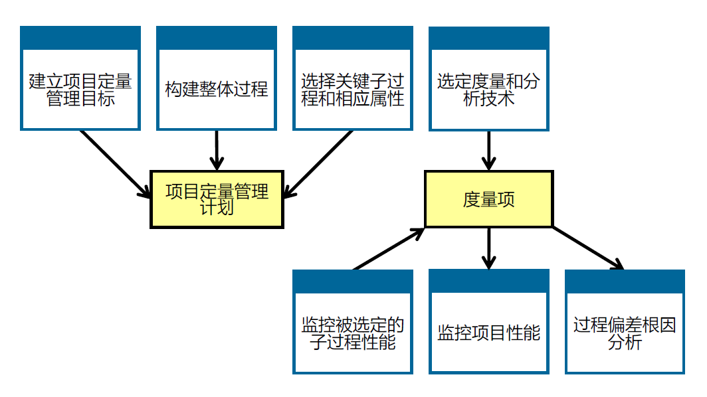

## 定量管理技术

定量管理技术通常被分为非统计技术和统计技术，这些技术的使用能够帮助解决软件项目管理中多种问题。

### 非统计技术

非统计技术一般是为了描述数据集整体特征或者关联关系，从而帮助选择适用的统计技术以应用于给定的数据集，以及调查通过数据分析检测到异常的原因。例如，检查表（或列联表），帕累托图，直方图，因果图，散点图等。

#### 直方图

+ 直方图以频率统计的方式进行显示，可以描述
  + 过程属性的频率，例如缺陷修复的时间、每次测试发现的缺陷的个数、每天无故障工作的时间、计算产品的不合格率等。
+ 一般用于
    + 有助于判断过程是否正常，过程能力是否满足需要，不良产品是否发生，分析产品质量问题的原因等。

#### 帕累托图

+ 一种特殊的直方图
+ 按照由高到低排列的直方图

#### 因果图

+ 因果图是用来分析影响产品质量的各种原因的一种有效的定性的分析图，它将对特性或结果有影响的要素加以分类分析，是一种发现问题根本原因的方法，可以让项目组成员通过头脑风暴、集思广益的方法从各个方面各种不同的角度找出这些问题的所有原因。

#### 散点图

+ 散布图表示的是一个变量相对于另一个变量的表现情况，可以假定一个变量是因变量，另一个变量是自变量。散布图通常表现了5 种相关关系。如图所示的散布图中分别表现了两个变量之间的弱正相关、弱负相关、不相关、强正相关、强负相关。

### 统计技术

+ 统计思维认识到许多决策是在不确定条件下做出的。统计方法有助于量化这种不确定性并指导采取行动以减少不确定性。

+ 统计分析支持许多类型的决策，在支持过程管理决策的统计分析中，有效的过程管理通常需要两级决策

  + 实时控制单个活动或子流程

  + 根据当前和已完成的活动对未来和最终过程的结果进行预测

+ 常用的统计技术包括：统计过程控制图，回归分析，方差分析，预测区间，假设检验，敏感性分析等

#### 控制图

+ 控制图是根据概率统计原理构造的一种图，用来监测生产过程是否处于控制状态。
+ 控制图是对过程质量数据测定、记录从而进行质量管理的一种用科学方法设计的图。
+ 图上有中心线(CL)、上控制限(UCL)和下控制限(LCL)，并有按时间顺序抽取的样本统计量数值的描点序列。

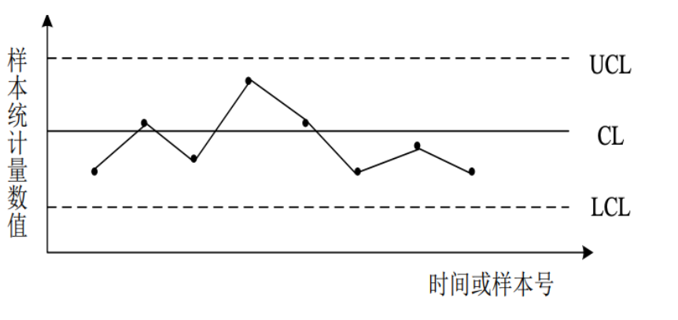

##### 目的

+ 控制图可由正态分布演变而来
+ 正态分布可用两个参数即均值μ和标准差σ来决定。正态分布有一个结论对质量管理很有用，即无论均值μ和标准差σ取何值，产品质量特性值落在μ±3σ之间的概率为99.73%，落在μ±3σ之外的概率为100%-99.73%=0.27%，而超过一侧，即大于μ+3σ或小于μ-3σ的概率为0.27%/2=0.135%≈1‰。

##### 异常模式

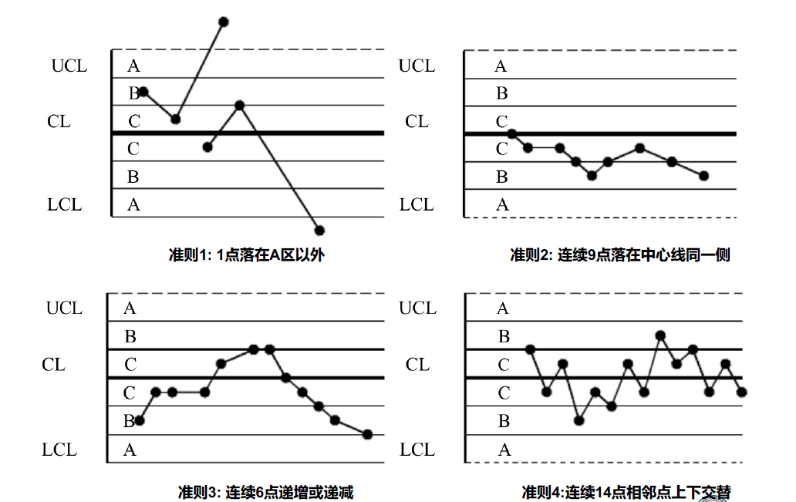

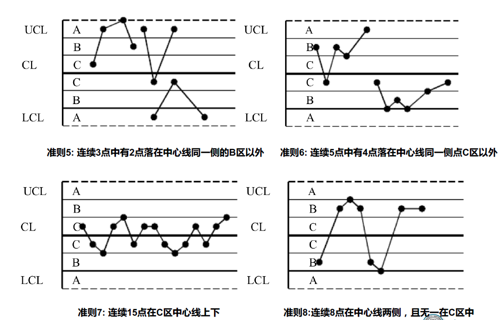

##### 两类错误

+ Ⅰ类错误：虚发警报错误，在生产正常的情况下,纯粹出于偶然而点子出界的概率虽然很小,但不是绝对不可能发生。故当生产正常而根据点出界判断生产异常就犯了虚发警报错误,发生这种错误的概率通常记以α
+ Ⅱ类错误：漏发警报错误,在生产异常的情况下,产品质量的分布偏离典型分布,但总有一部分产品的质量特性值在上下控制界之内。如果抽到这样的产品进行检测描点,根据点未出界判断生产正常就为漏发警报错误,此概率通常记以β。

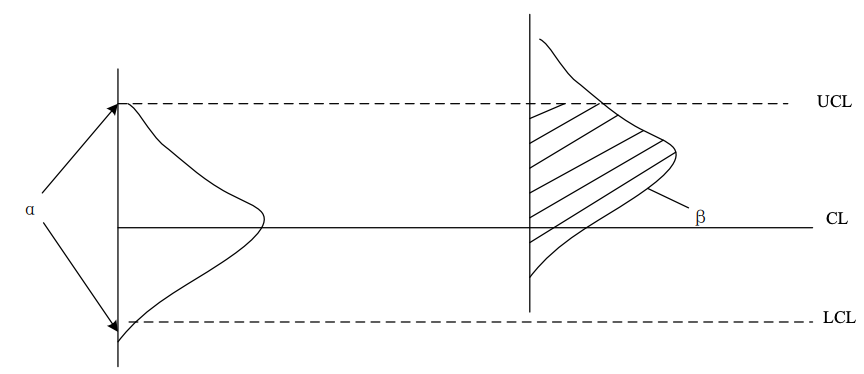

##### 流程

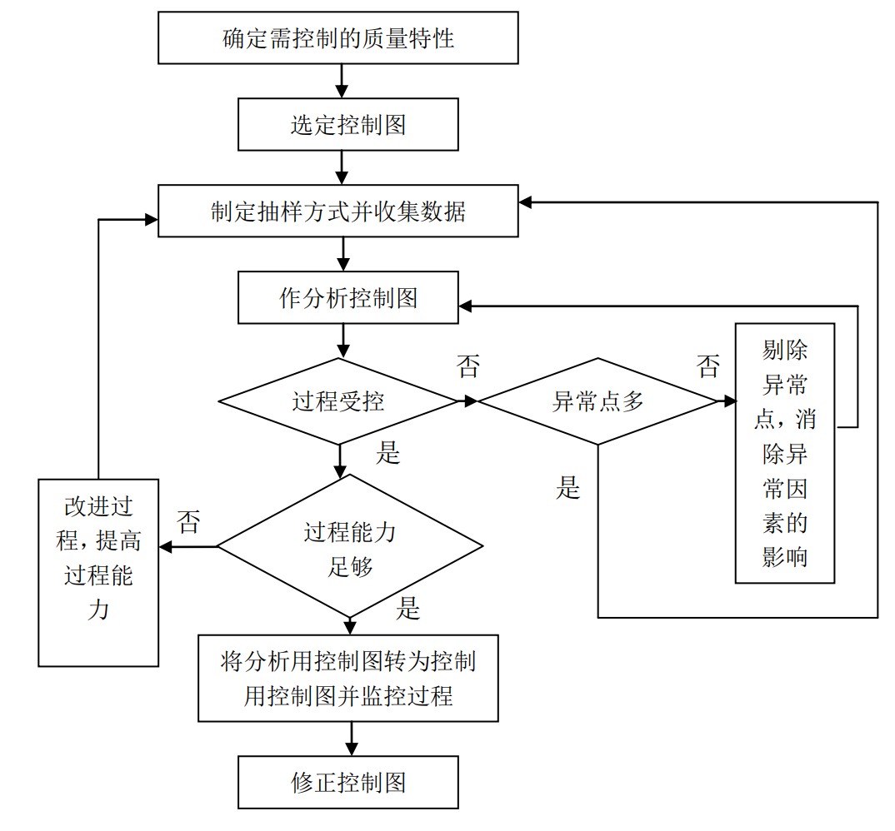

#### 回归分析

+ 回归分析预测法，是在分析现象自变量和因变量之间相关关系的基础上，建立变量之间的回归方程，并将回归方程作为预测模型。
+ 回归分析预测法是一种重要的预测方法，例如，在对市场现象未来发展状况和水平进行预测时，如果能将影响市场预测对象的主要因素找到，并且能够取得其数量资料，就可以采用回归分析预测法进行预测。

##### 流程

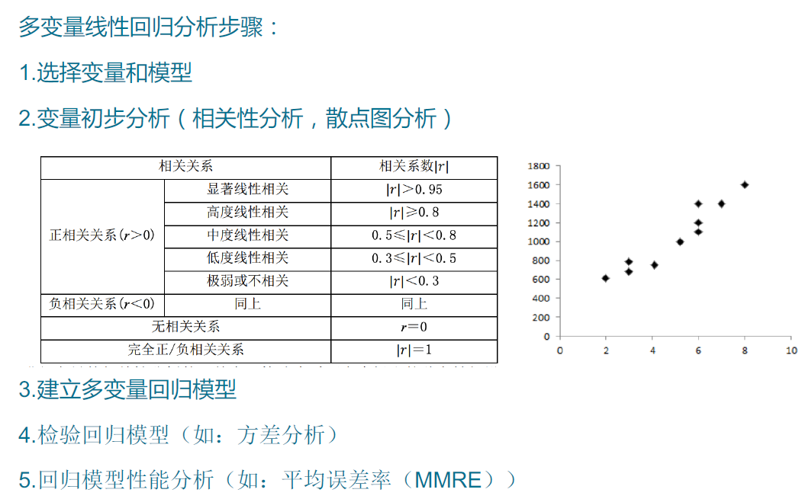

#### 假设检验

+ 假设检验又称“显著性检验”，是用来判断样本与样本，样本与总体的差异是由抽样误差引起还是本质特征差别造成的统计推断方法。其基本原理是先对总体的特征作出某种假设，然后通过抽样研究的统计推理，对此假设应该被拒绝还是接受作出推断。
+ 检验统计量：根据样本观测结果计算得到，是对样本估计量的概率标准化结果

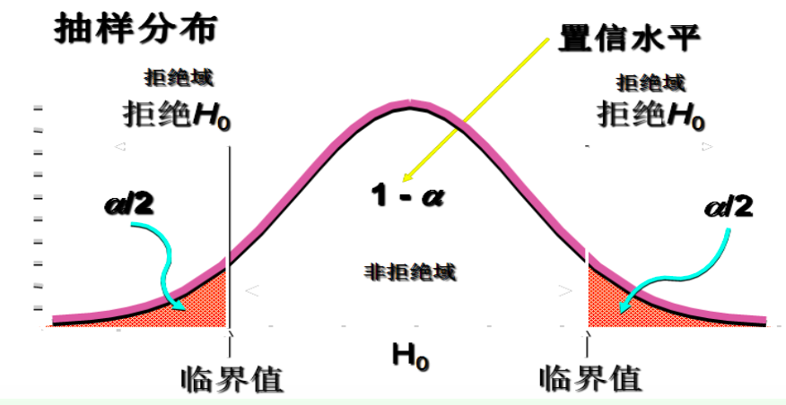

##### 流程

假设检验步骤为：
1）根据问题要求建立备选假设H1和原假设H0（一般认为没有差异）；
2）从研究的总体中抽出一个随机样本。
3）选取合适的统计量，其抽样分布不含任何未知参数。利用样本数据计算具体数据。以便计算其分位点。
4）确定一个适当的显著性水平，并计算出其临界值，指定拒绝域。
5）将统计量的值与临界值进行比较，作出决策：

- 统计量的值落在拒绝域，拒绝H0，否则不拒绝H0
- 也可以直接利用p值作出决策

##### 结果分析

放宽显著性水平的要求

+ P值 < 0.05 -> 干预措施有用（拒绝原假设）
+ P值 > 0.05 -> 不能说明这两者之间有差异（不拒绝原假设，也就是没证据）

#### 方差分析

+ 方差分析（ANOV）：方差分析是采用数理统计的方法对所有结果进行分析，鉴别各种因素对研究对象的某些特征值影响大小的一种有效方法。用于两个及两个以上的样本均数差别的显著性检验。
+ 方差分析的目的主要有以下：
  1）通过数据分析找出对该事物有显著影响的因素
  2）研究各因素之间的交互作用是否对该事物造成影响

## 仿真建模

### 概述

+ 模型

模型是对真实或概念复杂系统的抽象。一个模型被设计用来显示人们想要研究、预
测、修改或控制的系统的显著特征和特性。

+ 仿真模型

仿真模型是一种计算机化的模型，代表某种动态系统或现象。当操纵真实系统的成本、风险或后勤成本过高时，这是一种获得重要见解的廉价方法。当被建模系统的复杂性超出静态模型或其他技术所能有效表示的范围时，通常采用仿真解决实际系统中经常会遇到复杂性：系统不确定性和随机性，动态行为，反馈机制。

+ 软件过程仿真模型

软件过程仿真模型关注于特定的软件开发/维护/演化过程。它可以表示当前已实施（按现状）或计划在未来实施的过程。

+ 进行软件过程模型的仿真有多种原因。在许多情况下，仿真有助于决策。它还有助于降低风险，并帮助在战略、战术和运营层面进行管理。
+ 可将使用软件过程仿真的许多原因归纳为六类目的：
  1.战略管理;
  2.规划；
  3.控制和运营管理；
  4.流程改进和技术采用；
  5.理解；
  6.培训和学习。

### 流程

#### 确定范围

+ 确定模型范围是一个重要的问题，也是一个反复的过程。该模型的范围必须足够大，以完全解决提出的关键问题。
+ 例如，公司可能正在考虑本地化到代码和单元测试步骤的过程更改。他们想开发一个模型来预测这种变化对整个项目绩效的影响。尽管对过程所做的更改仅限于代码和单元测试步骤，但更改可能会影响后期测试阶段的质量和性能。因此，模型的范围需要反映出流程变更的这些扩展影响。

#### 定义结果变量

+ 结果变量是回答与模型目的一起指定的关键问题所需的信息元素。根据所提出的关键问题，可以设计出许多不同的变量作为过程模拟的结果。
+ 典型结果变量包括以下内容：
  ·成本；
  ·周期时间（又称持续时间，时间表，上市时间，间隔）；
  ·缺陷级别；
  ·随着时间的推移人员需求；
  ·人员使用率；
  ·成本/收益，投资回报率（ROI）或其他经济指标（通常对变化感兴趣）；
  ·产量/生产率；
  ·队列长度（积压）。

#### 过程抽象

+ 在计划和开发仿真模型时，模型构建者需要确定过程的关键元素，它们之间的相互关系和行为应包括在模型中。重点应放在过程中与模型的目的特别相关并被认为会影响结果变量的那些方面。例如，要确定：
  ·关键活动和任务；
  ·主要对象（例如，代码单元，设计，问题报告）；
  ·重要资源（例如人员，硬件）；
  ·活动依赖性，活动之间的对象流和排序；
  ·迭代循环，反馈循环和决策点；
  ·其他结构上的相互依赖性（例如，根据检查期间发现的缺陷数量，检查后修改
  代码单元的工作）。

#### 选择和定义输入参数

+ 要包含在模型中的输入参数（关键因素，驱动因素，独立变量）在很大程度上取决于所需的结果变量和确定的过程抽象。通常，需要许多参数来驱动软件过程仿真模型。有些需要几百个参数。下面提供了几种典型输入参数的示例：
  ·收到的工作量（通常以软件大小（LOC）或功能点等衡量）；
  ·根据尺寸来进行设计的努力（Effort）；
  ·在测试或检查过程中发现缺陷的效率；
  ·代码返工的工作量取决于要纠正的缺陷的大小和数量；
  ·代码重做期间的缺陷消除和注入率；
  ·决策点结果；返工周期数； ·雇用率；人员流失率；
  ·随着时间的推移，人员的能力和动力；
  ·提供的培训的数量和效果；
  ·资源限制；
  ·产品版本发布的频率。

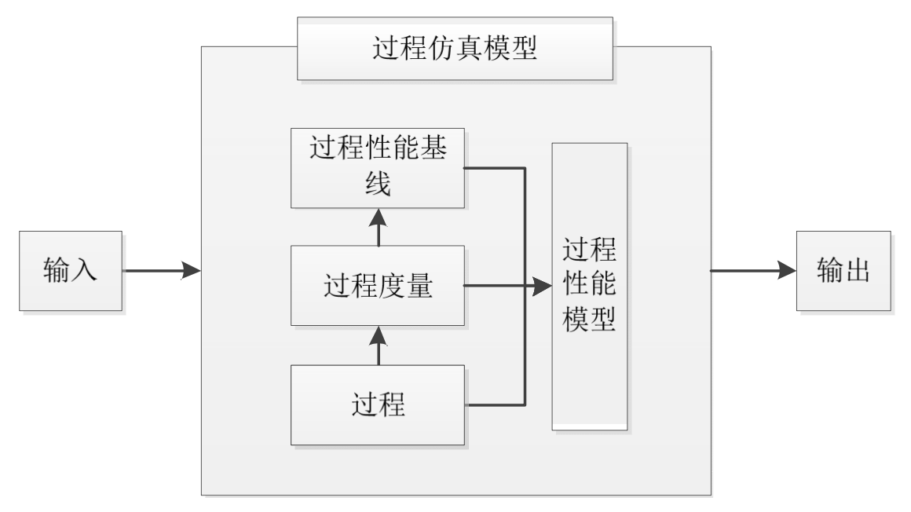

### 常用技术

+ 最常用的方法：蒙特卡罗仿真、离散事件仿真和系统动力学仿真
+ 混合仿真

### 蒙特卡罗仿真

+ 蒙特卡罗方法又被称为统计模拟法或者随机抽样技术，是一种以概率和统计理论方法为基础的随机模拟方法。其原理是当要模拟的对象本身具有某种概率特征时，可以用计算机模拟的方法产生某种抽样结果，然后根据抽样结果计算统计量以及参数的值.
+ 场景：蒙特卡洛模拟作为一种常用的模拟技术，在PMBOK里经常可以看到它的身影，其主要出现在风险管理知识领域中的定量风险分析过程，是用于做项目定量风险分析的工具之一，同时蒙特卡洛模拟也可以用于估算进度或成本以及制定进度计划等

#### 流程

1) 对重要的变量建立一个概率分布；
2) 对上述的每一个变量建立起累计概率分布；
3) 为每一个变量建立随机数区间(random number intervals)；
4) 生成随机数；
5) 进行一系列的模拟试验(Simulation experiment)。

#### 案例

谨慎的估算师会考虑各种可能性。蒙特卡洛仿真通过为每次仿真运行从输入分布中选择随机样本，并提供概率分布作为输出来支持这种风险分析。如下是总人力的仿真结果。

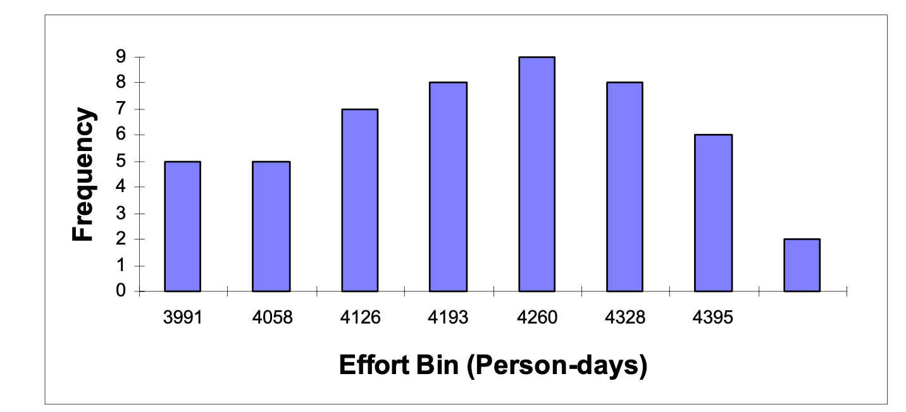

### 离散事件仿真

+ 离散事件仿真模型是离散的和动态的，它能够使用确定的数值和各种随机数值进行蒙特卡罗仿真。离散事件仿真模型所模拟的系统的状态变量随一个个事件的发生而在特定的时间点离散变化，系统的状态变化是由(往往是随机发生的)事件驱动的。
+ 应用场景：离散事件仿真适合于以过程为基础的场景，过程中各项活动随着事件的触发状态发生变化，具有强大的模拟各种事件流、过程流的能力，并且能够定量的评价过程能力。
+ 离散事件系统：系统中的状态只是在离散时间点上发生变化，而这些离散时间点一般是不确定的

#### 流程

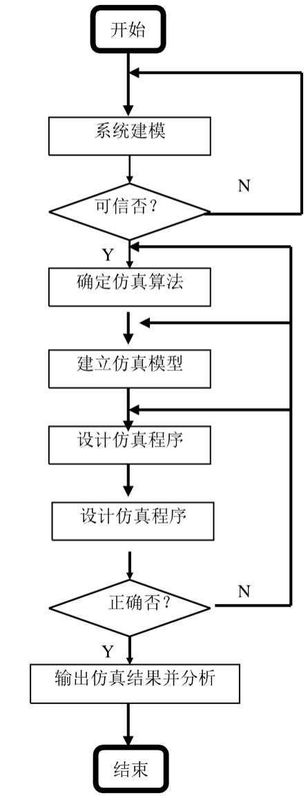

#### 示例

案例：以单服务台顾客排队为例，使用离散事件仿真模拟进行模拟。相邻两个顾客到达服务台的时间间隔服从参数为5min的指数分布，服务员为每位顾客的服务时间服从参数为4min的指数分布。

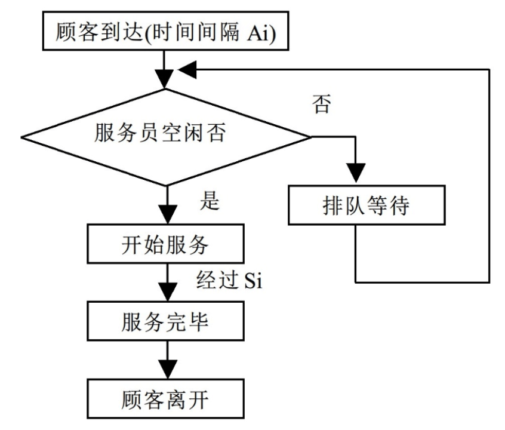

### 系统动力学仿真

+ 系统动力学仿真模拟的系统的状态随时间连续变化，也称为连续仿真。它动态的使用一组不同的方程计算系统或过程随着时间的变化的趋势，
+ 场景：系统动力学仿真本质上不是随机的，和离散事件仿真相比，它主要用于从比较高阶的层面对过程进行建模，没有关注太多的细节。系统动力学仿真工具通常在过程循环方面具有很好的图形表现能力。
+ 其开发目的是为复杂的连续系统建模，以改善管理政策和组织结构

#### 流程

系统动力学在解决问题时主要分为以下五个具体步骤:
1)分析阶段:运用系统动力学方法来分析研究对象，了解系统的整体结构和系统变
量之间的相互作用，来解答研究的问题。
2)反馈机制分析阶段:首先划分系统的层次结构，了解系统整体和局部的反馈机制，
确定变量的类型及变量之间的相互作用，从而明确模型的主回路。
2)建立方程式:列出各变量规范的数学方程式，并赋予常数、表函数等
相关变量的初始值。
3)仿真模拟与政策分析:运行建立好的系统动力学模型，利用案例模拟仿真，并结
合研究领域进行政策分析，进一步修改和完善系统。
5)模型的检验和评估:利用其他一些案例资料，对该模型进行检验模拟，然后根据
结果对模型进行评价。

#### 示例

案例：某项目的规模估计为50000 KLOC，发人员的原始数量为30，项目工期估计为450天。到目前为止已经完成了7500KLOC，每人每天可以完成2.5KLOC。按照这样的速度，到截止日期将有8750KLOC未完成。以下通过系统动力学仿真模拟增加人力和加班时间对项目完成程度的影响。

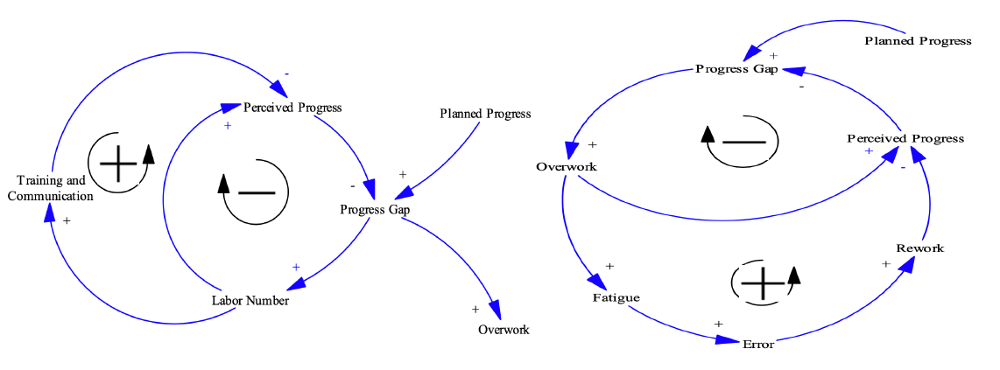

### 混合仿真

+ 混合仿真模型指的是混合了两种或多种仿真方法的模型。在软件过程仿真方面，混合仿真通常是混合离散事件仿真和系统动力学仿真两种方法。
+ 由于能够支持混合仿真的工具不是很多，再加上混合仿真的复杂度很高，因此混合仿真模型应用不是很广泛。
+ 混合仿真模型既包含动态性，又包含随机性，能仿真过程循环、过程流、工作产品和资源。

#### 垂直分层机制

基于垂直分层机制的软件过程混合仿真建模中，位于较高层抽象层次的仿真范式主要负责战略决策或环境动态因素的建模，而位于低层次的仿真范式主要用于构建操作层或具体实现活动( 编码、集成、测试等) 的仿真模型。

#### 水平联动机制

该机制中不同仿真范式间没有明显的界限，不同的建模范式间是混合在一起的。迭代式软件开发过程可以采用此混合机制来建立混合仿真模型