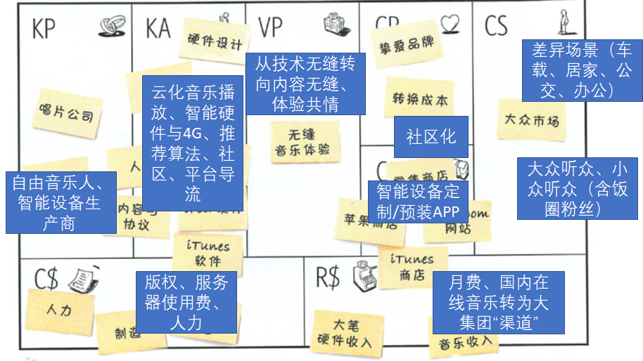
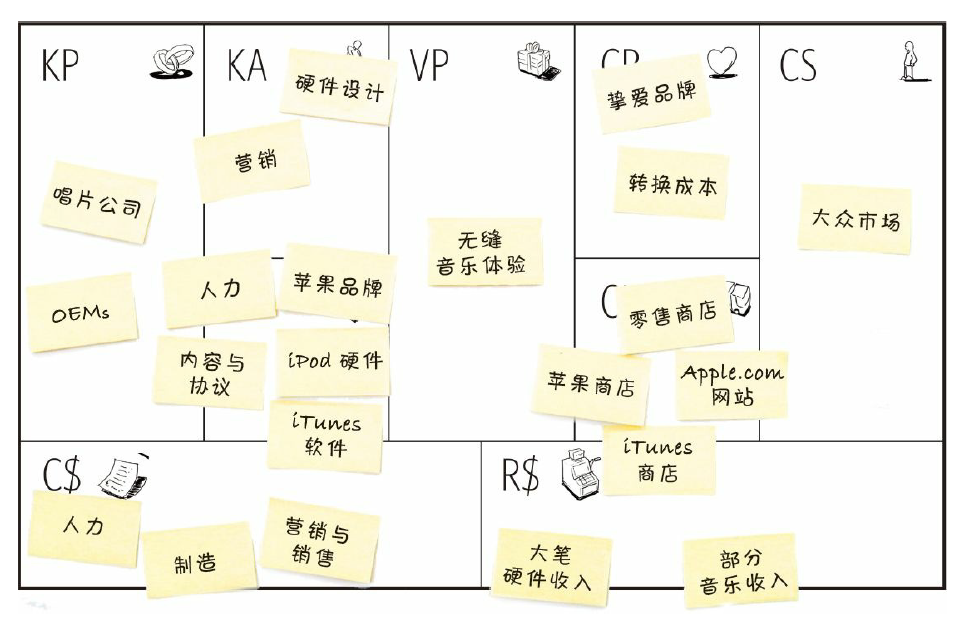
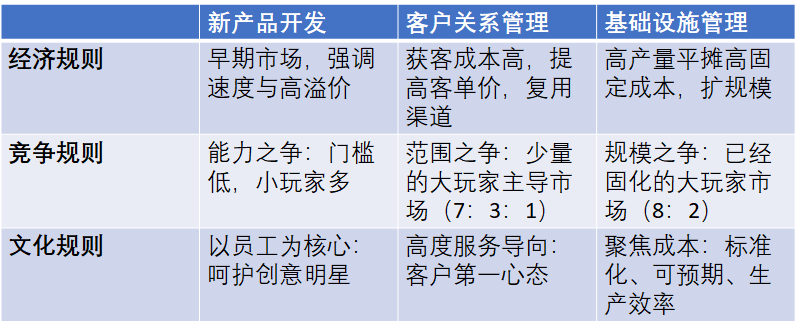
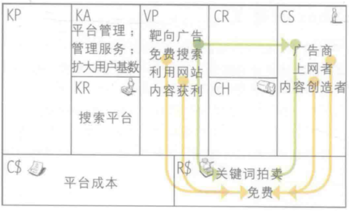
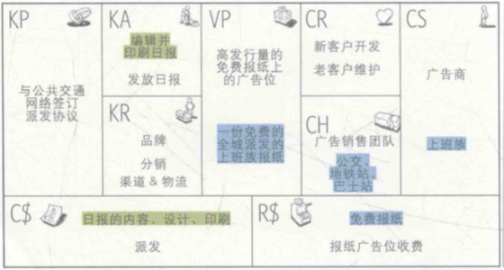
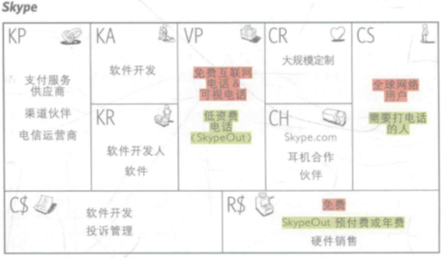
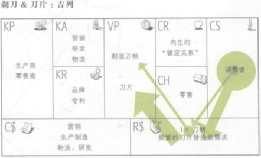
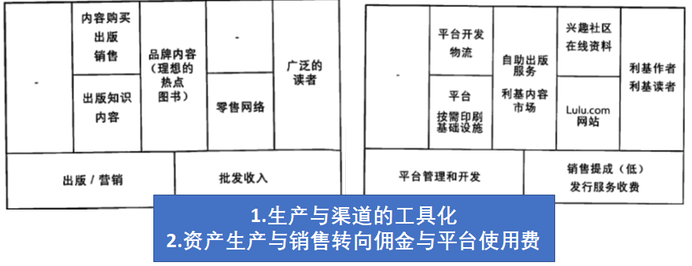
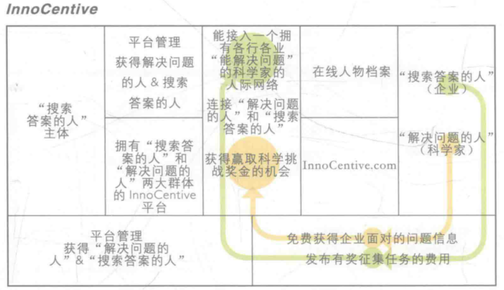
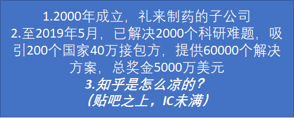

# 商业模式画布

## 九大模块

### 画布

### 客户群体

+ **一家企业想要获得的和期望服务的不同的目标人群和机构**

+ 细分条件：需求催生新供给、需要新分销渠道和客户关系类型、产生的利润率不同、愿意为某方面的特殊改进买单

+ 划分方式举例

  + 大众市场（mass market）消费电子、大型零售商（找人群共性）

  + 小众市场（niche market）：产业链上的供应商-采购商（强业务特征）
  + 求同存异的客户群体（segmented）：各类产品线、诺基亚（某业务下基于客户共性的细分）

  + 多元化客户群体（diversified）：3M、YAMAHA、AMAZON/阿里、SAMSUNG、华为（垄断地位、技术领先与外拓、团队能力与开拓意识强）

  + 多边平台/市场（multi-sided platforms/markets）：大型互联网平台、B站（大流量、上升为生活方式的使用习惯，多种收益流的平衡与补贴）

### 价值主张

+ **为某一客户群体提供能为其创造价值的产品和服务**

+ 解决客户的问题或满足其需求，使其选择一家而放弃另一家

+ 一家公司为特定客户群体提供的利益集合或组合

+ 创新性的、革命性的产品或服务 VS 既有产品或服务+新特点或属性

+ 有利于价值创造的因素
  + 创新：满足**客户未曾察觉全新需求（没有类似产品的）**，可以是非技术创新的
  + 让事情更简单（痛点）：价格、缩减成本、便利性/实用性
  + 让事情更“复杂”（收益）：定制、设计、品牌地位、可获得性
  + 让事情“透明”（痛点）：风险控制、一站式服务

### 渠道通路

+ **一家企业如何同它的客户群体达成沟通并建立联系，以向对方传递自身的价值主张**

+ 企业与客户交互体系：交流、分销、销售渠道（+售后），是用户的交互触点

+ 作用：了解产品与服务、评估价值主张；购买产品与服务、传递价值主张；提供售后支持

+ **商业真正的秘密，与产品设计的关系微妙（实现层面重合度小，却又容易受到产品口碑风险的冲击，需要做到真正的匹配），容易积累收益但波动性极大、风险高**
+ **一定要重视渠道 – 设计运维一体化，最容易产生新闻的地方，要能够从渠道构建与运维看出隐含的价值主张与客户关系**
+ 渠道五个阶段
  + 认知：我们如何在客户中提升公司产品和服务的认知？
  + 评估：我们如何帮助客户评估公司价值主张？
  + 购买：我们如何协助客户购买特定的产品和服务？
  + 传递：我们如何把价值主张传递给客户？
  + 售后：我们如何提供售后支持？
+ 一个渠道可包含一个或全部五个阶段
+ 一个组织可选用自有渠道、合作方渠道、或混用，以追求获益与成本的平衡以及最佳的客户体验

### 客户关系

+ 一家企业针对某一个客户群体所建立的客户关系的类型

+ 靠人员维护（“专属一对一财富管家”） VS 自动化设备（“24小时自助”）

+ **动机：开发新客户、留住原客户、增加销售量或客单价**（携程杀熟、杀苹果用户）

+ 免费推广-**提升忠诚度（全家桶、归属感、情怀）**-提高客单价

+ 新手礼包/老用户激活礼包-品牌宣传与建设/用户等级-老客户专属套餐
+ 类型
  + 成本导向：自助服务、自动化服务
  + 价值导向：私人服务、专属私人服务、客户共同创造
  + 兼顾：社区

### 收入来源

+ **企业从每一个客户群体获得的现金收益（扣除成本的利润）**

+ 探索用户真正愿意付费的点！

+ 两类收益来源：一次性交易收入、持续收入（进一步提供产品服务或售后支持）
+ 方式
  + 资产销售 asset sale：实物产品所有权转让，消费者拥有处置的全部权利
  + 使用费 usage fee：电信、宾馆、快递、*付费网游点卡、公共交通车票*
  + 会员费 subscription fee：健身卡、付费网游月卡、*公共交通月票*、音乐会员
  + 租赁 lending/renting/leasing：共享单车/汽车/**充电宝**，特定资产在特定时间的使用权转移并获益
  + 许可使用费 licensing：专利授权、版权（图片、音乐、字体）、**加盟或特许经营**
  + 经纪人佣金 brokerage fees：信用卡（交易手续费）、支付平台（交易与提现手续费）、中介
  + 广告费 advertising：传媒、品牌策划、软件业与服务业；*广告费增长乏力，分蛋糕的太多*

### 核心资源

+ **保证一个商业模式顺利运行所需的最重要的资产**

+ 用于：价值主张的创造与提供、开拓市场、维护客户关系并获益

+ *可以“拥有”或者“合作”*

+ “拥有”意味着额外的管理、折旧和风险，“合作”意味着让出的利润空间与不可持续的风险
+ 类型
  + 实物资源 physical：生产设备、房屋、车辆、机器、系统、销售点管理系统、分销渠道
  + 知识性资源 intellectual：品牌（可口可乐）、专利（高通与华为）、知识产权与体系（微软、SAP）
  + 人力资源 human：普遍存在，对于创新性和知识密集产业最重要（如IT业），出色的营销团队
  + 金融资源 financial：车贷、GE的膨胀与衰落、电商金融

### 关键业务

+ **保障其商业模式正常运行所需做的最重要的事情**

+ 价值主张、获得市场、客户关系与收益

+ 与价值主张强相关，价值主张的具象化

+ 构建护城河：商业模式创新 – 构建不可替代的关键业务 – 支撑服务升级 – 基础设施投资 –**底层技术突破
+ 类型
  + 生产 production：包含分销
  + 解决方案 problem solving：知识管理与持续的培训
  + 平台/网络 platform/network：XX网、Visa卡、操作系统、应用商店、游戏平台

### 重要合作

+ **保证一个商业模式顺利运行所需的供应商和合作伙伴网络**
+ 类型
  + 非竞争者之间的战略联盟：康采恩（不同业务之间的利益共同体）
    + 3q大战之后的腾讯联盟（与阿里直营思路显著不同）
  + 竞争者之间的战略合作：卡特尔（同产业控制产品产量和价格）
    + 红蓝快乐水、微信支付与支付宝、米国两党制
  + 新业务的合资公司：托拉斯（多个巨头通过合资公司组成的利益共同体）、
    + 大厂“生态” 、微信vs. 苹果、Fortnite vs. App Store + Google Play
  + 稳定供应关系的供应商和采购商：辛迪加（同产业垄断上游供应和下游销售）
    + 产业园、苹果认证供应商、闭环的互联网影视平台（传统影视产业：制作、发行、院线）
+ 动机
  + 优化与规模效应：降低成本，外包或共享基础设施
  + 特殊资源及活动的获得：高技术产品、销售团队、特许商品
  + 降低风险和不确定性：某领域内的战略联盟（蓝光、5g）

### 成本结构

+ **运营一个商业模式所发生的全部成本**

+ 确定核心资源、关键业务和重要合作之后，成本核算将相对容易

+ 也有以低成本结构为核心的商业模式（廉航、红米、Zara）

+ 导向
  + 成本导向 cost-driven：成本最小化，创造并维持极尽精简的成本结构
  + 价值导向 value-driven：高端的价值主张与高度的个性化服务

+ 特点
  + 固定成本：管理员工工资，租金，生产设备
  + 可变成本：加工工人工资，加（bai）班（ri）费（meng），广告推广费，水电，原材料消耗
  + 规模经济：大宗采购，大规模生产摊薄的固定成本
  + 范围经济：渠道的复用

## 案例

### 苹果iPod/iTunes商业模式

## 分类

我觉得这篇比ppt讲得好：https://www.jianshu.com/p/4356034140d7

### 分拆商业模式（Unbundled）

#### 概念

+ **商业版的“关注分离”**
+ 把业务拆分成三种独立但又相互联系的模型来处理，这三种独立的模型分别是基础设施管理、新产品开发和客户关系管理。
+ 客户关系型业务，其职责是寻找和获取客户，并与他们建立关系。
+ 产品创新型业务，其职责是开发新的和有吸引力的产品或服务。
+ 基础设施型业务，其职责是构建和管理平台，以支持大量重复性的工作。

#### 案例

##### 私人银行

##### 可口可乐

+ 新产品（追求健康化：咖啡、茶、纯净水、运动饮料、无糖）
  + 茶、运动饮料、纯悦纯净水、灌装Costa咖啡（英国上市，减糖）、纤维+可乐（原产日本）、咖啡可乐（原产巴西）、爽椰派雪碧、无糖芬达
  + 适应无糖趋势（元气森林的崛起）

+ 客户关系（本地品牌收购、产品运营、广告宣传）
  + 大量收购各国知名饮料品牌（尼日利亚Chi，收购汇源失败，约500+产品）
  + 从diet coke到zero：配方基本不变，摆脱女性专属形象
  + 外包装营销：与你的“女神/闺蜜”共享 – 电视剧名台词 – 小瓶、时尚罐与小罐

+ 基础运营（调整灌装线）
  + 外包灌装 – 收购灌装厂 – 再次外包灌装（国内为太古和中粮）
  + 可口可乐如何在二战期间从美国政府处得到足量的糖供给

### 多边商业模式（Multisided）

#### 概念

+ **促进群体互动造价值**
+ 多边平台将两个或更多独立但相互依存的客户群体连接在一起，如Visa信用卡连接了商家和持卡人；计算机操作系统连接了硬件生产商、软件开发商和用户；报纸连接了读者和广告主。
+ 平台对于其中某一客户群体的价值：其它群体的存在
+ 平台通过促进不同群体之间的互动而创造价值
+ 一个多边平台的价值提升在于它所吸引的用户数量的增加
+ “先有鸡还是先有蛋”：解决这个问题的方法就是针对某一个客户群体，为其提供低价甚至免费的服务，并依靠这个群体来吸引另一个与之相关联的客户群体。对多边平台来讲，选择哪个客户群体、以及以什么价格来吸引他们，是需要研究的重要课题。

#### 案例

##### Google

### 免费商业模式（Free）

#### 概念

+ **其它方面补贴免费产品**
+ 至少有一个关键的客户群体可以持续免费地享受服务
+ 不付费客户所得到的财务支持来自于另一个客户群体
+ 对价格为0的商品的需求要数倍于定价为1分钱或更高的商品
+ 方法
  + 广告模式：基于多边平台的免费商品
  + 免费增值：免费的基本服务，可选的增值服务
  + 诱饵&陷阱：以免费或很便宜的初始价格吸引客户，并引导其重复购买

#### 案例

##### 报纸（广告模式）

##### Skype（免费增值）

##### 吉列剃须刀（诱饵&陷阱）

### 长尾商业模式（Long-tail）

#### 概念

+ **专注于多种类产品销售**
+ 提供相当多种类的小众产品，每类卖出量相对很少，但汇总的销售收入可以与传统模式销售媲美

#### 案例

##### 图书出版

### 开放式的商业模式（Open）

+ **系统性与外部伙伴合作**

+ 企业的研发流程对外敞开

  + “由外到内”：将外部的理念、技术或知识产权引入内部

  + “由内到外”：将内部的知识产权或技术，特别是闲置资产向外出售

#### 案例

##### InnoCentive

##### 格力电器

+ 由外到内

2014年以前，国内高端中央空调机组主要靠引入并组装丹麦的丹佛斯磁悬浮压缩机

2014年，格力研发四年的“磁悬浮变频离心式制冷压缩机及水冷机组”成功，开始宣传“核心科技”

2015年10月中标CAP1400，2016年3月中标CAP1000，同时为核电站机组与核电站控制区提供制冷服务

+ 由内到外

2019年11月向**丹麦知名水泵生产商**格兰富提供新型**无稀土**磁阻电机领域3个系列的专利技术

+ 连接器

1997年开始设立格力科技进步奖，2018年总奖金5000万人民币

鼓励内部实现从宏观（核心技术、空调芯片）到微观（生产线环节优化）的研发攻关

与国内24所高校建立“卓越人才伙伴”