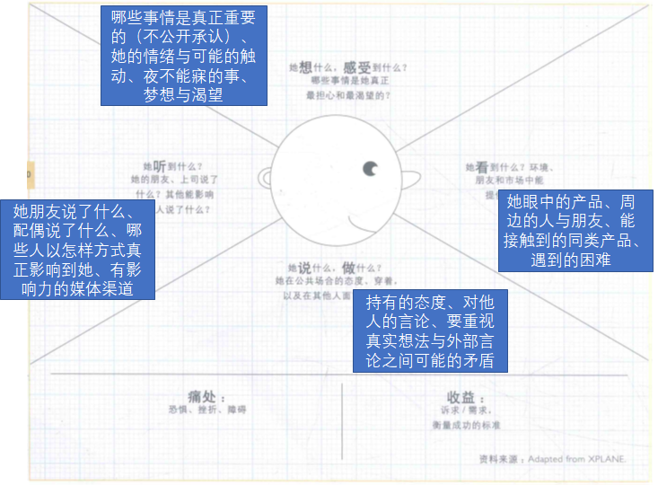
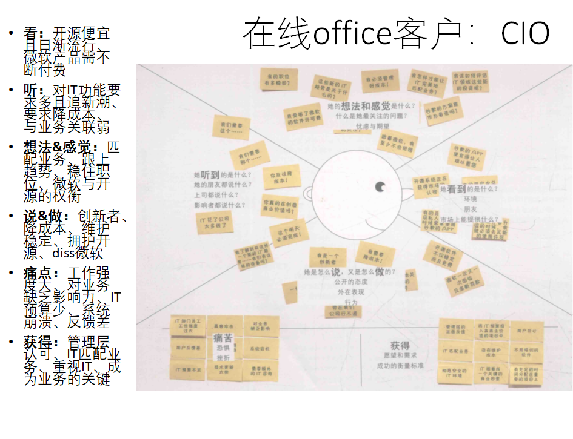
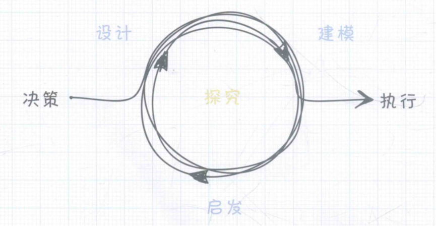
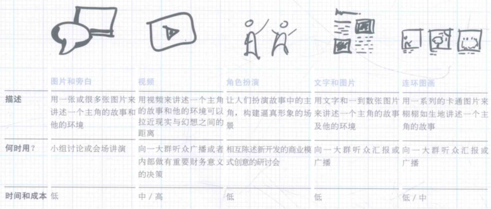
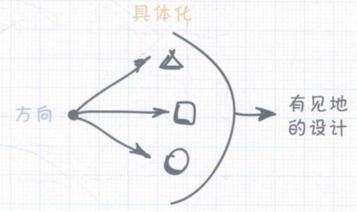
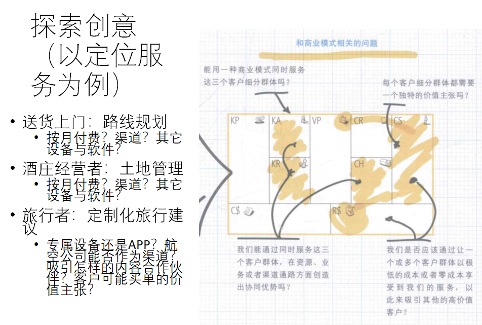
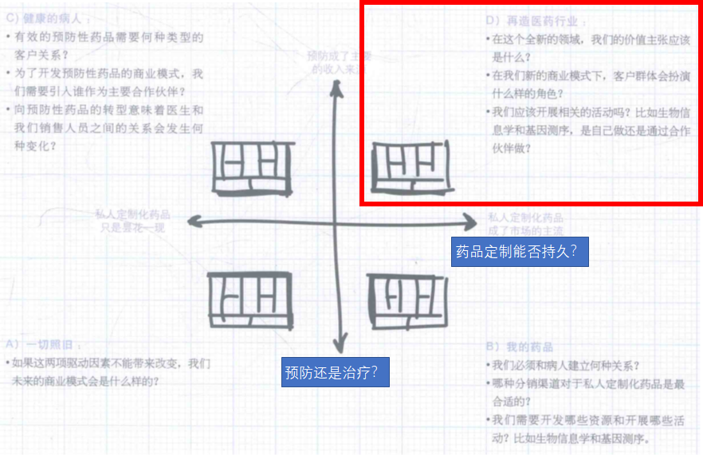

# 商业模式设计

## 客户洞察

### 概念

+ **客户视角是商业模式的指导性原则，客户的观点决定了我们选择怎样的价值主张、渠道、客户关系和收益来源**

+ 难点

  + 第一个挑战在于如何建立对客户的彻底理解，并基于这种理解进行商业模式设计。这种理解，并不是简单地问客户需要什么。透彻理解客户（ “问题背后的问题” ）；需要人类学、社会学理论（笼统的人），以及与实地调研（具体的人）结合；

  + 第二个挑战在于尽量避免过于聚焦在现有客户细分群体上，而应该盯着新的和未被满足的客户细分群体。清楚了解企业当前关注哪些客户（的需要），忽略哪些客户（的需要）

+ 变需要为需求（人为核心）

  + 细致观察并接纳目标客户的行为
  + “笼统的人”与“具体的人”和场景相结合
  + 功能、认知、情感逐渐深入的换位思考以及拓展
  + 将用户引入设计

### 移情图

+ 构建用户画像的易用工具（“素描”），可导出价值主张、渠道、客户关系、收入来源

+ 使用方式：罗列所有客户群体，挑选三个最有希望的，选择一个作为分析对象

#### 她看到的是什么？

描述客户在她的环境里看到了什么。

环境看起来像什么？谁在她的周围？谁是她的朋友？她每天接触什么类型的产品或服务？她遭遇的问题有哪些？

#### 她听到的是什么？

描述客户所处环境是如何影响客户的。

她的朋友说什么？她的配偶说什么？谁能真正影响她？如何影响？哪些媒体渠道能影响她？

#### 她真正的想法和感觉是什么？

设法概述你的客户所想的是什么。

对她来讲，什么是最重的？想象一下她的情感，什么能感动她？什么能让她失眠？尝试描述她的梦想和愿望。

#### 她说些什么，又做些什么？

想象这位客户可能会说什么或者在公开场合可能的行为。

她的态度是什么？她会给别人讲什么？要特别留意客户所说的和她真正感受之间的潜在冲突。

#### 这个客户的痛苦是什么？

她最大的挫折是什么？在她和她想要的事物或需要达到的目标之间有什么障碍？她会害怕承担哪些风险？

#### 这个客户想得到什么？

她真正要想和希望达到的是什么？她如何衡量成功？猜想一些她可能用来实现其目标的策略。

### 案例

## 创意构思

### 概述

+ 两步骤：生成大量创意 -> 对创意进行整合并挑选
  + 创意生成和创意合成。
  + 前一阶段重视创意的数量；后一阶段对所有创意进行讨论，加以组合，并缩减到少量具有更高可行性的创意方案。

+ 提出新创意的两个出发点
  + 从画布中寻找创新的焦点
  + 不断提出“如果…会怎样”的问题（“如果学生无法到校又要不停课会怎样”）

### 焦点

#### 资源驱动

+ 创新来源于组织现有的基础设施或合作伙伴资源

+ 云计算服务、高传输低时延的5g网络

#### 供给驱动

+ 创造全新的价值主张，并影响到其它模块

+ 水泥输送从48小时减为4小时
+ 云端的全托管机器学习与自动调优、云游戏

#### 客户驱动

+ 基于客户需求、可获得性或便利性的提升，并影响其他模块

+ 23andMe的个人DNA测试服务（从医疗与研究领域转来）
+ 付费自习室：价值主张-（成年人）沉浸式学习空间；收入来源：5-20元/小时租赁

#### 财务驱动

+ 由新收益来源、定价机制或者被缩减的成本驱动的创新

+ 施乐复印机从卖设备转向复印机出租（月费95美元，含2000份复印，超出5美分每张）
+ IBM服务器从软件+硬件转型为开源+咨询+硬件

#### 多点驱动

+ 多焦点驱动的创新，并对其它模块产生深远影响

+ “卖产品”转为“卖服务”
+ B站：与共青团及官媒的合作、内容从二次元到多圈融合、从内容转向社交（陪伴）、高粘性用户的游戏运营与内容驱动直播

### 流程

#### 团队组建

+ 除了“创意天才”，更需要多样化创新团队

+ 成员多样化：业务单元/领域不同、年龄/资历水平不同、文化背景不同、经验互补（例：美团成长期重要人物 – 原阿里“中供铁军”骨干干嘉伟）
+ 要引导积极倾听，并考虑在关键会议上引入一个中立的引导员或主持人

#### 钻研

+ 创新所需要的知识：总体研究、客户与潜在客户、新技术调研、现有商业模式评估等

#### 开拓

+ 从九大模块任意一点出发作为创新起点；数量是关键；重在创意，避免过早评论价值

#### 甄选标准

+ 在业务背景下包含：预期实施时间、潜在收入、可能的客户阻力、对竞争优势的影响

#### 构建原型（模型）

+ 确立标准后从创意中整理一个最优短名单，由此构建3-5个创新的商业模式，再利用画布进行勾勒和讨论

### 头脑风暴

#### 保持聚焦

+ 精确表达当前问题、始终与客户需求有关、不要跑题太远、将讨论拉回到开始问题

#### 执行规则

+ 坚决执行开始时的规则：“不过早下结论”、“每次一人讲“、”追求数量”、“可视化”、“疯狂创意”

#### 视觉化思考

+ 将创意写或者画在每个人都能看到的地方：便利贴+黑板/墙

#### 准备

+ 为一次头脑风暴所准备的钻研：技术研讨、实地考察、客户讨论等各种形式

## 视觉化思考

### 概述

+ **抽象的东西具体化、复杂的概念简单化**
+ 视觉化思考可以帮助我们看清楚一个模式的全貌。一个模式就是一个系统，只有看到全貌才能促进我们对模式的创新。
+ 视觉化思考能够把抽象变为具体，并能有效地阐明各个元素之间的逻辑关系，简化了事物的复杂性，进而大大地改善了讨论的质量。

### 实现

+ 绘画 + 便利贴

+ 便利贴的重要性：随意的添加、删除、移动（在画布上的位置）

  + 三个指导方针：粗的马克笔+只写一项元素+只用少量文字抓住关键点

  + 便利贴的绘制、添加、删除和移动能够有效组织人们参与讨论，反映了商业模式的动态变化过程，与结果同样重要

  + CRC卡片（正面对象状态+行为与协作者，背面简短描述）、Story Card（正面故事描述，背面故事实现的理由）

+ 绘画的强大表现力：人对图像的反应要比文字强烈的多

  + 最简陋的素描也能让事物变得具体和易于理解：如情绪、比例等

  + 帮助向别人解释和沟通你的商业模式，容易激发起建设性的讨论与创意

  + 可用于勾勒一个典型客户与他所处的环境，也可用于勾勒出客户群体的需求和任务

### 作用

#### 理解商业模式的本质

+ 视觉化的语言：画布是一张概念图，其功能类似于具有语法规则的视觉化语言，提供了视觉和文字的指引，帮助画出模式中所需的所有信息
+ 抓住全貌：画布的草图能够为观众提供足够的信息理解全貌，而不被过多的细节影响理解
+ 看到关键：一定要理解元素/模块之间的关联关系

#### 提升对话效率

+ 共同的参照点：将头脑中不言而喻的主观假设具象化，并将大量内容固化成为可回溯的参照点（人类的短时记忆只能保留有限数量的想法）
+ 统一的语言：利用图形和画布帮助不同参与者聚焦，特别是来自不同领域的人
+ 一致的理解：帮助不同部门的人将其深入理解的部分表达出来，再一起形成整体的洞察与一致的理解

#### 探索创意

+ 激发创意：模糊的想法-随着灵感发挥-有机地整合成一幅图画
+ 演习：视觉化的模型帮助思考部分元素的改变引发的系统性冲击

#### 提升沟通

+ 统一公司内部的理解：用图画在组织内形成共识，朝一个战略方向前进
+ 内部推销：好的图画使组织的现状、需要做的事情、怎么做、未来会怎样等方面变得易于沟通，从而赢得组织内部的理解和支撑
+ 外部推销：提升向投资人或潜在合作伙伴推销成功的概率

### 讲故事

+ 解释商业模式的一种有力的方式：利用画布草图逐一介绍一个完整的视觉化故事

+ 如何讲述

  + 绘制商业模式

    + 用简单的文字填充各个商业模式模块，一个模块只用一张便利贴
  + 用图形描绘每个商业模式元素
  
    + 每次取下一张便利贴，再用图形去取代文字想表达的内容，图形保持简单

  + 设计故事主线
  
    + 决定讲故事的时候先贴哪张便利贴；可以尝试不同的主线与起点，只要能支撑故事
    
  + 讲述故事

    + 根据便利贴的顺序与贴图的内容逐一讲述你的商业模式

## 模型构建

### 价值

+ 与“视觉化思考”一样，原型制作同样可以让概念变得更加形象、具体，并能促进新创新的探索。

+ 商业模式原型是用于讨论、调查或者验证概念目标的工具。

+ 商业模式原型可以帮助我们探索不同的方向——那些商业模式应该尝试选择的方向。使用原型来互动，更容易产生创意，有助于推动我们思考。

+ 全新的、可以改变游戏规则的商业模式源自深入的不懈的探究。全新的思考：多个商业模式可以共存或交叉于行业间；由内向外，商业模式可以改变行业；随机思考；探索式地选择商业模式；关注并重视设计；关注价值和效率。

### 流程

### 不同程度模型

+ 随手素描（napkin sketch）：勾勒和推销一个粗略的主意
  + 勾勒想法，含价值主张和主要收益来源

+ 精心描绘的画布（elaborated canvas）：探索实现该创意所需的因素
  + 完整画布，商业逻辑思考，市场潜力预估、理解模块之间联系、“事实查证”

+ 商业案例（business case）：检查该创意的可存活度
  + 全面画布，关键输入、核算成本与收入、估算利润潜力、模拟财务场景

+ 实地验证（field-test）：调查客户的可接受度和可行性
  + 准备合情合理的商业案例，站在客户角度进行实地验证，验证价值主张、渠道、定价机制等实际市场中的元素

## 讲故事

### 价值

+ 故事是一个理想的热身工具，为深度讨论商业模式与其内在逻辑做好准备

+ 将故事与画布结合，利用叙事性克服听众对不熟悉模式的抵触，放下对陌生事物的怀疑

### 目的

+ 介绍新想法：尝试融入组织战略

+ 向投资人推销：争取外部资源（是什么，为谁服务，如何获得收益）

+ 吸引员工（成员）：抓住组员的注意力和好奇心，为下一步探讨准备

+ 让未来触手可及：激发创意、辩证变革

### 视角

#### 公司视角

从员工的视角来解释商业模式，让员工成为故事的主人公，因为员工是公司及其商业模式的内部动作机制，员工为新模式的推行提供了依据。

#### 客户视角

把客户作为故事的主人公，让客户道出她的烦恼。接着把话题转移到公司，讲述公司是如何帮助她创造价值并为其解决问题的。以客户视角讲故事，最大的挑战在于如何让故事具有真实感，而不是给人一种夸大其词的印象。

### 方法

## 场景构建

### 类型

+ 不同的客户结构：结合客户洞察描绘出独特、具体的图景

+ 未来可能的竞争环境：想象未来可能的具体细节，品味特定条件下商业模式如何演进
+ 使用情景推测的方式设计商业模式，促使我们去思考商业模式在特定环境下可能的演变趋势，它能帮助我们更好地迎接未来的商业环境。

### 基于客户的场景

+ 客户情景推测可以在商业模式设计中引导我们做出正常的选择。帮助我们解决诸如此类的问题，如：哪种渠道通路最为恰当？与客户建立什么样的关系效果最佳？客户最愿意为哪种问题解决方案付费？

+ 一旦我们针对不同的客户细分群体设计出不同的情景模式，我们便可以问一下自己，这种单一模式是否能够应付所有的这些客户细分群体？是否我们需要针对不同的客户做一些调整？
+ 每一类客户细分群体都需要一种单独、有针对性的价值主张吗？
+ 在同时服务多个细分客户群体时，我们能在资源、业务或渠道通路上创造协同效应吗？
+ 为了吸引其它的一些高价值客户，我们应该以低成本甚至零成本的方式来服务一个或多个客户群吗？

#### 案例

### 基于未来的场景

+ 基于两个或多个主要衡量指标，设计出一组未来的情景图。在商业模式研讨之前，情景应该预先设计好，即使是最简单的情景设计也能激发你的创造力，把参与者投射到未来的情景之中。

+ 以故事的形式来讲述每一幅情景图，对它们的主要特点和要素做一个概述。为每个情景加一个标题，并用简短而形象的描述性词语把主要元素加以突出。

+ 针对每一种情景，设计出一种或多种恰当的商业模式，并进行研讨。设定研讨小组，组织参与者对不同情景下的商业模式进行探讨。

#### 案例

