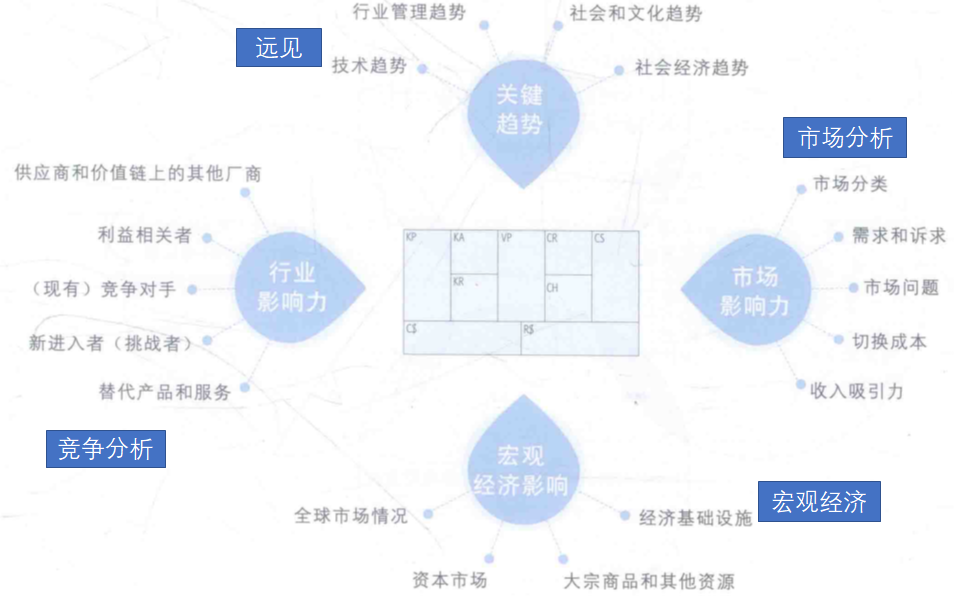
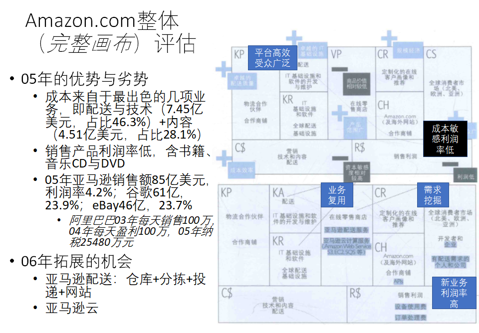
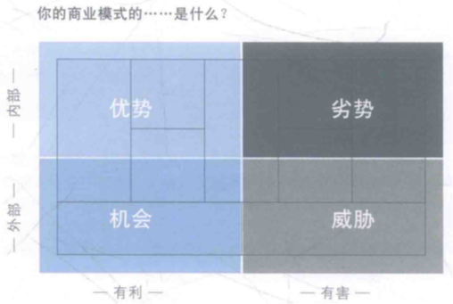
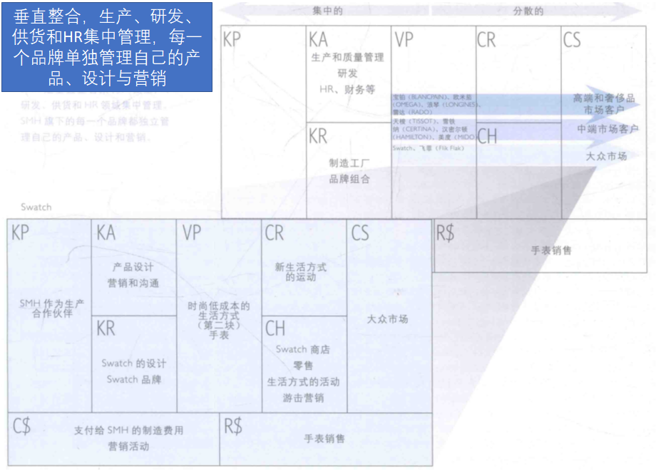
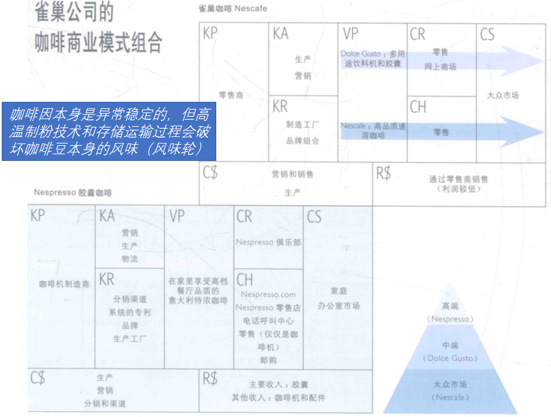
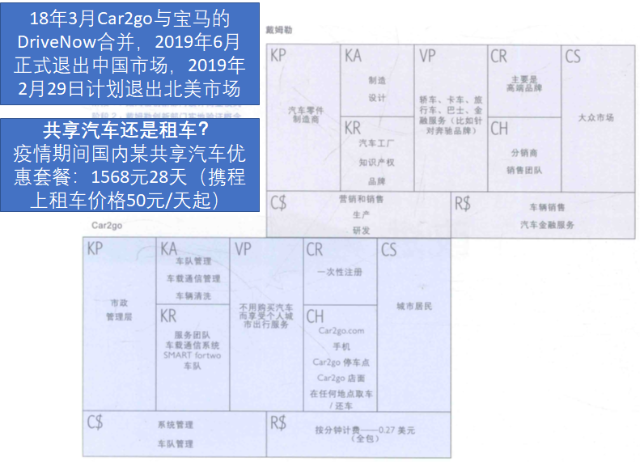

# 商业模式战略

## 环境评估

### 概念

### 市场影响力

+ 市场问题
  + 影响客户环境的关键因素是什么？现在正在发生什么转变？市场在朝什么方向发展？

+ 市场分类
  + 哪块客户细分群体最为重要？最大的增长潜力在哪里？哪个细分市场在萎缩？哪个边缘细分市场值得关注？

+ 需求和诉求
  + 客户需要什么？在客户需求中，哪些没有得到满足，最大的缝隙在哪里？客户最渴望满足的需求是什么？哪些需求在增长？哪些在降低？

+ 切换成本
  + 联系客户和公司及其产品或服务的纽带是什么？阻止客户投靠竞争对手的转移成本是什么？客户找到和购买相似产品或服务的难度大吗？品牌的作用大吗？

+ 收入影响力
  + 让客户真正愿意掏腰包的是什么产品或服务？什么产品或服务能获得最大的收益率？客户能轻而易举地发现和购买更为便宜的产品和服务吗？

### 关键趋势

+ 技术趋势
  + 在你的行业市场内外，主要的技术趋势是什么？哪种技术代表着重要市场机会或扰乱市场的危险？市场的客户正在采用哪种新显现的技术？

+ 行业管理趋势
  + 哪种监管法规趋势影响你的商业模式？什么视则可能会影响你公司的商业模式？哪种法规和税收制度会影响客户端的需求？

+ 社会和文化趋势
  + 描述关键的社会趋势。在文化和社会价值观中，哪种转变影响着你的商业模式？哪种趋势可能会影响消费者行为？

+ 社会经济趋势
  + 重要的人口趋势是什么？你会如何描述你市场里的收入和财富分配？可支配收入有多高？描绘出你所在的市场的消费形式（如房产、医疗、娱乐等）。城市人口和农村人口的数比例关系是怎样的？

### 行业影响力

+ 主流竞争对手
  + 谁是我们的竞争对手？在我们所处的行业里，主导游戏规则的公司是哪一个？它们的竞争优势和劣势分别是什么？描绘出它们的主要产品和服务。它们关注重点在哪一个客户细分群体？它们的成本结构怎么样？它们对我们的客户细分群体、收入来源和利润率能产生多大的影响？

+ 挑战者（相对于传统电商）
  + 谁是你所在市场的新进入者？它们有什么不同？它们分别有什么竞争优势和劣势？它们必须克服哪些市场准入壁垒？它们的价值主张是什么？它们专注于哪一块客户细分市场？它们的成本结构怎么样？它们对我们的客户细分群体、收入来源和利润率能产生多大的影响？

+ 替代产品和服务
  + 哪些产品和服务可以替代我们的？和我们的产品和服务的成本相比，它们的怎么样？客户转移到这些替代品有多容易？这些替代品和服务来源于什么样的传统商业模式？（例如高铁相比于飞机，手机相比于相机，Skype相比于长途电话服务公司。）

+ 供应商与价值链上的其他厂商
  + 在你所在行业的价值链上，谁是关键参与者？在多大的程度上，你的商业模式依存于其他的参与者？行业中的边缘参与者有可能崛起吗？哪个参与者的收益最高？

+ 利益相关者
  + 哪些利益相关者可能会影响你的商业模式？利益相关者的影响力有多大？它们是工人、政府还是游说集团？

### 宏观经济影响

+ 全球市场情况
  + 经济发展处在蓬勃发展期还是萧条衰败期？描绘出市场的整体气氛。GDP的增速是多少？失业率有多高？

+ 资本市场
  + 资本市场的情况怎么样？你所处的行业融资容易吗？原始资本、风险投资、公开募资、市场资本或是信贷在你的行业一应俱全吗？获取融资的或本高吗？

+ 大宗商品和其他资源
  + 描述对你的业务至关重要的商品和其他资源市场的当前情况（例如油价和人力成本）。获取你的商业模式运作所需要的相关资源容易吗（如吸引核心人才）？它们的成本高吗？价格的变化趋势是怎样的？

+ 经济基础设施
  + 你所在的市场公共基础设施怎么样？你会如何描述交通、贸易、教育质量和接触供应商和客户的状况？个人和公司的所得税有多高？针对企业的公共服务怎样？你会如何评价你的生活质量？

## 商业模式评估

### 详尽评估

### SWOT

+ 优势、劣势、机会和威胁（Strength, Weakness, Opportunity, Threat, SWOT）

+ 评估方面
  + 价值主张
  + 成本/收入
  + 基础设施
  + 客户界面
+ 前两个：你公司的优势和劣势分别是什么？（从内部评估你的公司）。
+ 后两个：你公司面临的机会和威胁分别是什么？（从外部评估你的公司）。
+ 这四个问题中，两个侧重有利于公司的方面（优势和机会），而另两个则关注不利于公司的方面。在提这些问题时，如果能同时从商业模式的整体和其九个构造块的角度考虑，将会十分有用。
+ 这种SWOT分析法为进一步的讨论、决策和最终的商业模式创新提供了一个良好的基础。

#### 评估威胁

我们已经讨论了商业模式是如何在特定的环境中构建起来，并描述了诸如竞争、法律环境或技术创新等外部力量是如何影响或威胁到一种商业模式的。在这一部分中，我们关注的是商业模式中每个构造块受到的威胁，并提供了一组未列举穷尽的问题清单来帮助你思考解决这些威胁的方法。

#### 评估机会

与威胁一样，我们也可以评估隐藏在每个商业模式的构造块中的机会。下面是一组未列举穷尽的问题清单，有助于思考在你的商业模式中出现在每个构造块中的商业机会。

## 蓝海战略

### 概述

+ 通过**价值创新**来开辟全新的没有竞争的市场空间，而不是模仿现有商业模式在当前行业中竞争。**所谓“价值创新”就是“在提升价值的同时降低成本”**。
+ 为了取得价值上的创新，推荐使用“**四项行动架构**”这一分析工具，该工具用四个重要问题来检查一个行业的战略逻辑和主流商业模式，以探寻价值创新、减少成本。

### 四项行动架构

### 整合商业画布

+ 商业模式右半部关注价值、聚焦客户，左半部分关注成本和基础设施。右侧的改变回对左半部分产生影响

+ 蓝海战略强调在增加价值的同时减少成本，通过删除和消减低价值产品或服务来降低成本，通过提升和创造对成本影响弱的高价值功能或服务来实现

+ 二者的整合使得使用“四项行动架构”分析时能够更好地识别这些行动对商业模式其它模块的影响

#### 案例

### 质疑商业模式画布

#### 探索成本的影响

+ 哪些活动、资源和合作关系的成本最高？
+ 如果减少或剔除某些成本因素，将会产生什么影响？
+ 在减少或剔除高成本的资源、活动和合作关系后，你会如何用成本更低的元素来弥补它们的缺失导致的价值损失？
+ 新计划的投资将创造出什么价值？

#### 探索价值主张的影响

+ 哪些相对价值较低的功能或服务可以剔除或减少？
+ 增强或重新再造哪些功能或服务可以产生一种有价值的新体验？
+ 在价值主张上的变化将对成本产生什么样的影响？
+ 价值主张上的变化将如何影响商业模式的客户侧？

#### 探索客户的影响

+ 你应该专注哪个新的客户细分群体，应该减少或剔除对哪个客户细分群体的关注？
+ 新的客户细分群体需要你帮他们解决什么样的问题？
+ 这些客户希望我们如何接触他们，和他们建立什么样的关系？
+ 服务这些新的客户细分群体将对成本产生什么影响？

## 管理多个画布

### 整合管理

+ 在分离的商业模式之间创造协同效应，必要的时候相互协调配合。

#### 案例

+ 瑞表在生产、研发、采购和人力资源方面，采用垂直整合，统一管理。
+ 瑞表（SMH）旗下的每一个品牌在产品、设计、市场推广等方面，都享有自主权。

### 分离管理

+ 避免因商业模式整合而产生冲突，并保留必要的自主权。

#### 案例

### 渐进式

#### 案例

+ 戴姆勒的渐进式商业模式创新
+ 阶段1：在戴姆勒创新部门内的商业模式设计
+ 阶段2：有戴姆勒创新部门规划下的现场概念测试
+ 阶段3：决定新商业模式的组织结构和确认其与核心业务之间的关系