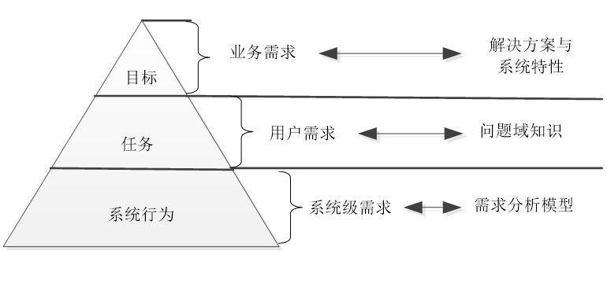
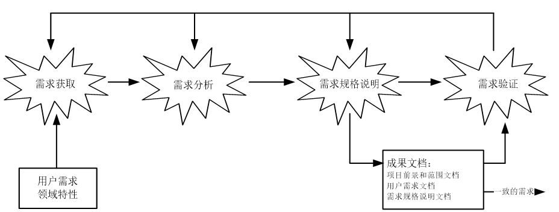
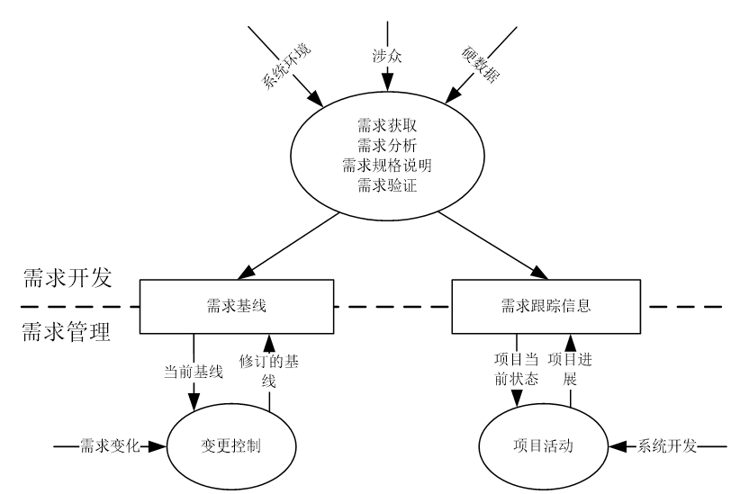
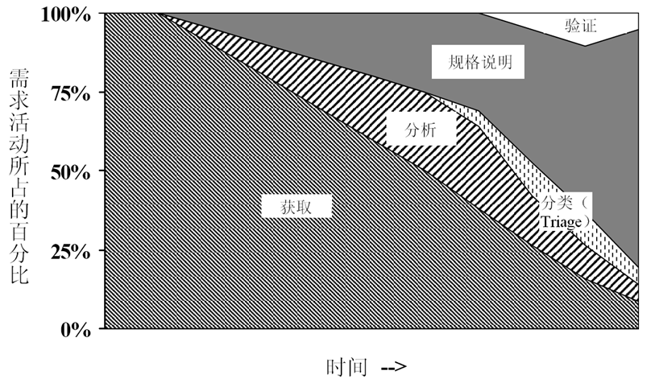

# 需求基础

## 基本概念

### 需求定义

+ 用户为了解决问题或达到某些目标所需要的条件或能力；
+ 系统或系统部件为了满足合同、标准、规范或其它正式文档所规定的要求而需要具备的条件或能力；
+ 对（1）或（2）中的一个条件或一种能力的一种文档化表述。

### 问题域

+ 问题的产生地：**当现实的状况与人们期望的状况产生差距时**，就产生了问题。

+ 要解决问题，就需要**改变现实当中某些实体的状态或改变实体状态变化的演进顺序**，使其达到期望的状态或演进顺序。

+ 这些实体和状态构成了问题解决的基本范围，称为该问题的问题域（Problem Domain）

#### 特性

+ 问题域自治的规律性称为问题域特性
  + 利用商业模式画布进行更好的描述 

+ 需额外关注的问题域特性
  + 间接特性（semi-automatic） 
  + 约束和假设 

+ 问题域特性的重要性
  + 要想解决问题，它就需要了解问题域特性，将解决方案和问题域特性结合起来 
  + 要防止解系统的引入在问题域当中引发未预见的连锁反应 （例：间接特性不直接与解系统交互而引发）

### 解系统

+ 软件系统通过影响问题域，能够帮助人们解决问题，称为解系统

+ **问题域是自治的，它有自己的运行规律，而且这些规律不会因解系统的引入而发生改变**

+ 用户应关注问题域，**开发者应以问题域为中心思考**

#### 特性

+ 软件系统通过影响问题域，能够帮助人们解决问题，称为解系统 

+ 手段而不是目的

+ **用户不应该关注软件系统，而是关注问题**

+ **开发者关注软件系统，但要学会以问题为中心思考**

### 需求定义

+ 描述明确的问题域特性E; 定义良好的系统行为S ; 预期的需求R

+ 需求工程的目的就是根据E，构建S，使得

+ 需求工程的困难之处：
  + （1）不存在描述明确的E；
  + （2）不存在确定的针对S的评估标准R；
  + （3） E, R => S是一个创造性的过程。

+ 需求工程的主要工作
  + 需求开发,确定 R 
  + 研究问题背景，描述问题域特性E 
  + 构建解系统，描述解系统行为S，使得 E, S => R

## 层次性

### 业务需求

+ 系统建立的战略出发点，表现为高层次的目标（Objective），描述了组织为什么要开发系统

+ 为了满足用户的业务需求，需求工程师需要描述系统高层次的解决方案（逐一细化），定义系统应该具备的特性（System Feature，SF）
  + 参与各方必须要对高层次的解决方案达成一致，以建立一个共同的前景（Vision） 
  + 特性说明了系统为用户提供的各项功能，它限定了系统的范围（Scope） 
  + **项目的前景和范围明确了软件（某版本）的开发范畴**
  + BR向SF*的转化过程可以利用商业模式画布*

### 用户需求

+ 执行实际工作的用户对系统所能完成的具体任务的期望，描述了系统能够帮助用户做些什么
  + 直接用户
  + 间接用户：通用、公共服务软件等用户无法确定的系统 

+ 基本表达方式：**用户可以使用系统完成**任务
  + 用户任务应是有价值的活动（**客户洞察**） ，并具有较强的目标性（**细化的讲故事与场景**） 
  + 对所有的用户需求，都应该有充分的问题域知识作为背景支持

+ 特性
  + 模糊、不清晰：允许使用形容词和副词 
  + 多特性混杂：允许混合功能和非功能性需求 
  + 多逻辑混杂：一条用户需求所代表的任务需多次系统交互才能完成

+ 需求开发阶段可视作从用户需要解决的问题到用户与系统的一系列交互的转化，此过程中用户的输入与获得的反馈不断精化，但系统本身仍被视作一个整体，留待后续设计阶段确定模块划分与结构

### 系统需求

+ 用户对系统行为的期望，一系列的系统行为联系在一起可以帮助用户完成任务，满足业务需求

+ 系统需求可以直接映射为系统行为（对应需求规格说明），定义了系统中需要实现的功能，描述了开发人员需要实现什么

+ 将用户需求转化为系统需求的过程是一个复杂的过程
  + 首先需要分析问题领域及其特性，从中发现问题域和计算机系统的共享知识，建立系统的知识模型；
  + 然后将用户需求部署到系统模型当中，即定义系列的系统行为，让它们联合起来实现用户需求，每一个系统行为即为一个系统需求。
  + 该过程就是需求工程当中最为重要的需求分析活动，又称建模与分析活动。 

## 需求类型

### 功能需求

+ 必备，价值的来源
+ 和系统主要工作相关的需求，即在不考虑物理约束的情况下，用户希望系统所能够执行的活动，这些活动可以帮助用户完成任务。功能需求主要表现为系统和环境之间的行为交互。

#### 概念

+ 是软件产生价值的基础

+ 最为复杂
  + 在所有需求中占比可达90%甚至更高。

+ 最需要按照BR（SF）、UR、SR三个层次进行展开

+ **价值主张** **–** **关键业务** **–** **功能需求，一般可以用可视化、故事和场景进行描述**

### 性能需求

+ 动态性（系统实际运行状态）需要专门模拟
+ 系统整体或系统组成部分应该拥有的性能特征，例如CPU使用率、内存使用率等。

#### 概念

+ 速度（Speed），系统的响应时间。
  + PR1：所有的用户查询都必须在10秒内完成。

+ 容量（Capacity），系统所能存储的数据量。
  + PR2：系统应该能够存储至少10万条销售记录。

+ 吞吐量（Throughput），系统在连续的时间内完成的事务数量，例如。
  + PR3：解释器每分钟应该至少解析5000条没有错误的语句。

+ 负载（Load），系统可以承载的并发工作量。
  + PR4：系统应该允许200个用户同时进行正常的工作。

+ 实时性（Time-Critical），严格的实时要求。
  + PR5：监测到病人异常后，监控器必须在0.5秒内发出警报。

### 质量属性

+ 从设计（尤其是体系结构设计）的角度来讲
+ 系统完成工作的质量，即系统需要在一个“好的程度”上实现功能需求，例如可靠性程度、可维护性程度等。

#### 概念

+ 系统为了满足规定的及隐含的所有要求而需要具备的要素称为质量（包含性能需求）

+ 质量属性是为了度量质量要素而选用的特征

+ 质量模型就是能够为质量需求的描述和评价提供工作基础的特征集及特征之间的联系

### 对外接口

+ 从封装和信息隐藏，以及多平台交互的角度来讲
+ 系统和环境中其他系统之间需要建立的接口，包括硬件接口、软件接口、数据库接口等等。

#### 概念

+ 解系统和其他系统之间的软硬件接口
  + 接口的用途
  + 接口的输入输出
  + 数据格式
  + 命令格式
  + 异常处理要求

+ 用户界面
  + 可以作为需求，写在SRS（Software Requirement Specification，需求规格说明）中
  + 也可以利用专门的人机交互设计文档记录 

### 约束

+ 容易忽略
+ 进行系统构造时需要遵守的约束，例如编程语言、硬件设施等 

#### 概念

+ 总体上限制了开发人员设计和构建系统时的选择范围

+ 系统开发及运行的环境
  + 包括目标机器、操作系统、网络环境、编程语言、数据库管理系统等。

+ 问题域内的相关标准（**商业模式评估**）
  + 包括法律法规、行业协定、企业规章等。

+ 商业规则（**商业模式设计**）
  + 用户在任务执行中的一些潜在规则也会限制开发人员设计和构建系统的选择范围 

## 优秀需求的特性

### 完备性

+ 不需要做更多的扩展就可以充分的说明用户所需要的系统功能。

+ 每一个需求的描述都应该包含开发人员设计和实现这项功能需要的所有信息

+ R2.5-1：系统应该允许被扩展。

+ （更好）R2.5-2：系统的调度算法应该允许被扩展。

### 正确性 

+ 真实的反映用户的意图 

+ 必须请需求的提出者予以确认 

### 可行性 

+ 由开发人员进行检查 

+ 需要进行一定的分析和研究，而不是单纯的凭借经验和直觉 

+ 必要的时候要通过开发原型来加以验证 

### 必要性 

+ 满足用户的业务需求所必需的

+ 避免客户或开发人员“镀金”要求的影响 

### 无歧义 

+ 每一项需求都应该有而且只能有一种解释 

+ 定义一个可以共同理解的词汇表（Glossary）

### 可验证

+ 通过分析、检查、模拟或者测试等方法能够判断需求是否被满足 

+ 不可验证的需求往往是因为描述模糊或者过于抽象，所以在进行需求的描述时要
  + 让需求具体化
  + 小心形容词和副词的使用
  + 避免程度词的使用

## 需求工程过程

### 概述

### 活动

#### 需求获取

+ 收集背景资料
  + 深入了解需要构建知识框架

+ 定义项目前景和范围 
  + 生成业务需求，前景应对冲突，范围排除不必要的变化请求，全部内容有助于坚定投资人信心（项目明确化）

+ 选择信息的来源
  + 从用户、硬数据、产品/专家/文档中选取最有代表性的部分 

+ 选择获取方法，执行获取
  + 面谈（调查表）、观察、原型（需要深入）

+ 记录获取结果（未精加工的原始信息） 

  + 前景和范围文档记录业务需求

  + 获取笔录记录用户需求和问题域特性 

#### 需求分析

+ 背景分析

+ 业务分析（问题分析、目标分析、涉众分析），确定系统边界 （**业务需求**）

+ 利用场景/用例模型描述**用户需求**

+ 需求建模（文本-UML图-Z模型） 

+ 需求细化（依据模型得到**系统级需求**）

+ 确定优先级（定期评估和调整） 

+ 需求协商

+ 最终得到一个需求基线集
  + 指定开发任务（用户要求功能的子集），具有优秀需求的特性（消除不一致和冲突）

#### 需求规格说明

+ 定制文档模版 

+ 编写文档

#### 需求验证

+ 执行验证（同级评审-原型-模拟） 

+ 问题修正（修正后需跟踪以确保落实） 

#### 需求管理

+ 建立和维护需求基线集 

+ 建立需求跟踪信息（后向：制品，前向：高层需求） 

+ 进行变更控制（策略与团队，*半自动化*）

### 并发性

