# 需求获取展开

## 展开

### 需求获取前半段

+ 确定项目的前景与范围
  + 问题分析-目标分析-业务过程分析

+ 涉众分析
  + 涉众识别-涉众描述-涉众评估-涉众代表选择-参与策略

### 需求获取后半段

+ 基于用例/场景展开用户需求获取
+ 用户获取手段
  + 面谈-原型-观察
  + 原型：抛弃式与演化式，控制成本，应对模糊与变更
  + 观察：采样观察与民族志，应对复杂协同

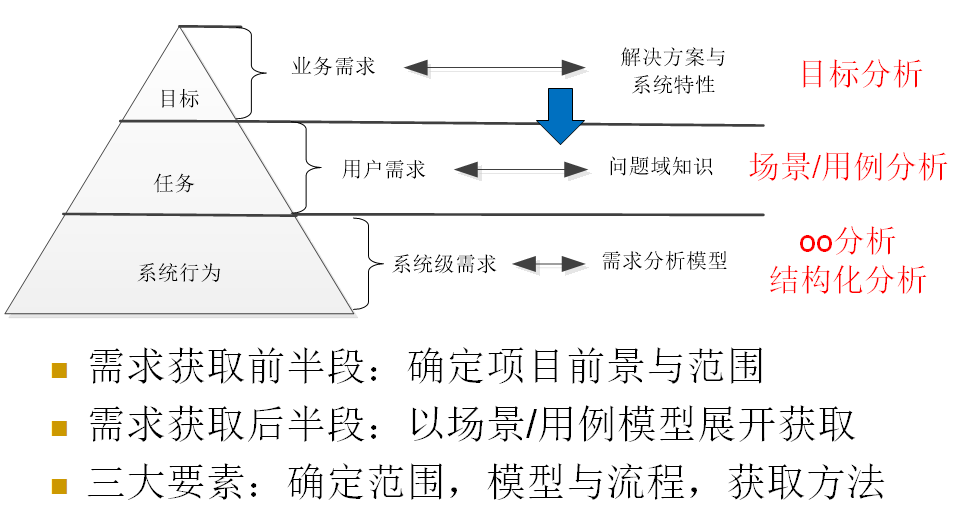

### 组织

+ 场景/用例模型驱动
  + 整理和归类需求获取行为得到的信息（框架） 
  + 指导和组织需求获取行为的开展
  + 为详细信息的分析提供背景基础和上下文知识 

+ 承上启下
  + 展开上一层（业务需求）
  + 准备下一层的展开（系统级需求）

## 用例与场景

### 场景

+ 具有重点描述真实世界（商业模式设计：讲故事->场景）的特征，它利用情景、行为者之间的交互、事件随时间的演化等方式来叙述性的描述系统的使用

### 用例

+ 用例是一种特殊的场景
+ 相关场景集合的叙述性的文本描述 
+ UML将用例定义为“在系统（或者子系统或者类）和外部对象的交互当中所执行的行为序列的描述，包括各种不同的序列和错误的序列，它们能够联合提供一种有价值的服务”

### 组织特点

#### 场景 -> 用例

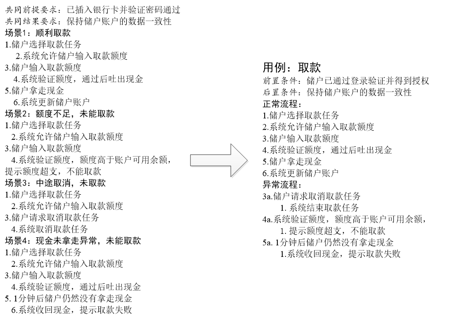

#### 组织作用

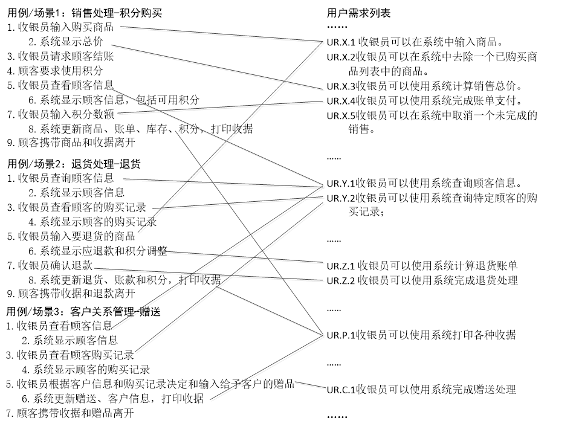

+ 它只考虑其他内容与功能需求之间的联系，却无法描述其他内容相互之间的联系，例如质量需求的相互依赖（*目标模型*）、界面需求的跳转（*对外接口中的人机交互文档*）、对外接口需求与质量需求的联系（*IF作为主体承载目标实现*）…
+ 只考虑存在联系的事实，却无法分析联系的合理性，例如有无遗漏功能需求、数据需求及业务规则是否充分、质量需求是否可行（**需求分析**）
+ 所以，虽然用例/场景的优点非常明显，但它毕竟只是一种组织形式，不能寄希望于单凭用例/场景模型解决所有问题[Gottesdiener2002]，**目标模型、面向对象分析模型**或结构化模型等其他的模型形式仍然是必要的。

## 场景/用例场景模型

### 用例模型

+ 用例
+ 参与者
+ 关联
+ 系统边界
+ 用于关联各项用例
+ 通过用例模型语义
  + 复用、简化用例的文本描述

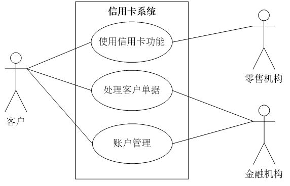

#### 包含关系

+ 抽象用例

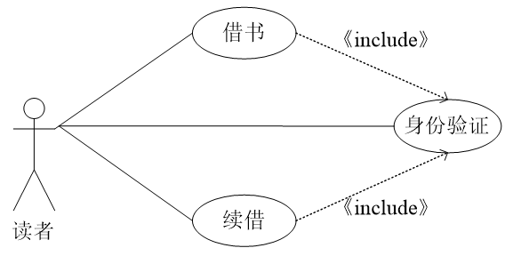

#### 扩展关系

+ 附加用例

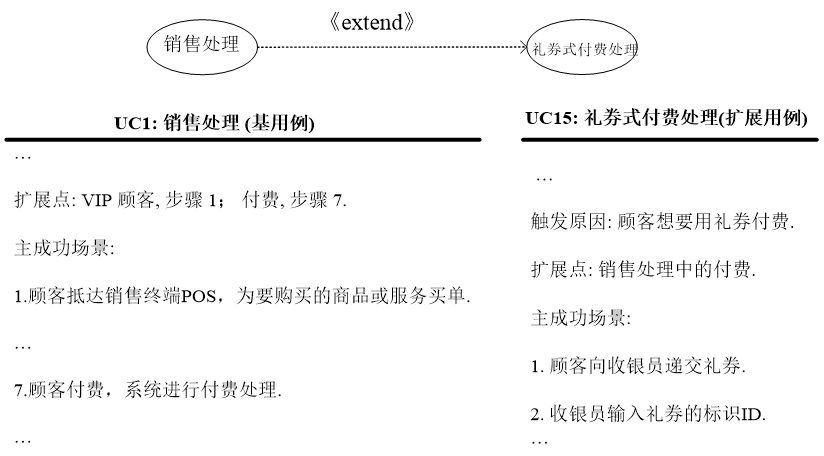

#### 泛化关系

+ 子用例继承父用例的特征并增加新特征

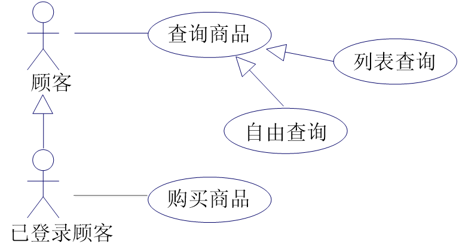

## 用例模型展开需求获取

### 流程表

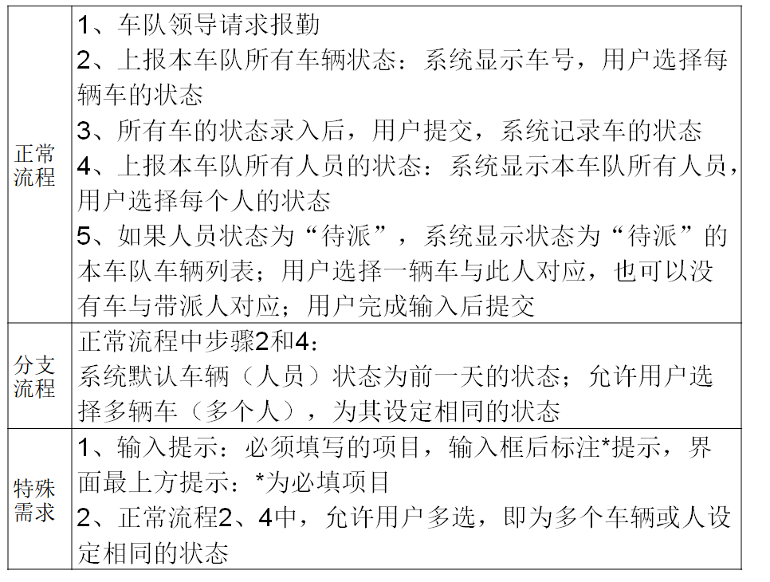

### 分析用例描述

+ 使用分析模型（行为+结构）

+ 改进

  + 子流程？

  + 异常流程？

## 原型

### 概述

+ 如果在最终的物件（final artifact）产生之前，一个中间物件（mediate artifact）被用来在一定广度和深度范围内表现这个最终物件，那么这个中间物件就被认为是最终物件在该广度和深度上的原型。

### 不确定性

+ 需求的不确定性
  + 需求原型、迭代需求、需求分析技术

+ 设计的不确定性（设计约束与设计决策）
  + 设计原型（体系结构原型）、迭代设计、设计技术

+ 构造的不确定性（编译错误与运行表现）
  + 算法原型、调试、程序语言

+ 测试的不确定性（缺陷分布）
  + 测试环境、测试技术

+ 管理的不确定性（时间、成本、风险…）
  + 管理技术

### 分类

+ 演示原型（presentation prototype）
  + 主要被用在启动项目阶段 
  + 目的是让用户相信应用系统的开发是可行的 

+ 严格意义上的原型（prototype proper） 
  + 主要被用在分析需求阶段 
  + 用来阐明用户界面或者系统功能的某些特定方面 

+ 试验原型（breadboard prototype） 
  + 主要被用在构建系统阶段 
  + 帮助开发者澄清他们所面对的一些和系统构建相关的技术问题 

+ 引示系统原型（pilot system prototype） 
  + 会被开发在系统开发的各个阶段 
  + 用作最终系统的构建核心 

### 流程

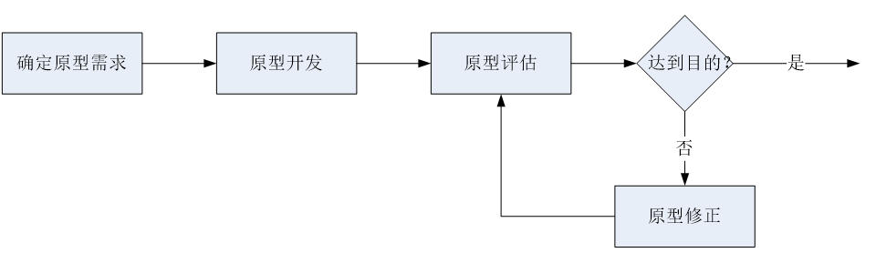

### 开发成本

#### 水平原型方法（horizontal prototyping）

+ 它仅仅实现选定功能所有层次中的某些特定层次 
+ 建立的原型产品称为水平原型（horizontal prototype） 
+ 要把注意力集中在概括性需求和工作流问题上 

#### 垂直原型方法（vertical prototyping）

+ 它会触及到选定功能实现的所有层次
+ 建立的原型产品称为垂直原型（vertical prototype） 
+ 要保证真实实现它的各种功能 
+ 用尽可能低的成本开发水平原型

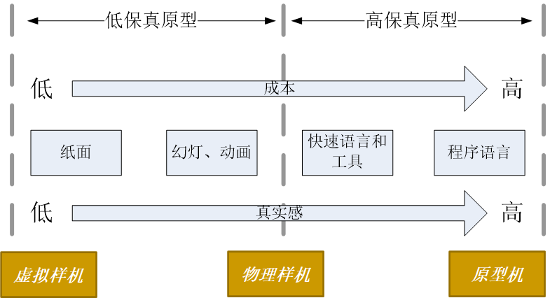

### 故事板原型

#### 概述

+ 故事板最早是好莱坞在设计电影场景和卡通故事时使用的，卡通制作者通过勾画出一系列相连的图片来展示一个卡通故事，具有更直观、可视化的故事叙述能力

+ 将原来分散的功能与步骤组织成故事，让普通人能够更好地体验与评估

+ 原型和用例/场景通常结合使用[Mannio2001]：为需要探索和澄清的用例/场景建立故事板原型，或者依据故事板原型的评估结果建立清晰、明确的用例/场景描述

#### 示例

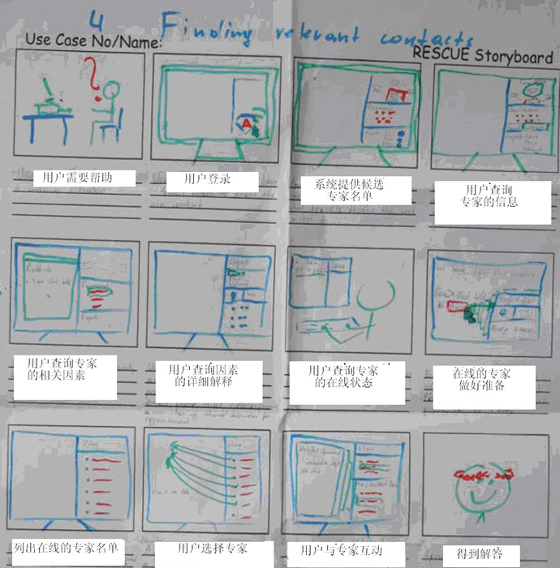

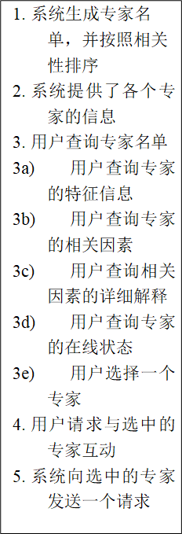

#### 构建

+ 明确故事板原型要素
  + 角色（Who）；
  + 内容（What）；
  + 方法（How）。

+ 构建不同类型的故事板原型
  + 被动（Passive）故事板原型 - *连环画*
  + 主动（Active）故事板原型 – *漫画*
  + 交互（Interactive）故事板原型 – *网页*

## 文档审查

### 情景性

+ 突现（Emergent）：集体促成 ，互动中突现 
+ 局部（Local） ：特定的上下文环境 
+ 暂时（Contingent） ：演进过程中的一刻
+ 涉身（Embodied） ：参与者的认知和能力受限 
+ 开放（Open） ：业务不确定并开放，以后完善
+ 模糊（Vague） ：基于潜在知识，尚未明确表达

### 采样观察

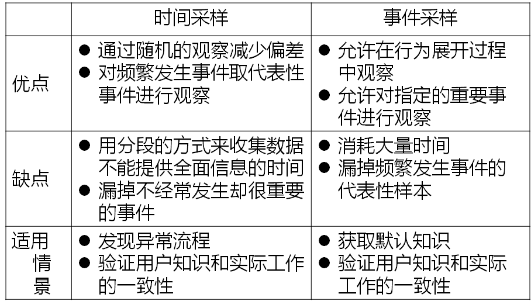

### 民族志

+ 建立在人群中实地调查(Field Research)基础下第一手观察和参与之上的关于习俗的撰写。

+ 优点

  + 能够得到信息的深度理解 

  + 能够让真实世界的社会性因素可见化 

  + 打破人们已有的一些错误假设和错误观念 

+ 缺点

  + 需要耗费很多的时间 

  + 调研结果很难传递到开发过程 

#### 复杂协同问题

+ 工作的分布式协同（Distributed Coordination）
  + 要特别注意那些利用物件实现的协同和创建这些物件的文书工作 

+ 工作的计划和程序（Plans and Procedures）
  + 关注它们在组织活动中的应用方式 
  + 发现实际工作和文档化程序之间存在的偏离 

+ 工作的意识（Awareness of Work）
  + 活动是如何对协同中的其他人可见或者可理解的？

#### 普通民族志

+ 应该定期的记录发现

+ 尽快的记录可能会在观察过程中发生的面谈

+ 定期的复查和更新自己的想法

+ 确定管理海量数据的应对策略

### 文档审查

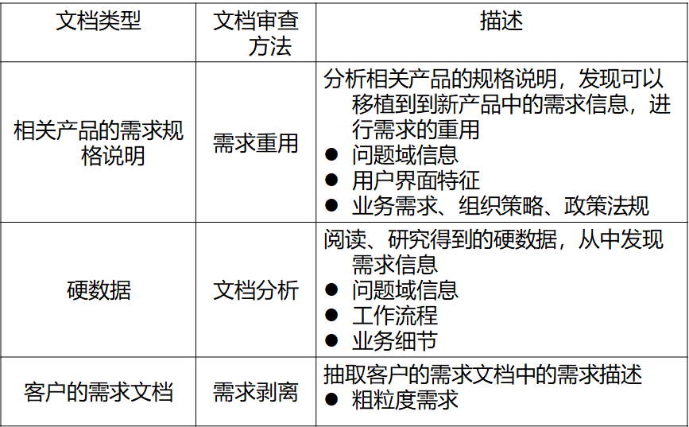

