# 需求分析

## 概述

### 流程

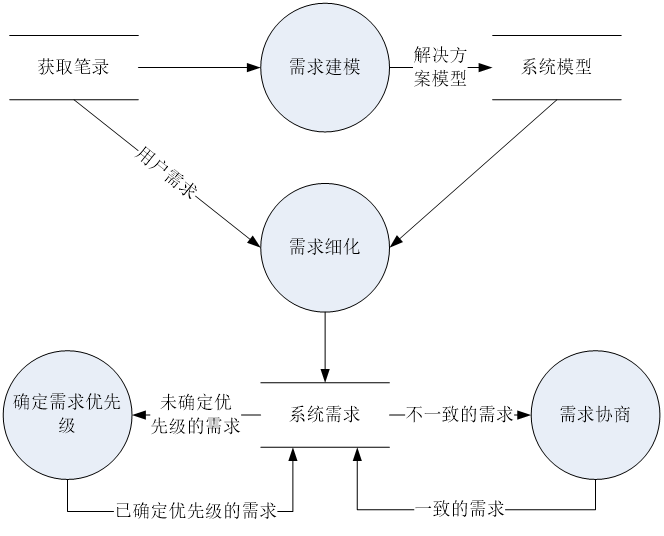

### 需求细化

#### 用例图

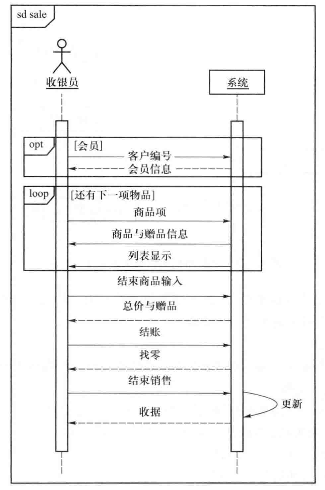

#### 解决方案细节

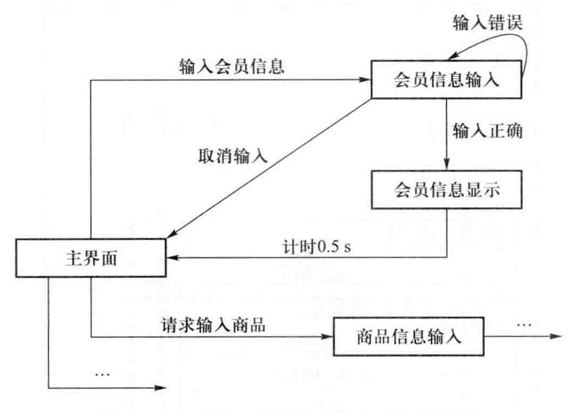

### 需求优先级

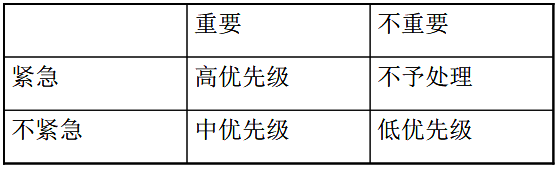

### 需求协商

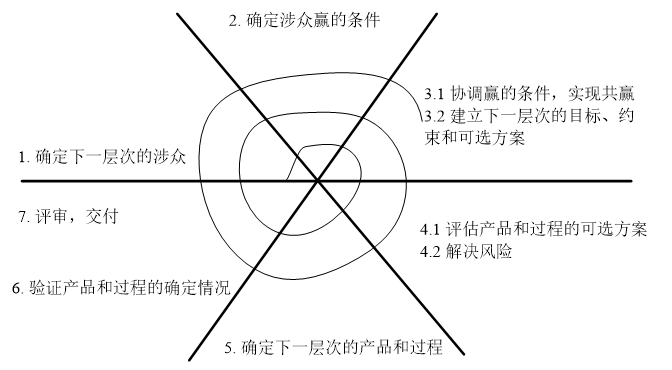

### 建立分析模型

#### 三种模型

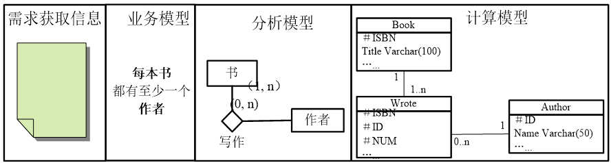

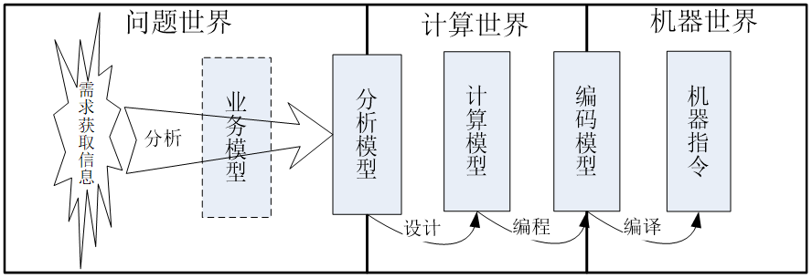

#### 建模流程

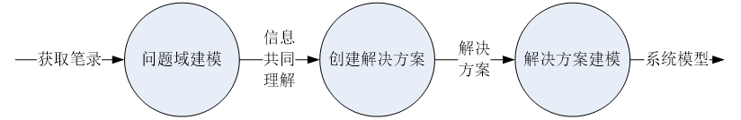

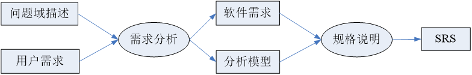

## 需求分析技术

### 技术分类

+ Wieringa通过描述系统与外界环境的交互将交互描述分为功能式描述、通信式描述、行为式描述，从功能到通信到行为的逐步精华是对系统功能的展开。另一方面框架对系统进行分解，将系统内外区分为：外部功能、外部通信、外部行为、概念组元、组元功能、组元通信、组元行为
+ Zackman认为系统开发是由不同观点的若干人员共同完成的，因此是从人角度进行的系统分解。Zackman的行分别是目标/范围（规划者视图）、企业模型（所有者视图）、系统模型（设计师视图）、技术模型（构建者视图）、组件模型（集成者视图）、实际运行的系统，列分别是What、How、Where（network）、Who、When、Why，分析技术就是用来对企业建模各列进行建模和描述的技术，其中面向对象分析的用例图、OCL、交互图、有限状态机、类图皆可以从企业建模中找到

## 面向对象建模

### 对象模型

#### 对象

+ 对象是指在一个应用当中具有明确角色的独立可确认的实体 
+ 对象职责：指对象持有、维护特定知识并基于知识行使固定职能的能力

+ 如果一个对象拥有多个行为组，就意味着该对象拥有多个不同的职责，需要扮演多个不同的角色。 

+ 理想的单一职责对象应该仅仅扮演一个角色

#### 链接

+ 如果一个对象a存在指向b的链接，那就意味着a拥有对b的假设，关于b的行为和行为效果的假设。也就是说，b需要满足a的某些行为期望

#### 类

+ 类是共享相同属性和行为的对象的集合，它为属于该类的所有对象提供统一的抽象描述和生成模板
  + 抽象描述称为接口（Interface），定义了类所含对象对外的（其他类和对象）的统一协议
  + 生成模板称为实现（Implementation），说明了类所含对象的生成机制和行为模式 

#### 关联

+ 类之间的某种语义联系

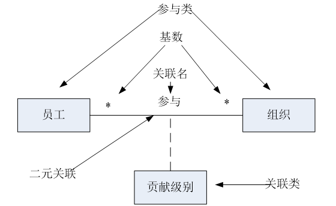

#### 继承与多态

+ 如果一个类A继承了对象B，那么A就自然具有B的全部属性和服务，同时A也会拥有一些自己特有的属性和服务，这些特有部分是B所不具备的
+ 广义多态（函数的重载与重写）
  + 一个对象在相似情景下表现出多个不同形态，或者多个对象在同一情景中表现出相同形态的现象
+ 狭义多态（子类对象或接口的多态性）
  + 多个对象在同一情景中表现出相同形态的现象 

### 领域模型

+ 对象模型的一种
+ 类大多是概念类（Concept Class），是一个能够代表现实世界事物的概念

#### 示例

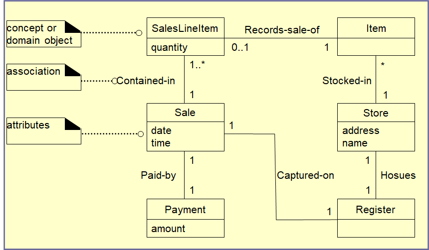

#### 流程

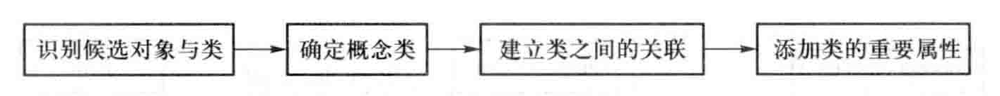

#### 确定概念类规则

+ 如果候选对象有状态、有行为，那么它就应该是一个独立存在的对象

+ 如果候选对象只有状态没有行为，那么就要分析它的状态是否是系统需要的数据。
  + 如果系统需要它的状态数据，那么该候选对象就应该作为其他对象的属性出现在最终的领域模型当中。
  + 否则，该候选对象应该被摈弃 

+ 如果候选对象只有行为没有状态，那么往往意味着需求信息的遗漏

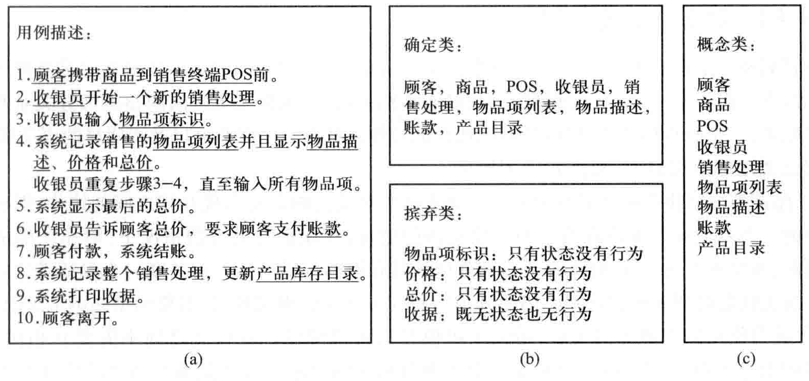

### 顺序图

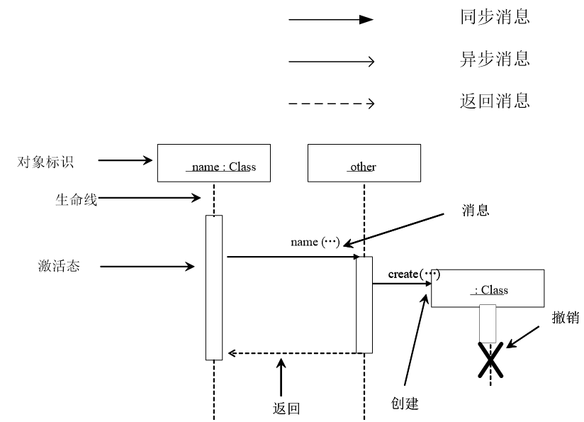

#### 组合

+ alt：选择
+ opt：条件执行
+ loop：循环
+ break：跳出循环
+ par：并行
+ critical：原子操作，不可被打断
+ strict：顺序执行
+ seq：不同生命线的可以并发执行（google和bing或yahoo可以并发，bing和yahoo必须顺序）

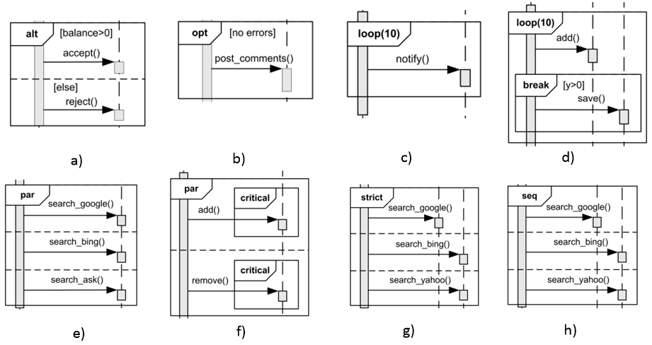

#### 示例

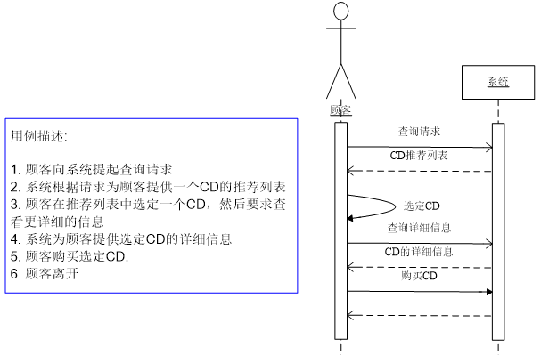

### 状态图

#### 简单示例

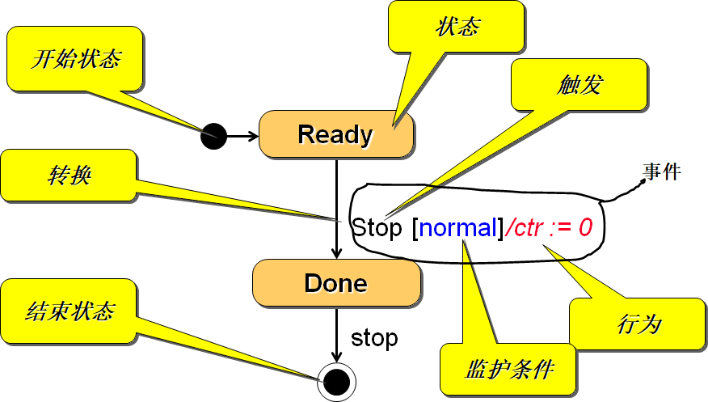

#### 组合

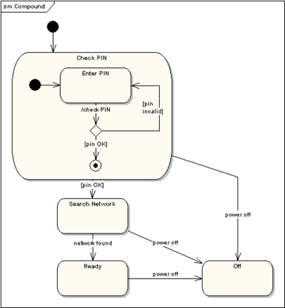

#### 并发

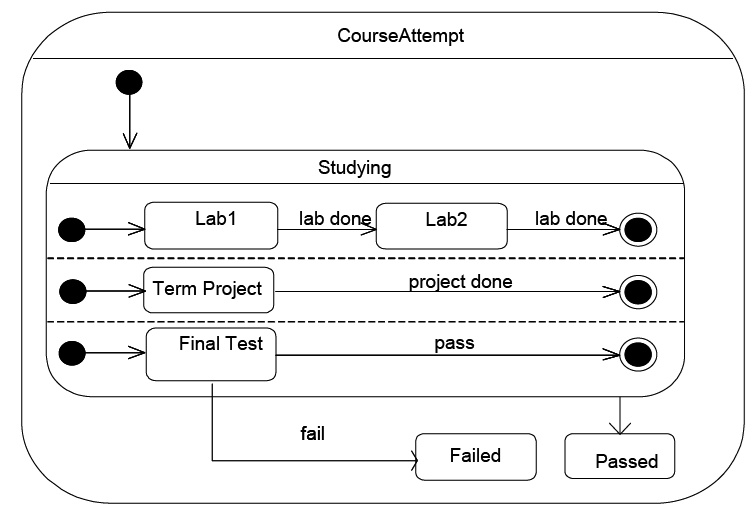

#### 入口与出口

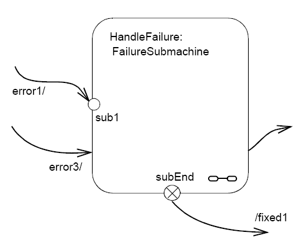

#### 决策

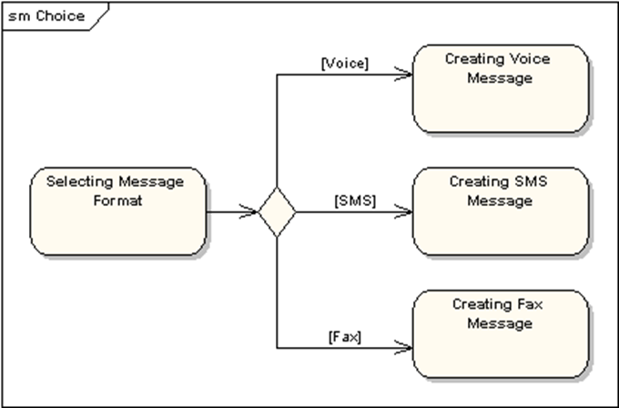

#### 汇集点

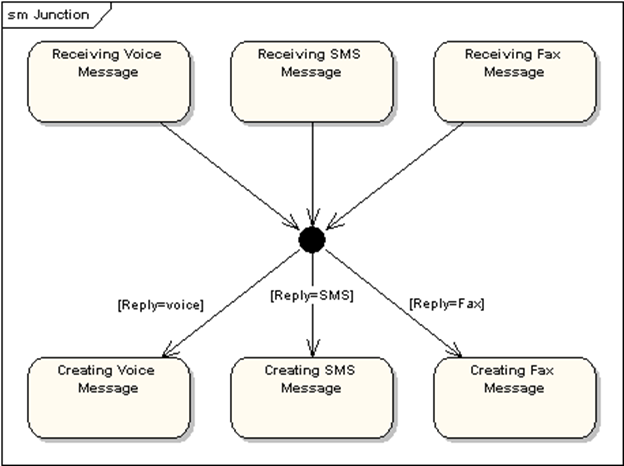

#### 终止与历史状态

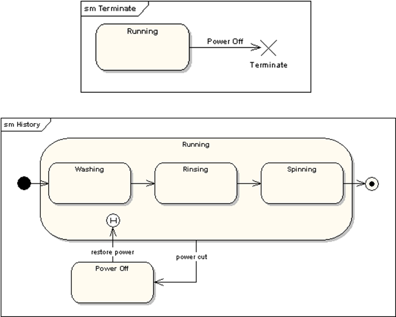

### 对象约束语言OCL

#### 不变量

+ 类元需要保持它的表达式取值在指定的时间范围内或者指定的条件下始终为“真”
+ 最常见的是用来约束类的属性或者类的方法 

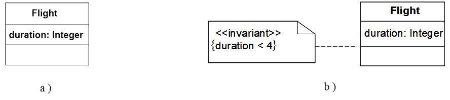

#### 前置条件与后置条件

+ 前置条件要求类元在执行操作之前必须保证前置条件的表达式为真
+ 后置条件要求类元在操作执行完成之后必须保证后置条件的表达式为真 

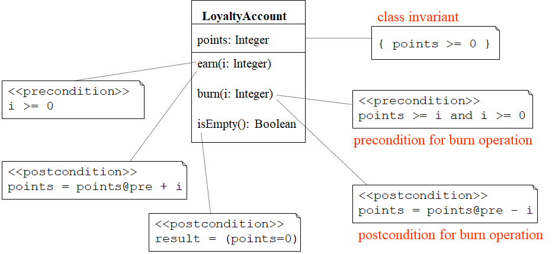

#### 监护条件

+ 在状态机到达转移点时，监护条件的表达式需要根据实际状态进行评估，并只有在表达式实际取值为“真”的情况下才进行转移

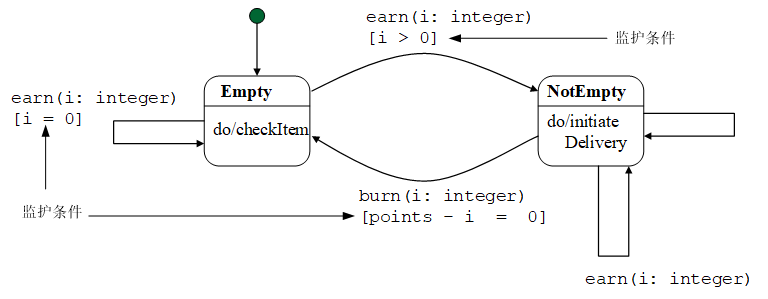

#### 示例

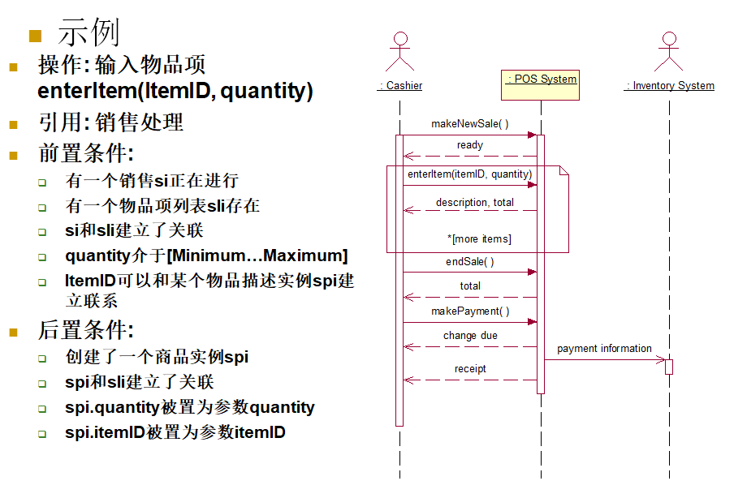

### CRC

+ Candidates、 Responsibilities和 Collaborators三者的缩写

+ 基于CRC可以建立一种索引卡片，被称为CRC卡，每个卡片代表了一个被发现的候选对象

#### 示例

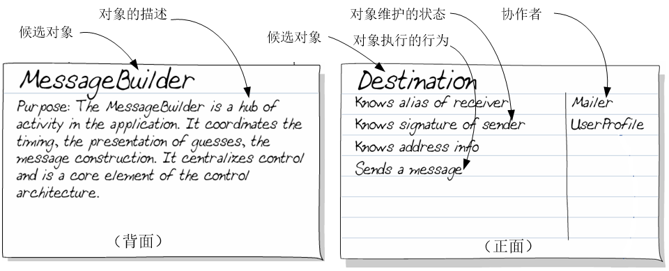