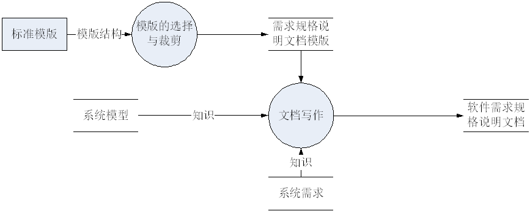
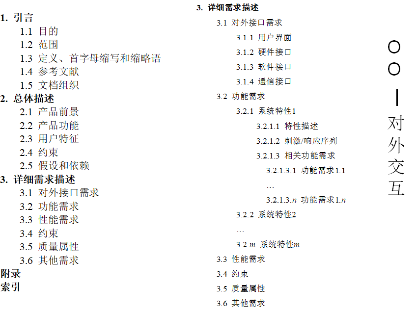
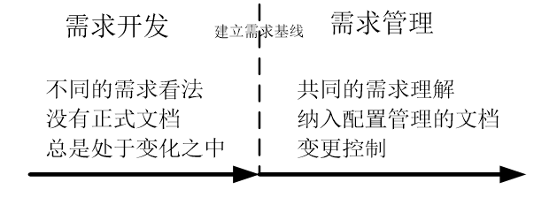
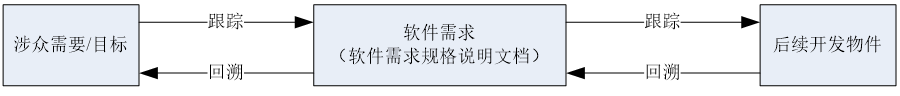
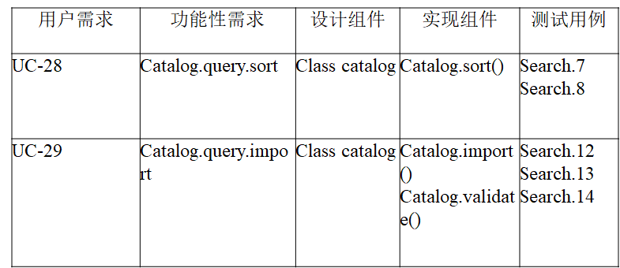

# 需求规格化与验证

## 需求规格

### 规格说明活动流程

### 说明文档

### 特性

#### 完备性

+ 标准
  + 描述了用户的所有有意义的需求，包括功能、性能、约束、质量属性和对外接口。
  + 定义了软件对所有情况的所有实际输入（无论有效输入还是无效输入）的响应。
  + 为文档中的所有插图、图、表和术语、度量单位的定义提供了完整的引用和标记。

+ 前景和范围

+ TBD问题

#### 一致性

+ 标准
  + 细节的需求不能同高层次的需求相冲突，例如系统需求不能和业务需求、用户需求互相矛盾
  + 同一层次的不同需求之间也不能互相冲突

+ 评审

+ 自动化检查

#### 根据重要性和稳定性分级

+ 建立需求的优先级

#### 可修改

+ 标准
  + 它的结构和风格使得人们可以对其中任一需求进行容易地、完整地、一致地修改，同时还不会影响文档现有的结构和风格

+ 文档的可修改性要求：
  + 有着条理分明并且易于使用的组织方式，包括目录、索引和显式的交叉引用。
  + 没有重复冗余。
  + 独立表达每个需求，而不是和其他需求混在一起。

#### 可跟踪

+ 前向跟踪（Pre-traceability）
  + 能找到需求的来源，例如和更早期文档的显式关联。

+ 后向跟踪（Post-traceability）
  + 能找到需求所对应的设计单元、实现源代码和测试用例等，它要求每个需求都要有唯一的标识或者可供引用的名称

## 需求验证

### 验证与确认

+ 需求验证：以正确的方式建立需求
  + 需求集是正确的、完备的和一致的；
  + 技术上是可解决的；
  + 它们在现实世界中的满足是可行的和可验证的。

+ 需求确认：建立的需求是正确的
  + 每一条需求都是符合用户原意的

### 验证方法

+ 需求评审（同级评审，静态分析）
+ 原型与模拟（动态行为）
+ 开发测试用例
+ 用户手册编制
+ 利用跟踪关系
+ 自动化分析

### 问题修正

+ 需求澄清（Requirements Clarification）
  + 理解偏差：重新进行分析工作
  + 分析遗漏：重新分析和文档化这部分信息
  + 表达不当：重新以合适的方式表达

+ 缺失需求
  + 重新执行需求获取等一系列工作

+ 需求冲突
  + 协商解决

+ 不切实际的期
  + 项目调整与需求协商

## 需求管理

### 需求基线

+ 已经通过正式评审和批准的规格说明或产品，它可以作为进一步开发的基础，并且只有通过正式的变更控制过程才能修改它

+ 是被明确和固定下来的需求集合，是项目团队需要在某一特定产品版本中实现的特征和需求集合

#### 维护基线

+ 标识配置项
  + 递增数值，例如1，2，…x；
  + 层次式数值编码，例如1.1.1，1.2.1，…x.y.z；
  + 层次式命名编码，例如Order.Place.Date，Order.Place.Register，…Task.Step.Substep

+ 版本控制
  + 每一条单独的需求需要进行版本控制
  + 相关的需求文档也需要进行版本控制

+ 变更控制

+ 访问审计
  + 记录和审计访问的情况

+ 状态报告
  + 反映需求基线的成熟度（变化的幅度越大，成熟度越低）、稳定性（改变的次数越多，稳定性越差）等

### 需求跟踪

#### 前向跟踪

前向跟踪是指被定义到软件需求规格说明文档之前的需求演化过程

+ 向前跟踪到需求：说明涉众的需要和目标产生了哪些软件需求

+ 从需求向后回溯：说明软件需求来源于哪些涉众的需要和目标

#### 后向跟踪

后向跟踪是指被定义到软件需求规格说明文档之后的需求演化过程

+ 从需求向前跟踪：说明软件需求是如何被后续的开发物件支持和实现的

+ 回溯到需求的跟踪：说明各种系统开发的物件是因为什么原因（软件需求）而被开发出来的

#### 跟踪矩阵

### 需求变更

+ 需求的变化是正当和不可避免的

+ 问题发生了改变

+ 环境发生了改变

+ 需求基线存在缺陷
+ 用户变动
+ 用户对软件的认识变化
+ 相关产品的出现

#### 注意事项

+ 认识到变更的必要性，并为之制定计划
+ 维护需求基线，审计变更记录

+ 管理范围蔓延
+ 灵活应对变更请求
+ 使用辅助工具